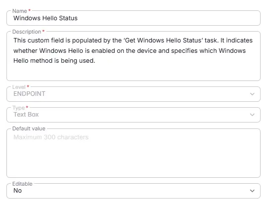

## Summary
This custom field is populated by the ‘Get Windows Hello Status’ task. It indicates whether Windows Hello is enabled on the device and specifies which Windows Hello method is being used.

## Details

| Name                 | Level                | Type                | Default         | Required | Editable | Description                              |
|----------------------|----------------------|---------------------|------------------|----------|----------|------------------------------------------|
| Windows Hello Status | Endpoint | Text | blank | True/False | No   | This custom field is populated by the ‘Get Windows Hello Status’ task. It indicates whether Windows Hello is enabled on the device and specifies which Windows Hello method is being used. |

## Dependencies

- [Solution - Windows Hello Audit](/docs/1ec129b5-f607-41ab-b451-b54a2078950c)
- [Script - Get Windows Hello Status ](/docs/2de3c07b-22ab-4796-90b9-e6e0f4082299)

## Creation Process

### Step 1

Navigate to `Settings` ➞ `Custom Fields`  

### Step 2

Locate the `Add Field` button on the right-hand side of the screen and click on it.  

## Step 3

The `Add new custom field` dialog box will occur

## Completed Custom Field

