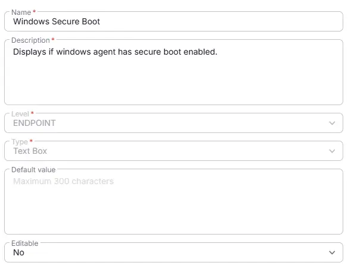
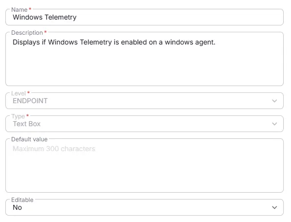
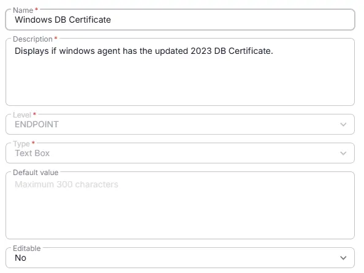
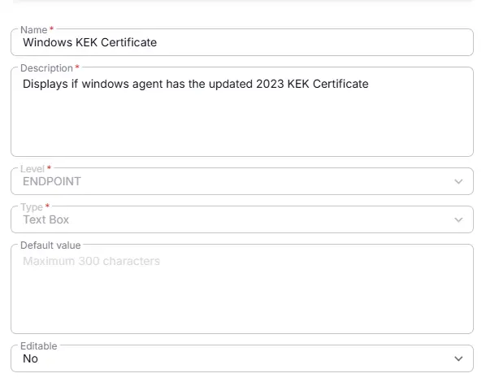

## Summary
The document details all the Custom Fields related Windows Secure Boot Audit.

## Details

| Name                 | Level   | Type    | Default        | Required | Editable | Description       |
|----------------------|---------|--------|------------------|----------|----------|----------------|
| Windows Secure Boot | Endpoint | Text | Blank |False | No   | Displays if Windows agent has secure boot enabled. |
| Windows Telemetry | Endpoint | Text | Blank |False | No   | Displays if Windows Telemetry is enabled on a windows agent. |
| Windows DB Certificate | Endpoint | Text | Blank |False | No | Displays if windows agent has the updated 2023 DB Certificate. |
| Windows KEK Certificate | Endpoint | Text | Blank |False | No   | Displays if windows agent has the updated 2023 KEK Certificate. |

## Dependencies

- [Solution : Windows Secure Boot Audit](/docs/05b9e73a-64ae-43f6-8ed5-89c952a3aaec)  

## Creation Process

### Step 1

Navigate to `Settings` ➞ `Custom Fields`  

### Step 2

Locate the `Add Field` button on the right-hand side of the screen and click on it.  

## Step 3

The `Add new custom field` dialog box will occur

Follow the above steps for creating all the four custom fields.

## Completed Custom Field

### Windows Secure Boot

### Windows Telemetry

### Windows DB Certificate

### Windows KEK Certificate

## Changelog

### 2026-03-23

- Initial version of the document