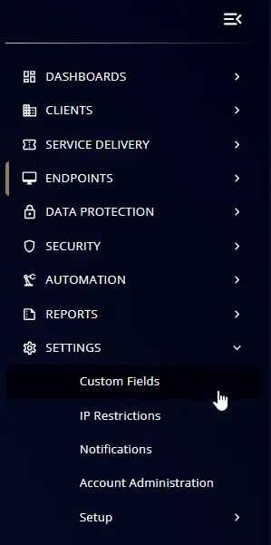

## Summary
This stores the WSUS status discovered from the script "Patching - Check for WSUS Settings".

## Details

| Name        | Level    | Type | Default | Editable | Description |
|-------------|----------|------|----------|----------|-----------------------------------------------------------------------------|
| WSUS_Status | Endpoint | Text |          |  No       | This custom field stores the WSUS status discovered from the script "Patching - Check for WSUS Settings". |

## Creation Process

### Step 1

Navigate to `Settings` ➞ `Custom Fields`  

### Step 2

Locate the `Add Field` button on the right-hand side of the screen and click on it.  

## Step 3

The `Add new custom field` dialog box will occur

## Step 4
#### Set the following
- Name: `WSUS_Status`
- Description: `This stores the WSUS status discovered from the script "Patching - Check for WSUS Settings".`
- Level: `Endpoint`
- Type: `Text Box`
- Default Value: `<Leave it Blank>`
- Editable: `No`

## Completed Custom Field

