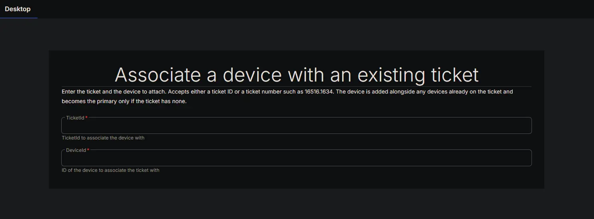
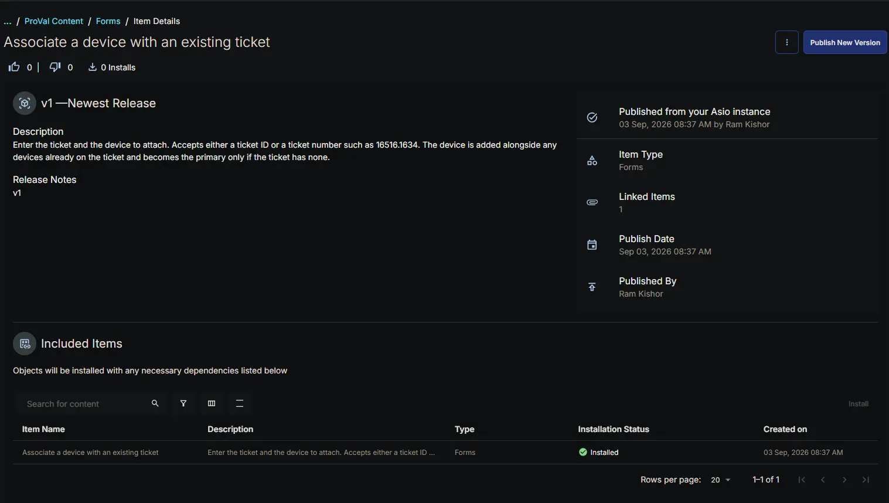
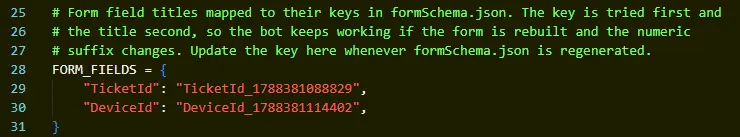

## Summary

The **Associate a device with an existing ticket** form is the input surface for the [Bots: Associate a device with an existing ticket](/docs/b98f159a-f34a-4c4c-8ff3-b89a0d003219) custom bot. It collects only the two values needed to attach a device to a ticket that already exists.

This pairing exists to cover the single capability a native CW RMM workflow lacks. A workflow can create a ticket, add notes to it and change its status, but it cannot associate a device with it. Placing this form and bot directly after a **Create Ticket** action gives a workflow the missing step, which is how it is used in [CWRMM Ticket Management for Monitors](/docs/57daa951-2acc-4be7-a025-0d0ca729ef57).

**Design intent:**

- **Two fields, nothing else.** Everything else the platform needs is already recorded on the target ticket, so the form asks only what cannot be inferred.
- **`TicketId` accepts either identifier.** A workflow may expose the ticket GUID or the human readable ticket number such as `16516.1634`. The bot shape-tests the value and looks it up the appropriate way, so whichever one the calling workflow makes available will work.
- **Existing devices are never displaced.** The bot merges rather than replaces, and preserves whichever device is already flagged as primary. The incoming device becomes primary only when the ticket has no devices at all.
- **Safe to run twice.** If the device is already attached, the bot reports that and changes nothing. A retried workflow step will not duplicate an association or fail.

To create a ticket and attach a device in a single operation instead, use the [Forms: Create ticket with associated device](/docs/8d147440-f887-4c21-8fc8-fb93c0d54c29) form.

## Details

| Form Title | Form Description | Tags |
| ---------- | ---------------- | ---- |
| Associate a device with an existing ticket | Enter the ticket and the device to attach. Accepts either a ticket ID or a ticket number such as 16516.1634. The device is added alongside any devices already on the ticket and becomes the primary only if the ticket has none. | Ticketing |

## Fields

| Field Label | Variable Name | Help Text | Example | Required | Read Only | List Options | Default Value |
| ----------- | ------------- | --------- | ------- | -------- | --------- | ------------ | ------------- |
| TicketId | `TicketId_1788381088829` | TicketId to associate the device with | `6bfcd348-4a20-4fbc-a2ef-2e15add3dea3` | Yes | No | N/A | *(blank)* |
| DeviceId | `DeviceId_1788381114402` | ID of the device to associate the ticket with | `41d6a66d-b5a9-4544-81af-88cdf5f37e94` | Yes | No | N/A | *(blank)* |

**Field notes:**

- Both fields are single line text boxes of type `string`, and both are required. Neither value can be derived from the other.
- Both fields carry an explicit default of an empty string. This is mandatory — see [Implementation](#implementation).
- `TicketId` accepts either the ticket GUID or the ticket number. A value matching the GUID pattern is fetched directly; anything else is treated as a ticket number and searched for. A ticket number that matches more than one ticket is reported as an error rather than resolved arbitrarily.
- `DeviceId` must be the endpoint GUID. Unlike the company and site fields on the companion form, there is no name based fallback, because device names are not unique in the platform and attaching the wrong endpoint is not a recoverable mistake.

## Forms Setup Path

- **Tasks Path:** `Automation` ➞ `Forms`

## Dependencies

- [Bots: Associate a device with an existing ticket](/docs/b98f159a-f34a-4c4c-8ff3-b89a0d003219)

The form has no function on its own. It must be attached to the bot above, which resolves the ticket and performs the association.

**Consumed by:**

- [CWRMM Ticket Management for Monitors](/docs/57daa951-2acc-4be7-a025-0d0ca729ef57)

## Form Preview

## Implementation

Install the form from the `ProVal - Content` Community, selecting the **Forms** repository. After installation the following configuration steps are mandatory.

### 1. Verify the variable names against the bot

Both variable names carry a numeric suffix that is generated when the field is created. The paired bot looks these names up in its `FORM_FIELDS` dictionary.

1. Open the form and confirm each variable name matches the **Variable Name** column in the [Fields](#fields) table above.
2. If either field was recreated, the suffix will have changed. Open the bot and update the matching entry in `FORM_FIELDS` to the new variable name.
3. The bot falls back to matching on the field **title** when the variable name does not resolve, so a mismatch is usually recoverable, but the variable name is the primary lookup and should be corrected.

### 2. Confirm both fields have a default value

Each property in the form schema must define a default of an empty string. Without a default, the platform hands the bot the field's own title in place of the entered value, and the bot fails with a message stating that the field returned its own field name.

### 3. Map both inputs in the calling workflow

When the bot is called from a workflow rather than the Automation Pod, each field appears as a bot step input and must be mapped explicitly. An unmapped input is delivered as an empty value, not as a default.

Place the bot step immediately after the action that creates or retrieves the ticket, and map:

- **TicketId** ➞ the ticket ID or ticket number output by the preceding ticket action.
- **DeviceId** ➞ the endpoint ID already resolved earlier in the workflow.

**Primary Note: TicketId delivery**  
Both fields are required and neither can be derived, so if the bot log reports that no value reached it for `TicketId`, the input was not delivered. Confirm the workflow step maps it. If the mapping is present and the value still does not arrive, rename the form field to something less likely to collide with the workflow's own ticket context, such as `TargetTicket`, and update `FORM_FIELDS` in the bot to match.

## Changelog

### 2026-09-03

- Initial version of the document
