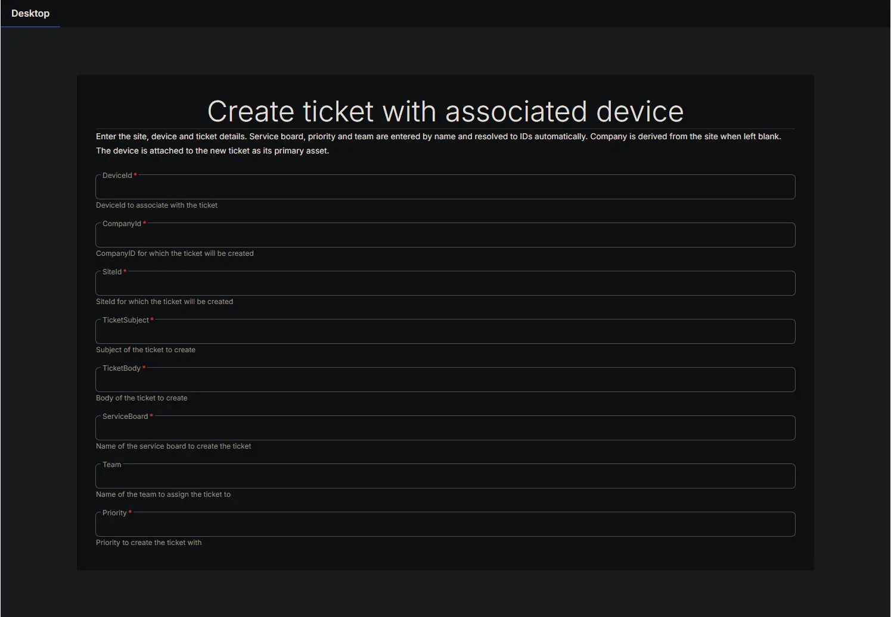
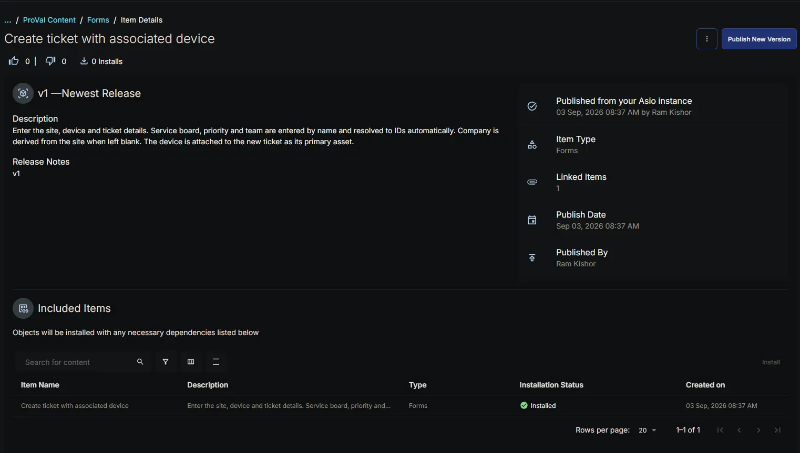
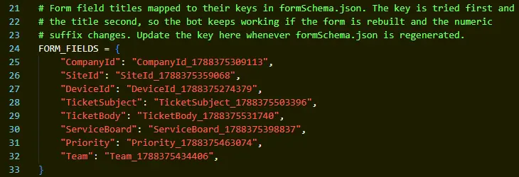

## Summary

The **Create ticket with associated device** form is the input surface for the [Bots: Create ticket with associated device](/docs/cf8a2c3d-456c-4567-8039-97e89f894ac5) custom bot. It collects everything needed to raise a service ticket and attach a device to it in a single operation.

The form exists because a native CW RMM workflow can create a ticket but cannot associate a device with it. The bot closes that gap, and this form supplies the values it needs.

**Design intent:**

- **IDs where the platform demands them.** `DeviceId` and `SiteId` are passed straight through to the API, because these GUIDs are available to a workflow but the platform will not accept anything else in their place.
- **Names where a human is typing.** `ServiceBoard`, `Priority` and `Team` are entered as the display names shown in the CW RMM console, and the bot resolves each one to its GUID at runtime. Those GUIDs are not exposed anywhere in the interface, so requiring them here would make the form unusable by hand.
- **`CompanyId` is optional.** When it is left blank the bot reads the parent company from the site record. This matters in practice: a workflow step frequently fails to map a bot input named `CompanyId`, and deriving it from `SiteId` keeps the form working regardless.

If the ticket already exists and only the device needs attaching, use the [Forms: Associate a device with an existing ticket](/docs/45135ca2-b3f8-4d0e-9331-ef89768b487b) form instead.

## Details

| Form Title | Form Description | Tags |
| ---------- | ---------------- | ---- |
| Create ticket with associated device | Enter the site, device and ticket details. Service board, priority and team are entered by name and resolved to IDs automatically. Company is derived from the site when left blank. The device is attached to the new ticket as its primary asset. | Ticketing |

## Fields

| Field Label | Variable Name | Help Text | Example | Required | Read Only | List Options | Default Value |
| ----------- | ------------- | --------- | ------- | -------- | --------- | ------------ | ------------- |
| DeviceId | `DeviceId_1788375274379` | DeviceId to associate with the ticket | `41d6a66d-b5a9-4544-81af-88cdf5f37e94` | Yes | No | N/A | *(blank)* |
| CompanyId | `CompanyId_1788375309113` | CompanyID for which the ticket will be created. Leave blank to derive it from the SiteId. | `436f6d6d-616e-6420-4944-3a2000051f97` | No | No | N/A | *(blank)* |
| SiteId | `SiteId_1788375359068` | SiteId for which the ticket will be created | `436f6d6d-616e-6420-4944-3a2000051f97` | Yes | No | N/A | *(blank)* |
| TicketSubject | `TicketSubject_1788375503396` | Subject of the ticket to create | `A Sample Ticket for PRLPT162 Created by Bot` | Yes | No | N/A | *(blank)* |
| TicketBody | `TicketBody_1788375531740` | Body of the ticket to create | `This ticket is created to test the functionality of the Bot` | Yes | No | N/A | *(blank)* |
| ServiceBoard | `ServiceBoard_1788375398837` | Name of the service board to create the ticket | `MSP` | Yes | No | N/A | *(blank)* |
| Team | `Team_1788375434406` | Name of the team to assign the ticket to | `MSP` | No | No | N/A | *(blank)* |
| Priority | `Priority_1788375463074` | Priority to create the ticket with | `Medium` | Yes | No | N/A | *(blank)* |

**Field notes:**

- Every field is a single line text box of type `string`. There are no list or dropdown fields, because the valid service boards, priorities and teams differ per partner and are validated by the bot at runtime rather than hardcoded into the form.
- Every field carries an explicit default of an empty string. This is mandatory — see [Implementation](#implementation).
- `TicketSubject` accepts up to 255 characters and `TicketBody` up to 10000, matching the platform ticket schema. The bot rejects anything longer before calling the API.
- `SiteId` also accepts the site display name or the legacy numeric Command ID. `CompanyId` behaves the same way. This is a convenience of the bot's resolution logic, not a property of the form.

## Forms Setup Path

- **Tasks Path:** `Automation` ➞ `Forms`

## Dependencies

- [Bots: Create ticket with associated device](/docs/cf8a2c3d-456c-4567-8039-97e89f894ac5)

The form has no function on its own. It must be attached to the bot above, which performs the ID resolution and the ticket creation.

## Form Preview

## Implementation

Install the form from the `ProVal - Content` Community, selecting the **Forms** repository. After installation the following configuration steps are mandatory.

### 1. Verify the variable names against the bot

Every field's variable name carries a numeric suffix that is generated when the field is created. The paired bot looks these names up in its `FORM_FIELDS` dictionary.

1. Open the form and confirm each variable name matches the **Variable Name** column in the [Fields](#fields) table above.
2. If any field was recreated, the suffix will have changed. Open the bot and update the matching entry in `FORM_FIELDS` to the new variable name.
3. The bot falls back to matching on the field **title** when the variable name does not resolve, so a mismatch is usually recoverable, but the variable name is the primary lookup and should be corrected.

### 2. Confirm every field has a default value

Each property in the form schema must define a default of an empty string. Without a default, the platform hands the bot the field's own title in place of the entered value, and the bot fails with a message stating that the field returned its own field name.

### 3. Leave CompanyId optional

`CompanyId` must not be marked required. Workflow steps commonly leave an input of that name unmapped, and a required field that never receives a value blocks the whole run. The bot derives the company from the site record when the value is absent, so no information is lost.

### 4. Map every input in the calling workflow

When the bot is called from a workflow rather than the Automation Pod, each form field appears as a bot step input and must be mapped explicitly. An unmapped input is delivered as an empty value, not as a default.

**Primary Note: Field order**  
The field order in the form determines the display order only. It has no bearing on the bot, which reads each field by variable name.

## Changelog

### 2026-09-03

- Initial version of the document
