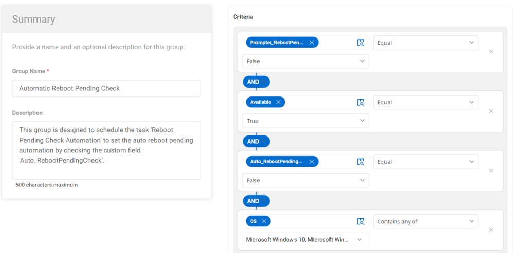

## Summary

This group is designed to schedule the task 'Automatic Reboot Pending Check' to set the auto reboot pending automation by checking the custom field 'Auto_RebootPendingCheck'.

## Dependencies

- Auto_RebootPendingCheck --> Custom field (Endpoint)  
- [CW RMM - Custom Fields - Reboot Prompter](<../custom-fields/Reboot Prompter.md>)  
- [CW RMM - Task - Reboot Pending Check Automation](<../tasks/Reboot Pending Check Automation.md>)  

## Details

| Field Name                        | Type of Field (Machine or Organization) | Description                                                                                                                                               |
|-----------------------------------|-----------------------------------------|-----------------------------------------------------------------------------------------------------------------------------------------------------------|
| Automatic Reboot Pending Check     | Dynamic group                           | This group is designed to schedule the task 'Reboot Pending Check Automation' to set the auto reboot pending automation by checking the custom field 'Auto_RebootPendingCheck'. |

## Group Creation

1. Create Dynamic Groups:  
   

2. Automatic Reboot Pending Check  
     

   Criteria:
   - Prompter_RebootPending custom field equal to False.
   - Auto_RebootPendingCheck custom field equal to False.
   - The agent available is equal to True.
   - The OS contains any of Windows 10, Windows 11, Windows 2016 Server, Windows 2019 Server, and Windows 2022 Server.

