## Summary

There are four device groups related to the BitLocker drive encryption auditing solution. Please see the guide below to create the separate device groups. 

## Dependencies

- [CW RMM - Custom Field - BitLocker Key Backup Status](https://proval.itglue.com/DOC-5078775-12878969) 
- [CW RMM - Custom Field - BitLocker Status and Recovery Key Audit](https://proval.itglue.com/DOC-5078775-12878960) 

## Create Device Groups

There are four device groups for this solution. To create device groups, please navigate to Devices > Device Groups.

**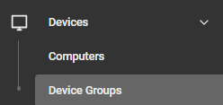**

Select Add > Dynamic Group

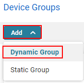

Please repeat the above steps per device group.

---

### Device Group Name: BitLocker - Audit Required

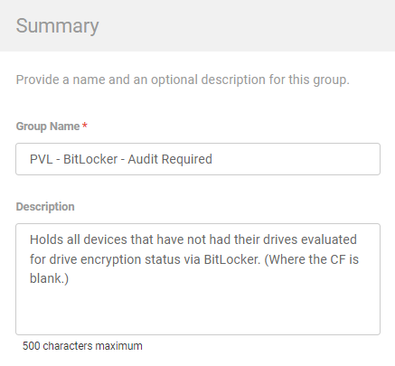

Description: Holds all devices that have not had their drives evaluated for drive encryption status via BitLocker. (Where the CF is blank.)

Criteria:

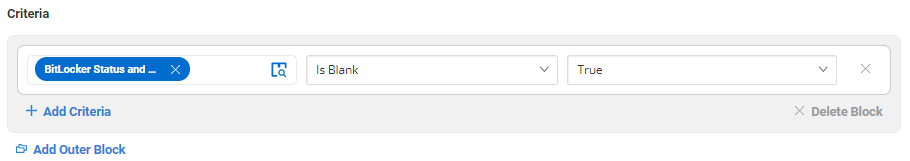

When adding criteria, please search for the BitLocker Status and Recovery Key Audit field.

- Contains: "Is Blank"
- Condition: "True"

This group holds all devices that have not had their BitLocker status audited.

---

### Device Group Name: BitLocker - Enabled

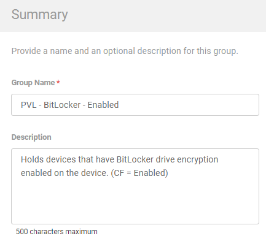

Description: Holds devices that have BitLocker drive encryption enabled on the device. (CF = Enabled)

Criteria:

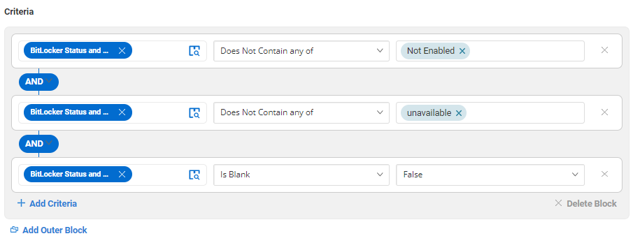

When adding criteria, please search for the BitLocker Status and Recovery Key Audit field.

- Row 1: Contains: "Does Not Contain any of"
  - Condition: "Not Enabled"
  - + Add Criteria
- AND
- Row 2: Contains "Does Not Contain any of"
  - Condition: unavailable
  - + Add Criteria
- AND
- Row 3: Contains "Is Blank"
  - Condition: False

This group holds all devices where BitLocker is enabled and will include the details of the recovery key (if available).

---

### Device Group Name: BitLocker - Disabled

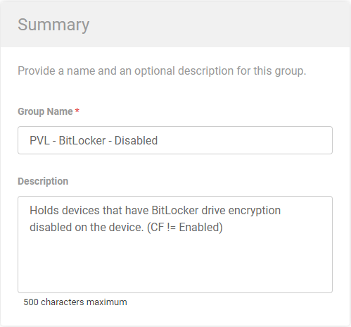

Description: Holds devices that have BitLocker drive encryption disabled on the device. (CF != Enabled)

Criteria:

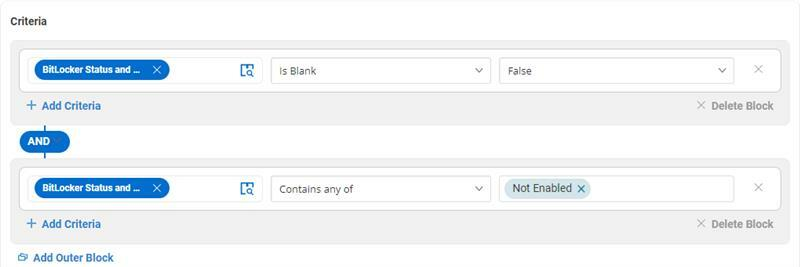

When adding criteria, please search for the BitLocker Status and Recovery Key Audit field.

- Row 1: Contains: "Is Blank"
  - Condition: "False"
  - + Add Criteria
- AND
- Row 2: Contains "Contain any of"
  - Condition: "Not Enabled"

This group holds all devices where BitLocker is not enabled.

---

### Device Group Name: BitLocker - Regular Auditing

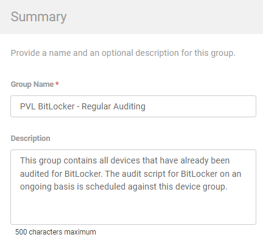

Description: This group contains all devices that have already been audited for BitLocker. The audit script for BitLocker on an ongoing basis is scheduled against this device group.

Criteria:

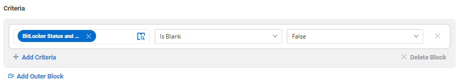

When adding criteria, please search for the BitLocker Status and Recovery Key Audit field.

- Contains: "Is Blank"
- Condition: "False"

This group holds all devices that have been audited for BitLocker and check their status on a regular basis. 

This is the scheduled recurrence of the [CW RMM - Task - BitLocker Status and Recovery Key Audit](https://proval.itglue.com/DOC-5078775-12878983) Task.

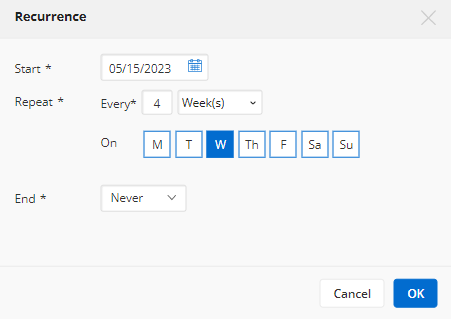

