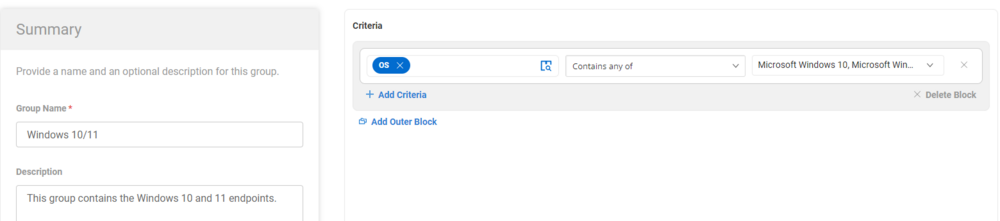
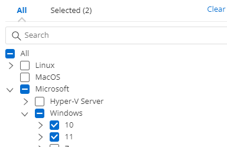

## Summary

This group contains only the Windows 10 and Windows 11 agents.

## Details

| Field Name      | Type of Field (Machine or Organization) | Description |
|------------------|-----------------------------------------|-------------|
| Windows 10/11    | Dynamic Group                           |             |

## Group Creation

1. **Create Dynamic Groups:**

   

2. **Windows 10/11**

   

   **Criteria:**

   - OS contains any of Windows 10 or Windows 11  
   
     

