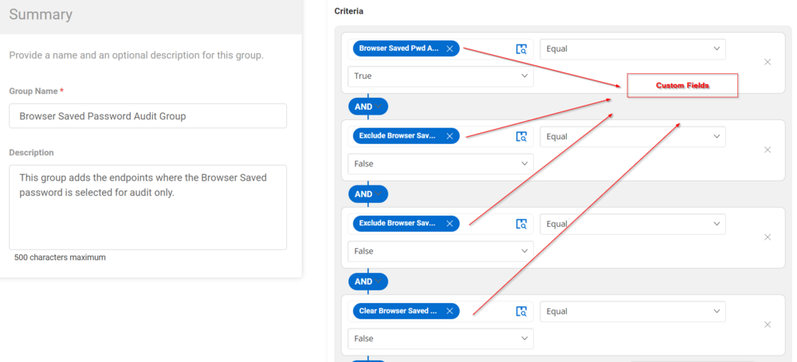
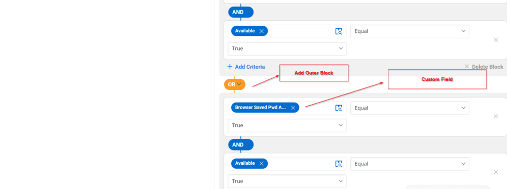
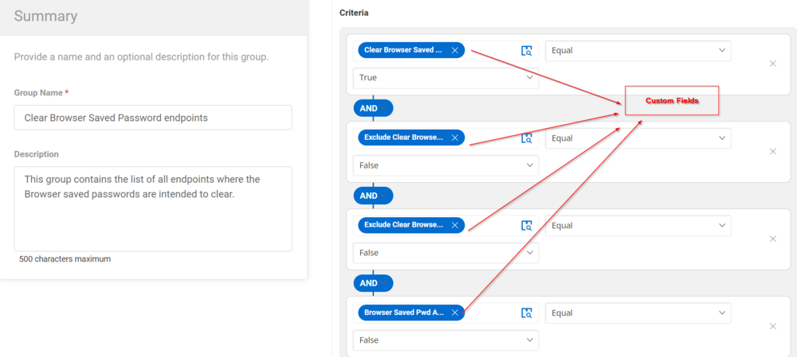
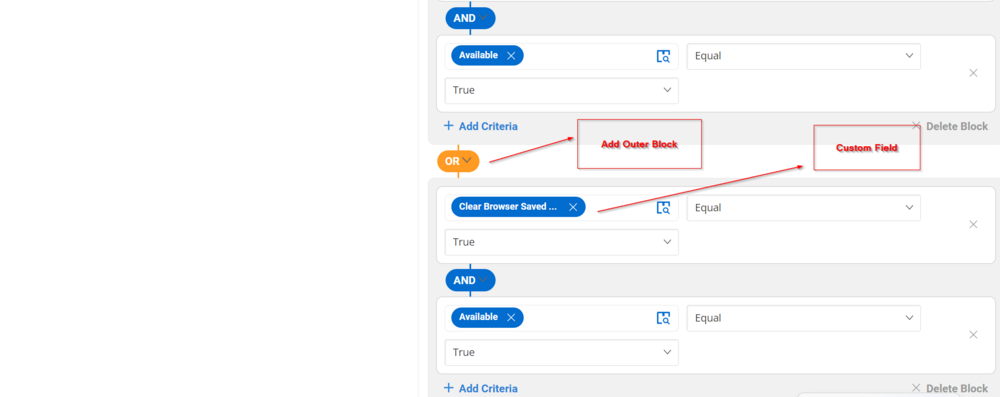
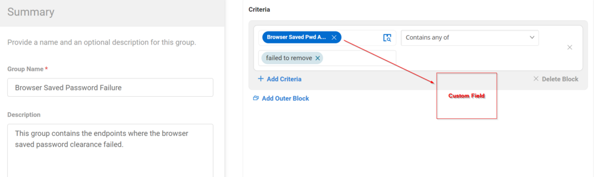

## Summary

The groups below are created to deploy the [Task - Clear/Audit - Browser Saved Password](https://proval.itglue.com/DOC-5078775-17309286) and audit the failure endpoints where the browser's saved passwords failed to clear.

## Dependencies

[Custom Field - Clear/Audit Browsers Saved Password](<../custom-fields/ClearAudit Browsers Saved Password.md>)

## Details

| Field Name                        | Type of Field (Machine or Organization) | Description                                                                                                                                                      |
|-----------------------------------|-----------------------------------------|------------------------------------------------------------------------------------------------------------------------------------------------------------------|
| Clear Browser Saved Password endpoints | Dynamic Group                          | This group contains the list of all endpoints where the browser saved passwords are intended to clear by scheduling [Task - Clear/Audit - Browser Saved Password](https://proval.itglue.com/DOC-5078775-17309286). |
| Browser Saved Password Audit Group | Dynamic Group                          | This group adds the endpoints where the browser saved password is selected for audit only by scheduling [Task - Clear/Audit - Browser Saved Password](https://proval.itglue.com/DOC-5078775-17309286).            |
| Browser Saved Password Failure     | Dynamic Group                          | This group contains the endpoints where the browser saved password clearance failed by the [Task - Clear/Audit - Browser Saved Password](https://proval.itglue.com/DOC-5078775-17309286).                        |

---

## Create Group

Create Dynamic Groups:

### 1. Browser Saved Password Audit Group

Criteria:

- `Browser Saved Pwd Audit Only` company-level custom field should be checked
- AND `Exclude Browser Saved Pwd Audit` site-level custom field should not be checked
- AND `Exclude Browser Saved Pwd Audit` endpoint-level custom field should not be checked
- AND `Clear Browser Saved Pwd` endpoint-level custom field should not be checked
- AND agent should be Available (True)
- OR `Browser Saved Pwd Audit Only` endpoint-level custom field should be checked
- AND agent should be Available (True)

### 2. Clear Browser Saved Password endpoints

Criteria:

- `Clear Browser Saved Pwd` company-level custom field should be checked
- AND `Exclude Clear Browser Saved Pwd` site-level custom field should not be checked
- AND `Exclude Clear Browser Saved Pwd` endpoint-level custom field should not be checked
- AND `Browser Saved Pwd Audit Only` endpoint-level custom field should not be checked
- AND agent should be Available (True)
- OR `Clear Browser Saved Pwd` endpoint-level custom field should be checked
- AND agent should be Available (True)

### 3. Browser Saved Password Failure

Criteria:

- `Browser Saved Pwd Audit Data` endpoint custom field should contain "Failed to remove"

