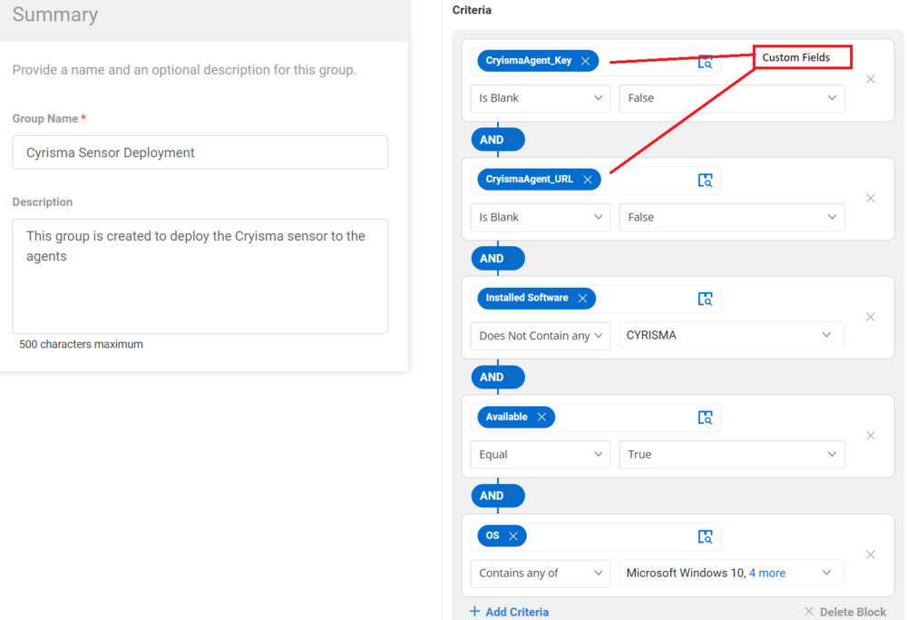
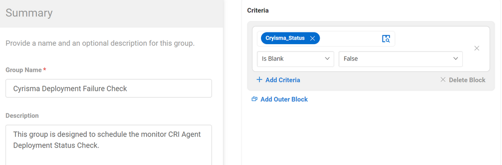
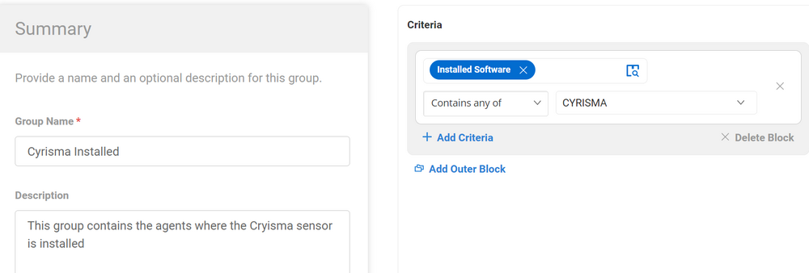

## Summary

The groups mentioned below are created to deploy and audit the Cyrisma Sensor.

## Dependencies

[CW RMM - Cyrisma Custom Fields](https://proval.itglue.com/DOC-5078775-15298953)

## Details

| Field Name                     | Type of Field (Machine or Organization) | Description                                                                                       |
|--------------------------------|-----------------------------------------|---------------------------------------------------------------------------------------------------|
| Cyrisma Sensor Deployment       | Dynamic Group                          | This group is created to deploy the task [CW RMM - Task - CRI Agent Deployment](https://proval.itglue.com/DOC-5078775-15298955) |
| Cyrisma Deployment Failure Check | Dynamic Group                          | This group is designed to schedule the monitor [CW RMM - Monitor - CRI Agent Deployment Status Check](https://proval.itglue.com/DOC-5078775-15298956) |
| Cyrisma Installed               | Dynamic Group                          | This group contains the agents where the Cyrisma sensor is installed for the auditing.           |

## Create Group

Create Dynamic Groups:

1. **Cyrisma Sensor Deployment**

   

   Criteria:

   - CryismaAgent_Key should not be blank
   - CryismaAgent_URL should not be blank
   - Installed Software does not contain any of 'CYRISMA'
   - The agent should be online
   - OS contains any of (Windows 10, Windows 11, Windows Server 2016, Windows Server 2019, and Windows Server 2022).

2. **Cyrisma Deployment Failure Check**

   

   Criteria:
   - Cryisma_Status should not be blank

3. **Cyrisma Installed**

   

   Criteria:
   - Installed Software Contains any of 'CYRISMA'

