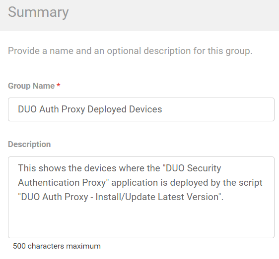
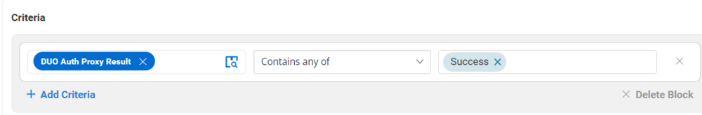

## Summary

This shows the devices where the "DUO Security Authentication Proxy" application is deployed by the script "DUO Auth Proxy - Install/Update Latest Version".  
It is built for auditing purposes.

## Dependencies

[CW RMM Custom Fields - DUO Auth Proxy Deployment](https://proval.itglue.com/DOC-5078775-17914128)

## Details

| Field Name                           | Type of Field (Machine or Organization) | Description                                                                                                                                                                |
|--------------------------------------|-----------------------------------------|----------------------------------------------------------------------------------------------------------------------------------------------------------------------------|
| DUO Auth Proxy Deployed Devices      | Dynamic                                 | This shows the devices where the "DUO Security Authentication Proxy" application is deployed by the script "DUO Auth Proxy - Install/Update Latest Version". It is built for auditing purposes. |

---

## Group Creation

1. Navigate to `Devices` > `Device Groups`.  
   

2. Create a new dynamic group by clicking the `Dynamic Group` button.  
     
   This page will appear after clicking on the `Dynamic Group` button:  
   

3. Set the group name to `DUO Auth Proxy Deployed Devices`.  
   Description: `This shows the devices where the "DUO Security Authentication Proxy" application is deployed by the script "DUO Auth Proxy - Install/Update Latest Version".`  
   

4. Search and select the `Duo Auth Proxy Result` custom field from the search box.  
   Set `Success` in the comparison condition.  
     
   **Condition:** `Duo Auth Proxy Result` `Contain any of` `Success`

