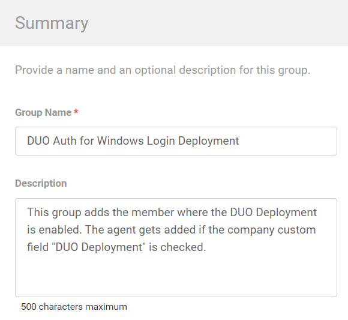
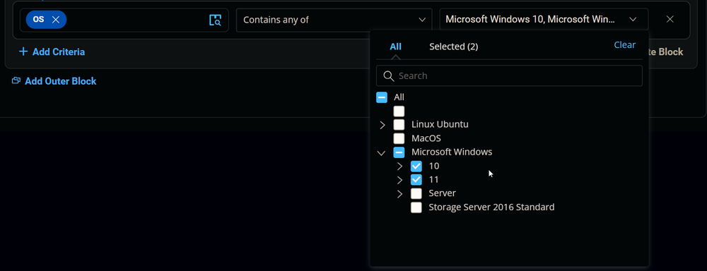
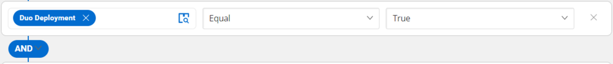
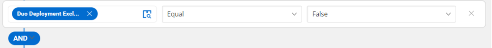

## Summary

This group adds members where the DUO Deployment is enabled. The agent is added if the company custom field "DUO Deployment" is checked.

## Dependencies

[CW RMM Custom Fields - Duo Authentication for Windows Logon Deployment](<../custom-fields/Duo Authentication for Windows Logon Deployment.md>)

## Details

| Field Name                                     | Type of Field (Machine or Organization) | Description                                                                                                                                                    |
|------------------------------------------------|-----------------------------------------|----------------------------------------------------------------------------------------------------------------------------------------------------------------|
| DUO Auth for Windows Login Deployment           | Dynamic                                 | This group adds members where the DUO Deployment is enabled. The agent is added if the company custom field "DUO Deployment" is checked.                   |

## Group Creation

1. Navigate to `Devices` > `Device Groups`.
   

2. Create a new dynamic group by clicking the `Dynamic Group` button.
     
   This page will appear after clicking on the `Dynamic Group` button:  
   

3. Set the group name to `DUO Auth for Windows Login Deployment`.  
   Description: `This group adds members where the DUO Deployment is enabled. The agent is added if the company custom field "DUO Deployment" is checked.`  
   

4. Click `+ Add Criteria` in the `Criteria` section of the group.  
     
   This search box will appear.  
   

5. - Search and select the `OS` from the search box.
   - Mark and select `Microsoft Windows 10` and `Microsoft Windows 11` in the comparison field.  
     
   **Condition:** `OS` `Contains any of` `Microsoft Windows 10, Microsoft Windows 11`

6. - Search and select the `Duo Deployment` custom field from the search box.
   - Set `True` in the comparison condition.  
     
   **Condition:** `Duo Deployment` `Equal` `True`

7. - Search and select the `Duo Deployment Exclude` custom field from the search box.
   - Set `False` in the comparison condition.  
     
   **Condition:** `Duo Deployment Exclude` `Equal` `False`

8. - Search and select the `Duo Deployment Result` custom field from the search box.
   - Set `Failed` in the comparison condition.  
     
   **Condition:** `Duo Deployment Result` `Does Not Contain any of` `Failed`

