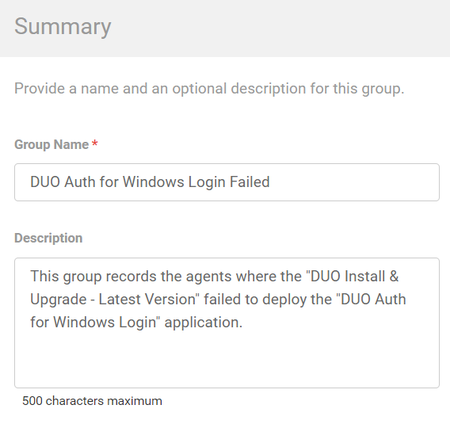
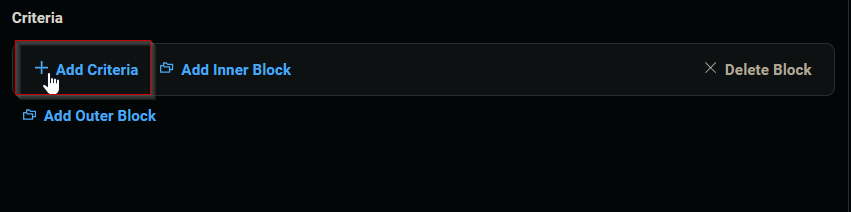
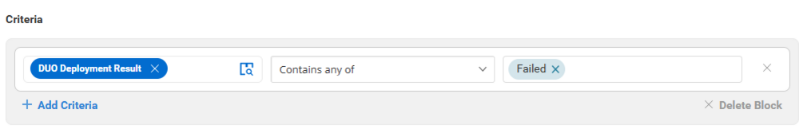

## Summary

This group records the agents where the "DUO Install & Upgrade - Latest Version" failed to deploy the "DUO Auth for Windows Login" application. It is built for auditing purposes.

## Dependencies

[CW RMM Custom Fields - Duo Authentication for Windows Logon Deployment](<../custom-fields/Duo Authentication for Windows Logon Deployment.md>)

## Details

| Field Name                             | Type of Field (Machine or Organization) | Description                                                                                                                                         |
|----------------------------------------|-----------------------------------------|-----------------------------------------------------------------------------------------------------------------------------------------------------|
| DUO Auth for Windows Login Failed      | Dynamic                                 | This group records the agents where the "DUO Install & Upgrade - Latest Version" failed to deploy the "DUO Auth for Windows Login" application. It is built for auditing purposes. |

## Group Creation

1. Navigate to `Devices` > `Device Groups`.  
   

2. Create a new dynamic group by clicking the `Dynamic Group` button.  
     
   This page will appear after clicking on the `Dynamic Group` button:  
   

3. Set the group name to `DUO Auth for Windows Login Failed`.  
   Description: `This group records the agents where the "DUO Install & Upgrade - Latest Version" failed to deploy the "DUO Auth for Windows Login" application.`  
   

4. Click the `+ Add Criteria` in the `Criteria` section of the group.  
     
   This search box will appear.  
   

5. - Search and select the `Duo Deployment Result` custom field from the search box.  
   - Set `Failed` in the comparison condition.  
     
   **Condition:** `Duo Deployment Result` `Contain any of` `Failed`

