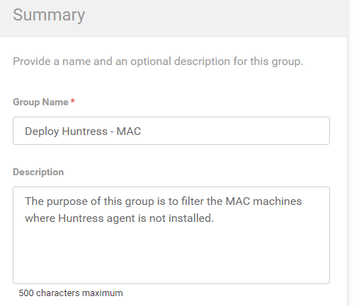
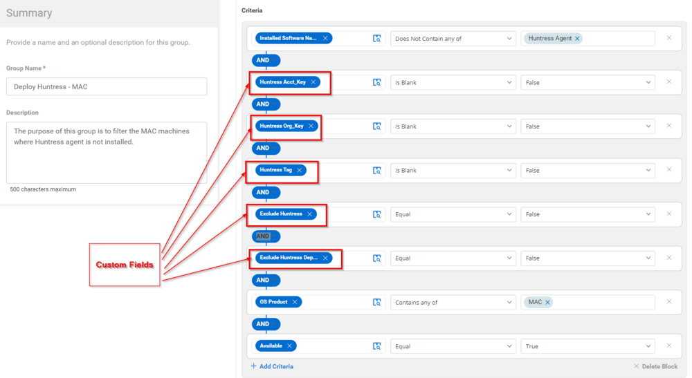
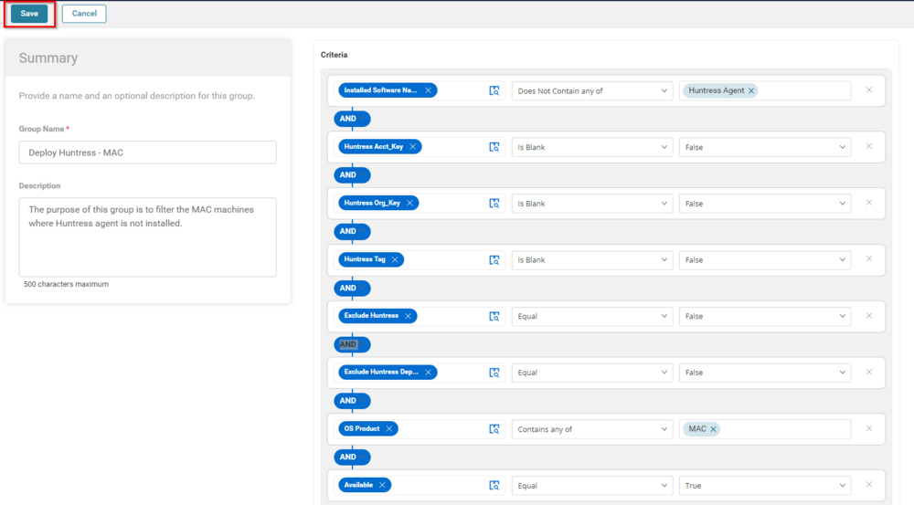
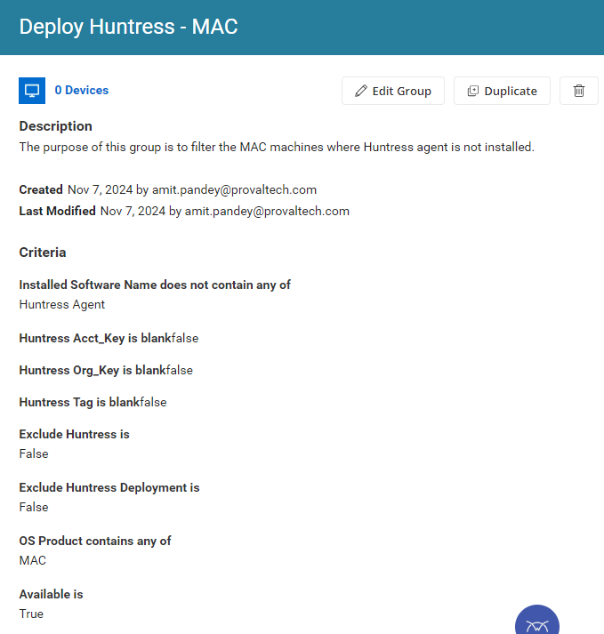

## Summary

The purpose of this group is to filter the MAC machines where the Huntress agent is not installed.

## Dependencies

- [CW RMM - Custom Fields - Huntress Acct_Key](<../custom-fields/Huntress Acct_Key.md>)
- [CW RMM - Custom Fields - Huntress Org_Key](<../custom-fields/Huntress Org_Key.md>)
- [CW RMM - Custom Fields - Huntress Tag](<../custom-fields/Huntress Tag.md>)
- [CW RMM - Custom Fields - Exclude Huntress](<../custom-fields/Exclude Huntress.md>)
- [CW RMM - Custom Fields - Exclude Huntress Deployment](<../custom-fields/Exclude Huntress Deployment.md>)
- [CW RMM - Task - Huntress Agent (INSTALL)](<../tasks/Huntress Agent (INSTALL).md>)

## Group Overview

**Group Type:** Dynamic  
**Group Name:** Deploy Huntress - MAC  
**Description:** The purpose of this group is to filter the MAC machines where the Huntress agent is not installed.

## Criteria

- Installed Software does not contain any of the `Huntress Agent`
- Huntress Acct_Key should not be blank
- Huntress Org_Key should not be blank
- The Huntress Tag should not be blank
- Exclude Huntress should be false
- Exclude Huntress Deployment should be false
- OS Product Contains `MAC`
- Available should be True.

## Saving the Group

Once the above criteria are met, click the Save button to save the group.

