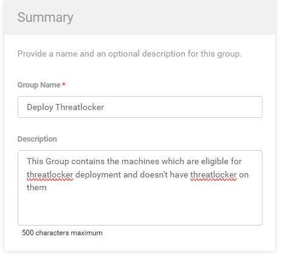
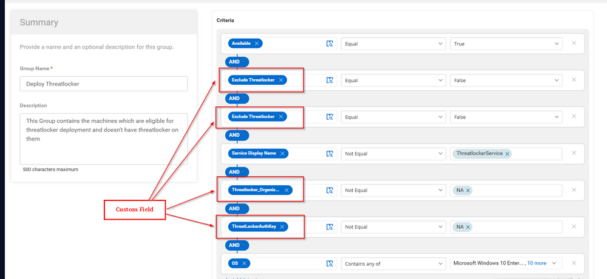
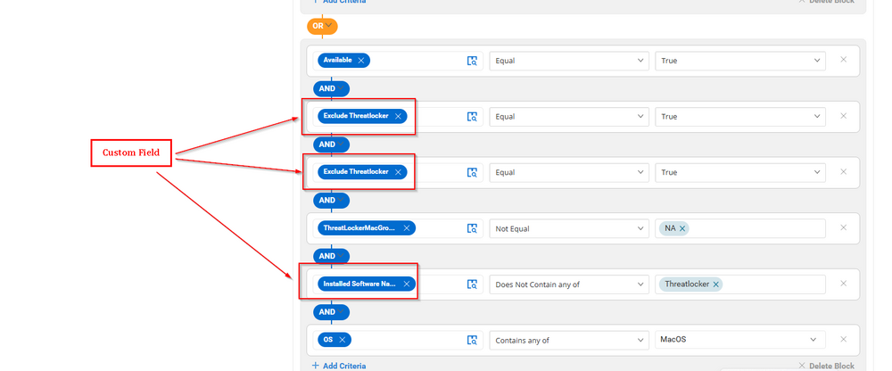
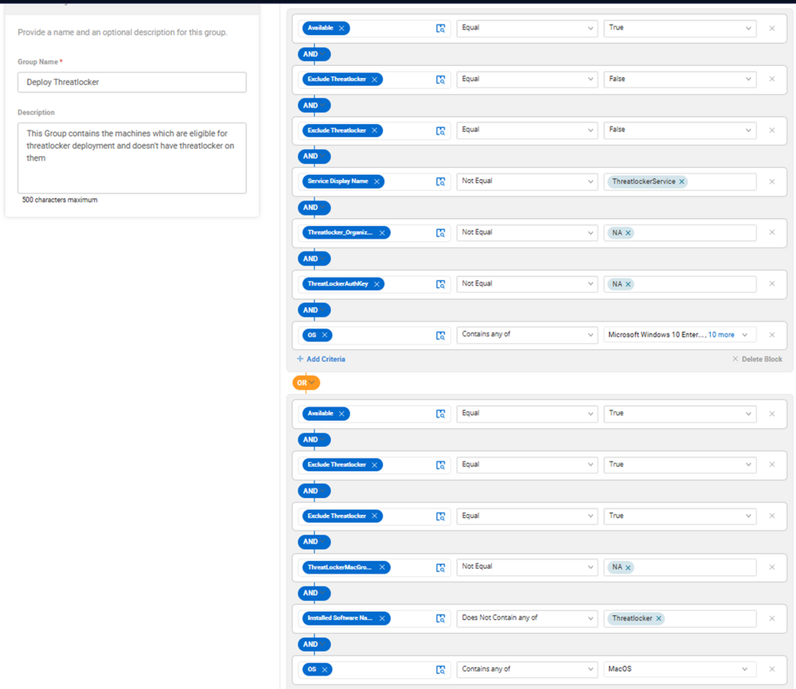
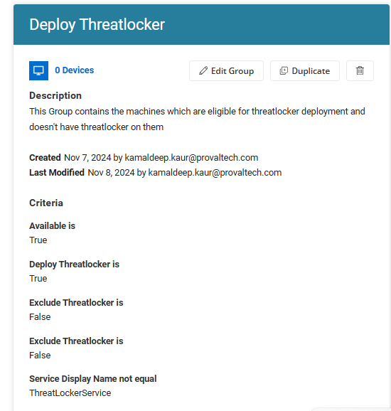

## Summary

This group contains the machines that are eligible for Threatlocker deployment and do not have Threatlocker installed.

## Dependencies

[CW RMM - Solution - Threatlocker Deployment](https://proval.itglue.com/DOC-5078775-17730657)

## Details

| Group Name          | Type of Field (Machine or Organization) | Description                                                                 |
|---------------------|-----------------------------------------|-----------------------------------------------------------------------------|
| Deploy Threatlocker | Dynamic Group                          | This group contains the machines that are eligible for Threatlocker deployment and do not have Threatlocker installed. |

## Criteria

This group is divided into two blocks to work for both Mac and Windows machines:

**For the First Block:**

- Available should be True.
- Exclude Threatlocker (Site) should equal False.
- Exclude Threatlocker (Endpoint) should equal False.
- Service Display Name should not equal "ThreatlockerService."
- Threatlocker_Organization_Name should not be equal to "NA."
- ThreatLockerAuthKey should not be equal to "NA."
- OS should be all Windows machines except EOS machines like Windows 7, 8, XP, 2008 Server, etc.

**For the Second Block:**  
Add another block joining with OR and set the criteria as follows:

- Available should be True.
- Exclude Threatlocker (Site) should equal False.
- Exclude Threatlocker (Endpoint) should equal False.
- Installed Software name does not equal "Threatlocker."
- ThreatLockerMacGroupKey should not be equal to "NA."
- OS should be MAC machines.

## Group

Once the above criteria are set, click the Save button to save the group.

