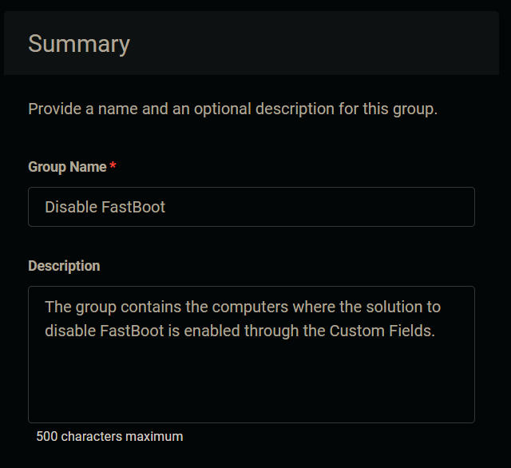
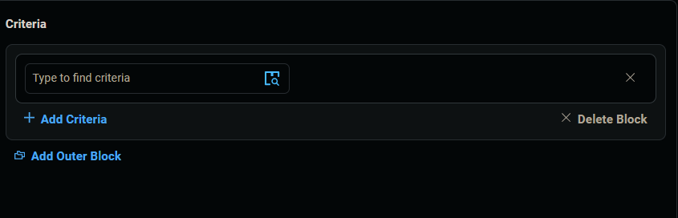
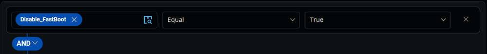
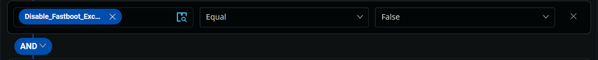
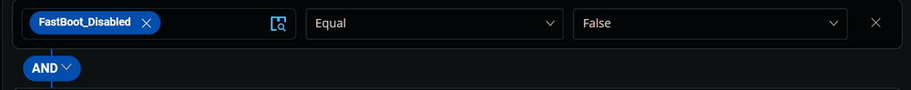
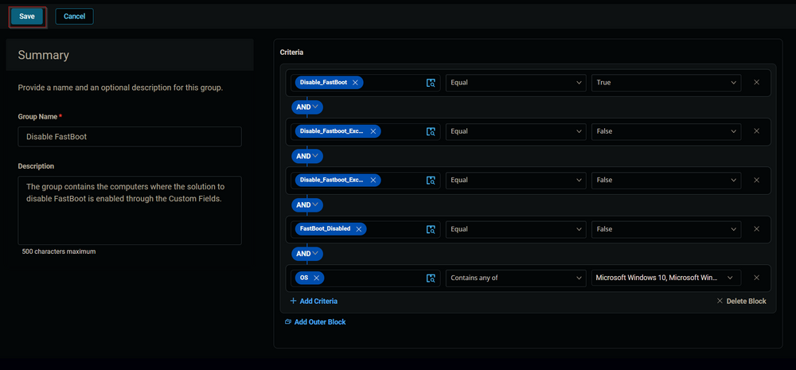
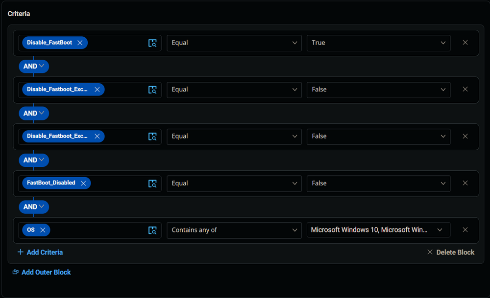
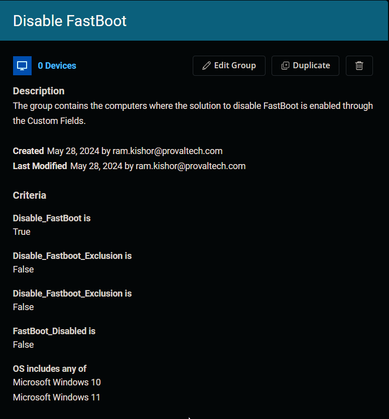

## Summary

The group contains the computers where the solution to disable FastBoot is enabled through the Custom Fields.

## Dependencies

- [CW RMM - Custom Field - Company - Disable_FastBoot](<../custom-fields/CW RMM - Custom Field - Company - Disable_FastBoot.md>)
- [CW RMM - Custom Field - Endpoint - FastBoot_Disabled](<../custom-fields/Endpoint - FastBoot_Disabled.md>)
- [CW RMM - Custom Field - Endpoint - Disable_Fastboot_Exclusion](<../custom-fields/Endpoint - Disable_Fastboot_Exclusion.md>)
- [CW RMM - Custom Field - Site - Disable_Fastboot_Exclusion](<../custom-fields/Site - Disable_Fastboot_Exclusion.md>)

## Group Creation

1. Navigate to `Devices` > `Device Groups`.  
   

2. Create a new dynamic group by clicking the `Dynamic Group` button.  
     
   This page will appear after clicking on the `Dynamic Group` button:  
   

3. Set the group name to `Disable FastBoot`.  
   

4. Click the `+ Add Criteria` in the `Criteria` section of the group.  
     
   This search box will appear.  
   

5. 
   - Search and select the `Disable_FastBoot` custom field from the search box.
   - Set `True` in the comparison condition.  
     
   **Condition:** `Disable_FastBoot` `Equal` `True`

6. 
   - Search and select the Site-Level `Disable_FastBoot_Exclusion` custom field from the search box.
   - Set `False` in the comparison condition.  
     
   **Condition:** `Disable_FastBoot_Exclusion` `Equal` `False`

7. 
   - Search and select the Endpoint-Level `Disable_FastBoot_Exclusion` custom field from the search box.
   - Set `False` in the comparison condition.  
     
   **Condition:** `Disable_FastBoot_Exclusion` `Equal` `False`

8. 
   - Search and select the Endpoint-Level `FastBoot_Disabled` custom field from the search box.
   - Set `False` in the comparison condition.  
     
   **Condition:** `FastBoot_Disabled` `Equal` `False`

9. 
   - Search and select the `OS` from the search box.
   - Mark and select `Microsoft Windows 10` and `Microsoft Windows 11` in the comparison field.  
     
   **Condition:** `OS` `Contains any of` `Microsoft Windows 10, Microsoft Windows 11`

10. Click the `Save` button to save/create the group.  
    

## Completed Group

  

