## Summary

Classify Windows 10 and 11 computers that are already using the latest build version but still possess a value in any of the associated custom fields.

## Dependencies

- [CW RMM - Task - Feature Update Install With Tracking](https://proval.itglue.com/DOC-5078775-12947845)
- [CW RMM - Custom Field - WinFeatUpgradeAttempts](https://proval.itglue.com/DOC-5078775-12949095)
- [CW RMM - Custom Field - Feature Update Reboot Pending](https://proval.itglue.com/DOC-5078775-14592255)
- [CW RMM - Custom Field - Feature Update Install Failure](https://proval.itglue.com/DOC-5078775-14592254)
- [CW RMM - Task - Feature Update Install with Tracking (Reset Custom Fields)](https://proval.itglue.com/DOC-5078775-14591609)

## Summary

**Group Type:** Dynamic

**Group Name:** Feature Pack Update - Updated Computers

**Description:** Categorize the Windows 10 and 11 computers that are already on the latest build version.

## Criteria

- Select `OS Build Number` for the Criteria
  - Contains any of `19045` and `22631` in the condition box.
  

  
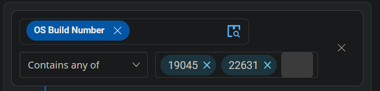

- Click the `Add Criteria` button to add another Criteria.

- Select `OS` for the Criteria
  - Contains any of `Microsoft Windows 10 and 11` for the condition.

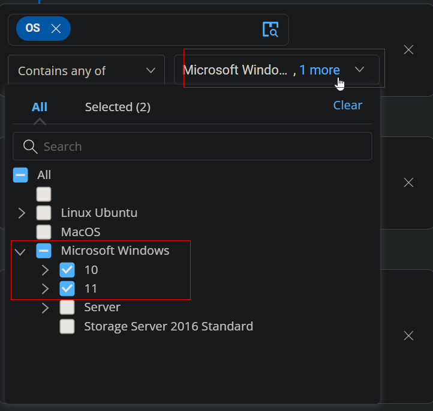

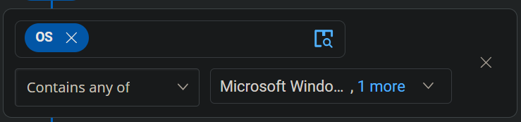

- Add an Outer Block by clicking the `Add Outer Block` button.

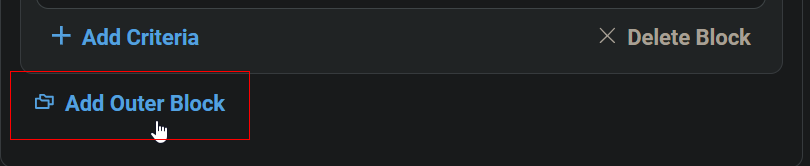

- The main outer block should be using AND and not OR.

- In the `Outer Block`, Select `Feature Update Install Failure` custom field for criteria, 
  - Contains any of `Error` in the condition box.

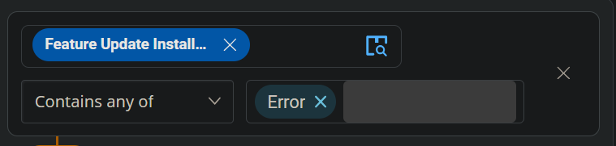

- Select `Feature Update Reboot Pending` custom field for criteria, `Equal` for comparator and type `True` in the condition box.

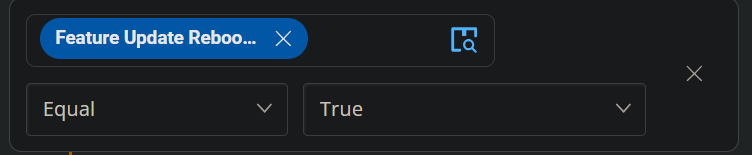

- Add another criteria by clicking the `Add Criteria` button inside the outer block.

- Choose the `WinFeatUpgradeAttempts` custom field for criteria, 
  - Contains any of integers from 1 to 15 in the condition field. Enter each number individually, pressing Enter after each one: 1,2,3, 4, 5, 6, 7, 8, 9, 10, 11, 12, 13, 14, 15.

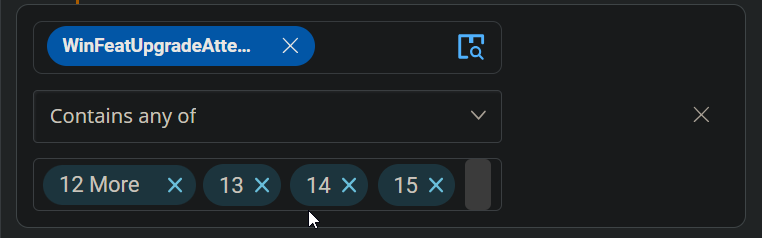

- Now, change the comparators from `AND` to `OR` inside the outer block.

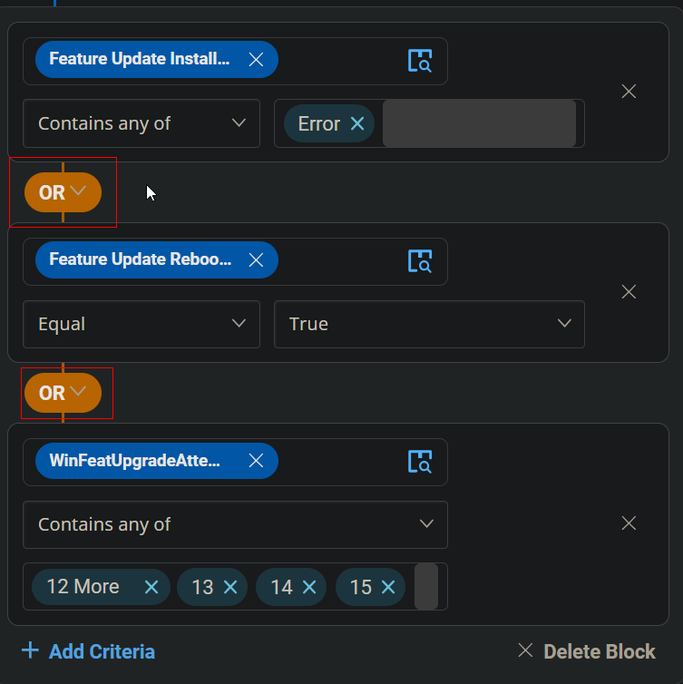

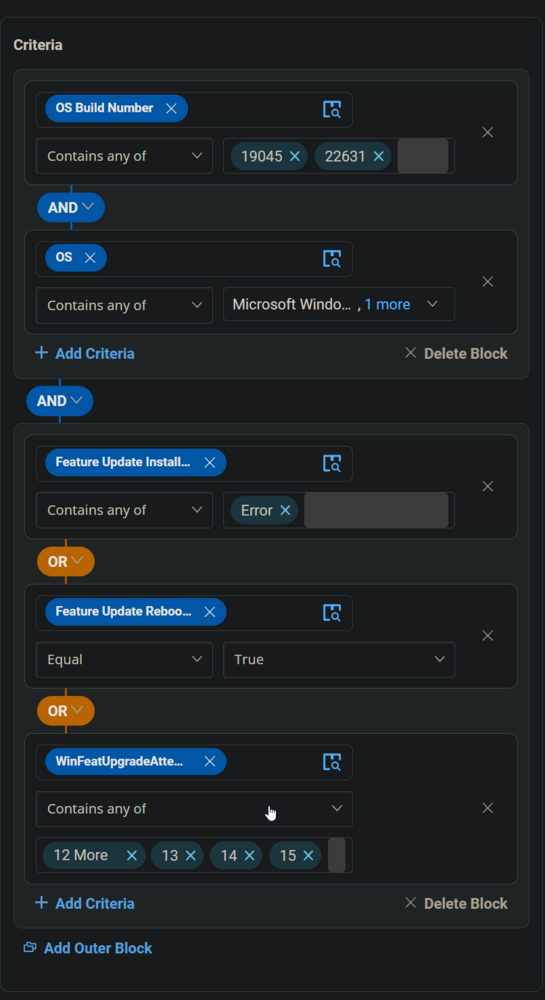

## Group

Click the Save button to Save the Group.

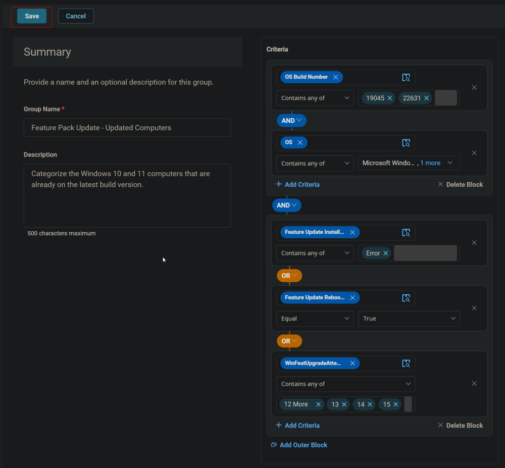

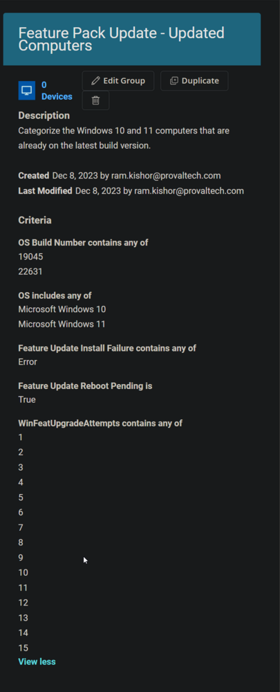

