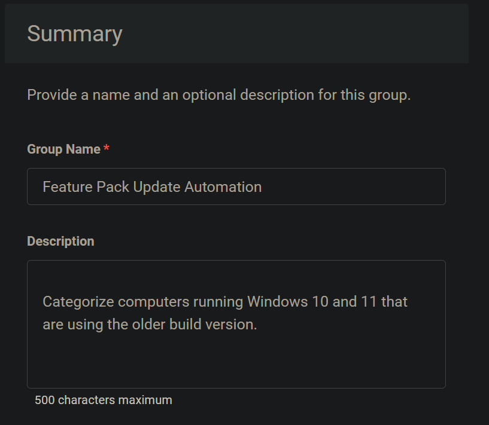
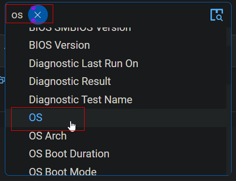
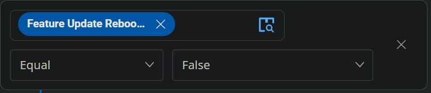
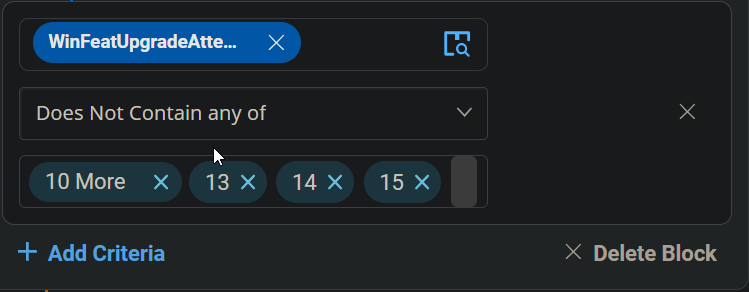
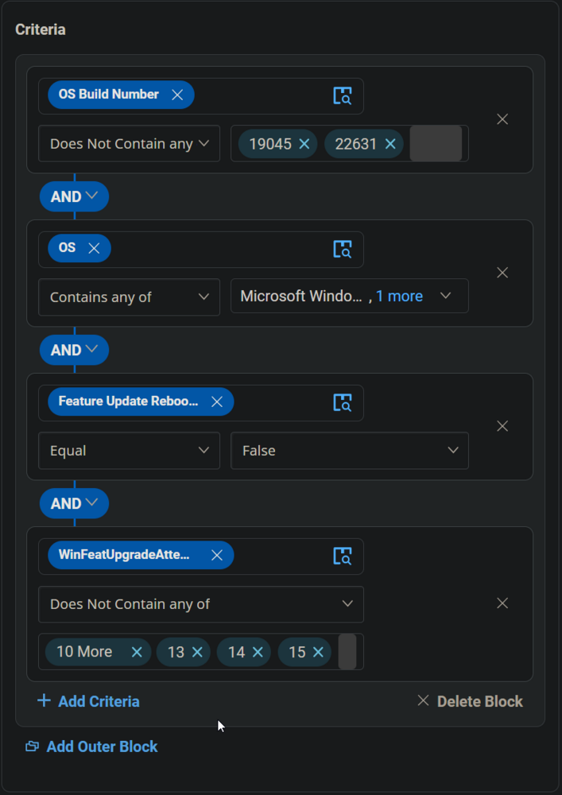
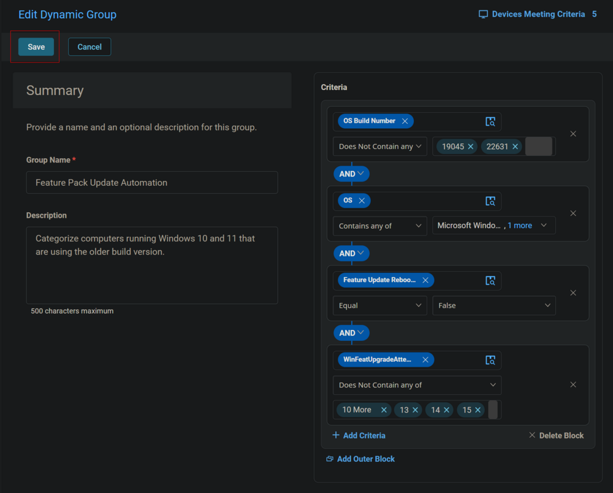
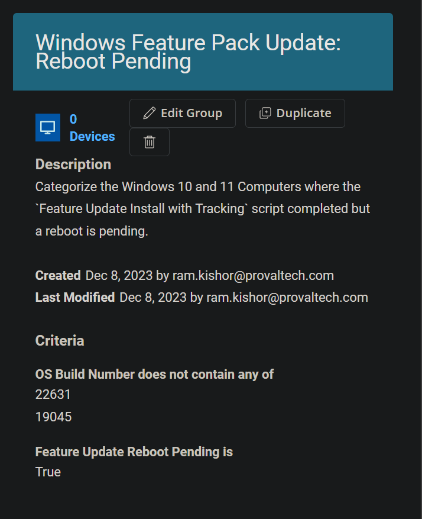

## Summary

Organize computers operating on older build versions of Windows 10 and 11. The grouping involves comparing the computer's build version with the latest available build for the operating system. Currently, the latest builds are 22631 for Windows 11 and 19045 for Windows 10; these values should be updated manually in the group's criteria after Microsoft releases the newer builds.

## Dependencies

- [CW RMM - Task - Feature Update Install With Tracking](https://proval.itglue.com/DOC-5078775-12947845)
- [CW RMM - Custom Field - WinFeatUpgradeAttempts](https://proval.itglue.com/DOC-5078775-12949095)
- [CW RMM - Custom Field - Feature Update Reboot Pending](https://proval.itglue.com/DOC-5078775-14592255)

## Summary

**Group Type:** Dynamic Group  
**Group Name:** Feature Pack Update Automation  
**Description:** Categorize computers running Windows 10 and 11 that are using the older build version.

## Criteria

- Select `OS Build Number` for the Criteria `Does Not Contain any` for comparator and type `19045` and `22631` in the condition box.  
    
    
  

- Click the `Add Criteria` button to add another Criteria.  
  

- Select `OS` for the Criteria `Contains any of` for comparator and `Microsoft Windows 10 and 11` for the condition.  
    
    
  

- Add another criteria by clicking the `Add Criteria` button.

- Select `Feature Update Reboot Pending` custom field for criteria, `Equal` for comparator and type `False` in the condition box.  
  

- Add another criteria by clicking the `Add Criteria` button.

- Choose the `WinFeatUpgradeAttempts` custom field for criteria, select `Does Not Contain any` for the comparator, and enter the integers from 3 to 15 in the condition field. Enter each number individually, pressing Enter after each one: 3, 4, 5, 6, 7, 8, 9, 10, 11, 12, 13, 14, 15.  
    
  

## Group

Click the Save button to Save the Group.  

