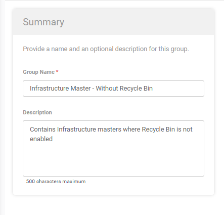
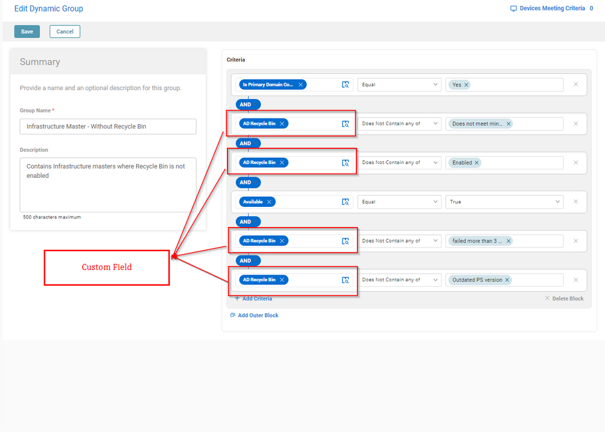
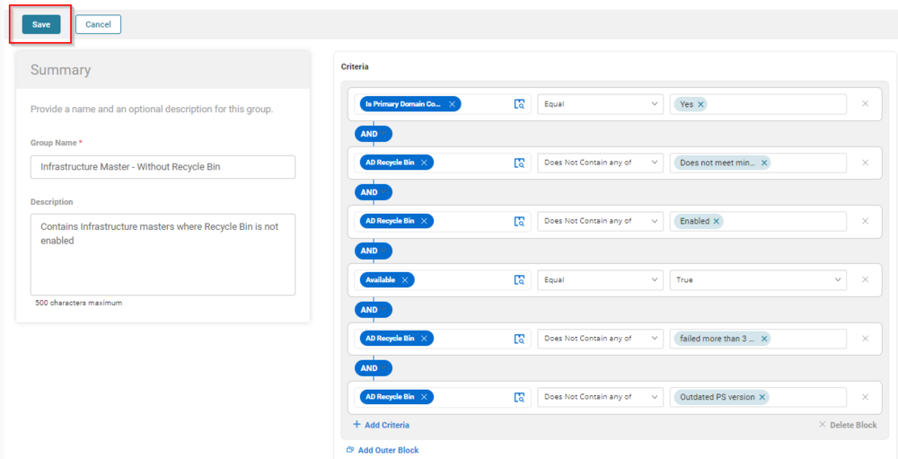
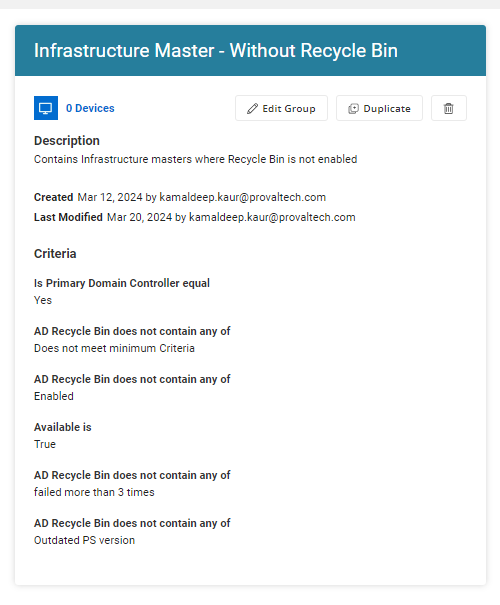

## Summary

The purpose of this group is to filter Windows Infrastructure master where the Recycle bin is not enabled.

## Dependencies

[CW RMM - Task - Enable AD Recycle Bin](https://proval.itglue.com/DOC-5078775-15349513)

## Summary

**Group Type:** Dynamic  
**Group Name:** Infrastructure Master - Without Recycle Bin  
**Description:** Contains Infrastructure masters where Recycle Bin is not enabled  

### Criteria

- Is Primary Domain Controller should be equal to `Yes`
- AD Recycle Bin Does not contain any of `Does not meet minimum Criteria`
- AD Recycle Bin Does not contain any of `Enabled`
- Available Should be True.
- AD Recycle Bin Does not contain any of `failed more than 3 times`
- AD Recycle Bin Does not contain any of `Outdated PS version`

## Group

Once adding the above criteria, click the Save button to Save the Group.  

