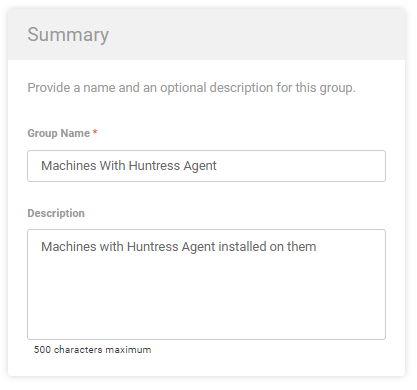
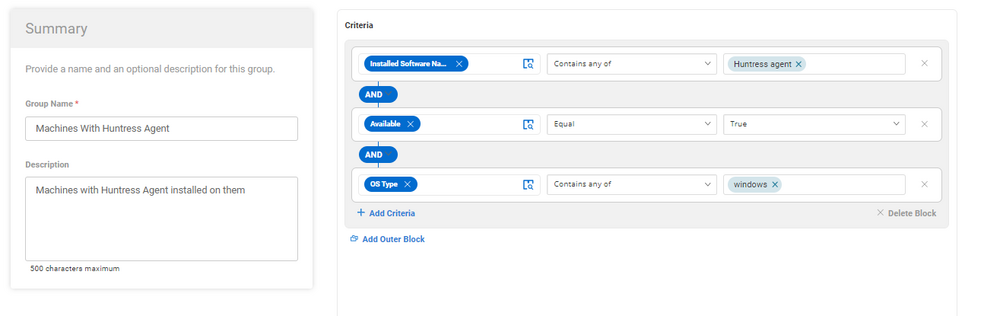
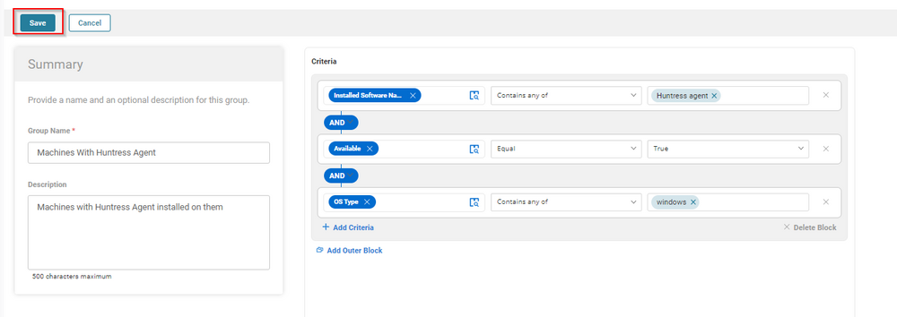
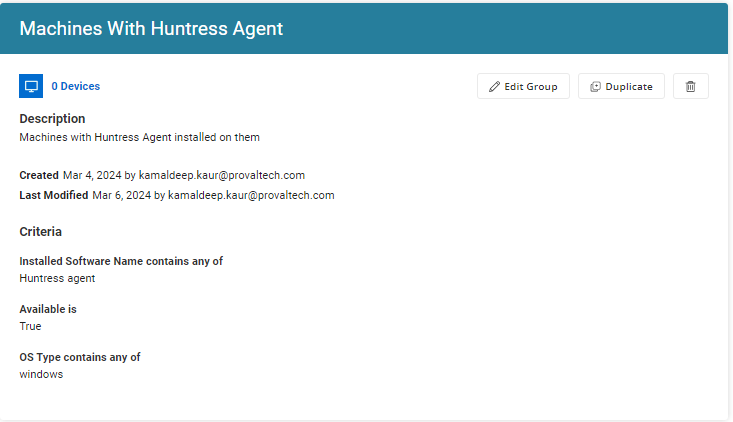

## Summary

This group filters out windows machines with huntress agent installed on them.

## Summary

**Group Type:** Dynamic  
**Group Name:** Machines With Huntress Agent  
**Description:** Machines with Huntress Agent installed on them  

## Criteria

- Installed Software contains any of `Huntress Agent`
- OS Product Contains of `Windows`
- Available Should be True.

## Group

Once adding the above criteria, click the Save button to Save the Group.  

