## Summary

Groups computers where Cumulative Update was installed by the Out of Date Cumulative Update (Autofix) task but a reboot is pending.

## Dependencies

[CW RMM - Custom Field - EndPoint - Out_of_Date_CU_Autofix_Result](https://proval.itglue.com/DOC-5078775-15748265)  
[CW RMM - Custom Field - EndPoint - Out_of_Date_CU_Autofix_Date](https://proval.itglue.com/DOC-5078775-15748263)  

## Group Creation

1. Navigate to `Devices` > `Device Groups`.
   

2. Create a new dynamic group by clicking the `Dynamic Group` button.  
     
   This page will appear after clicking on the `Dynamic Group` button:  
   

3. Set the group name to `Out of Date CU _ Reboot Pending`.  
   Description: `Groups computers where Cumulative Update was installed by the Out of Date Cumulative Update (Autofix) task but a reboot is pending.`  
   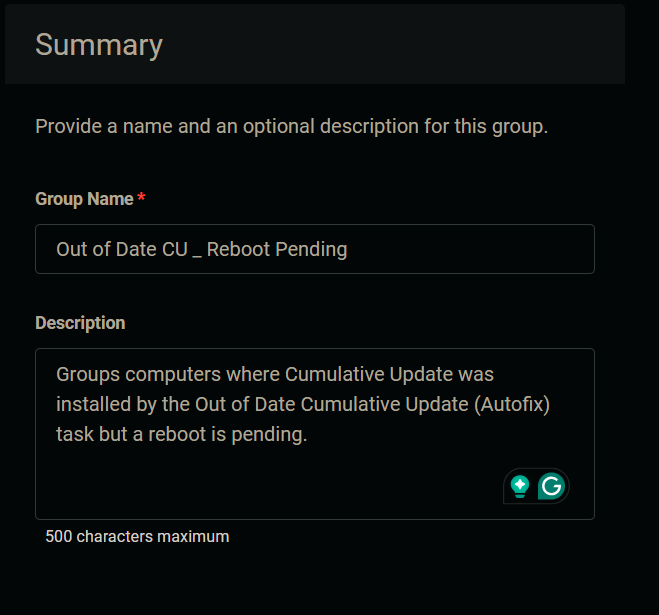

4. Click the `+ Add Criteria` in the `Criteria` section of the group.  
     
   This search box will appear.  
   

5. Search and select the `Out_of_Date_CU_Autofix_Result` custom field from the search box.  
     
   Type `Reboot Pending` in the comparison condition and press `Enter`.  
   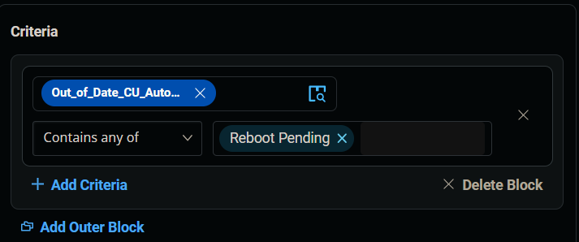  
   **Condition:** `Out_of_Date_CU_Autofix_Result` `Contains any of` `Reboot Pending`

6. Click the `+ Add Criteria` button.  
   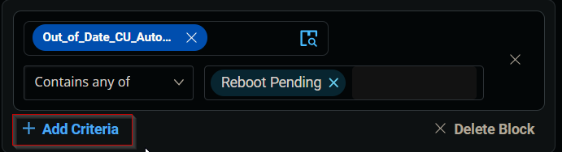  
   A new search box will appear.  
   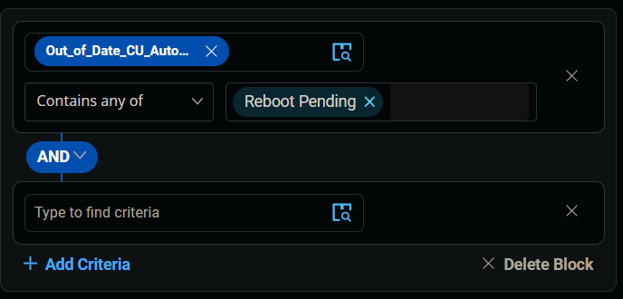  
   Search and select the `OS` Criteria.  
   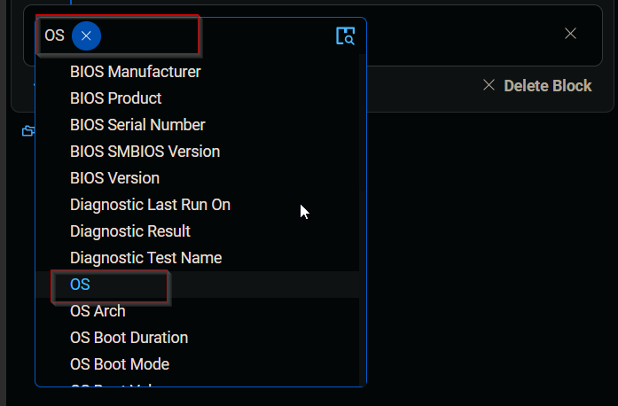  
   Select all available instances of `Microsoft Windows` `10`, `11`, `Server 2016`, `2019`, and `2022` in the comparison Field.  
     
   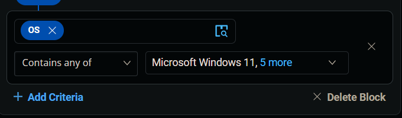  
   Condition: `OS` `Contains any of` `Microsoft Windows 10`, `Microsoft Windows 11`, `Microsoft Windows Server 2016`, `Microsoft Windows Server 2019`, `Microsoft Windows Server 2022`

7. Click the `+ Add Criteria` button.  
   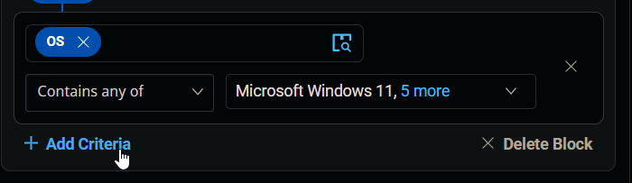  
   A new search box will appear.  
   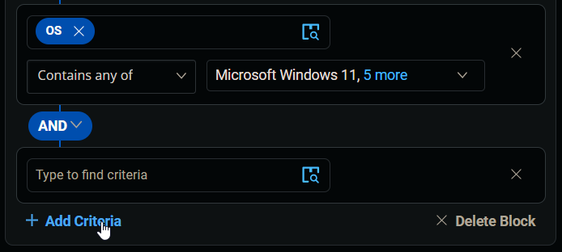  
   Search and select the `Out_of_Date_CU_Autofix_Date` custom field from the search box.  
   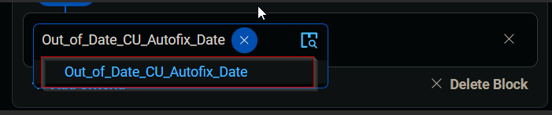  
   Change the comparator to `Does Not Contain any of`.  
   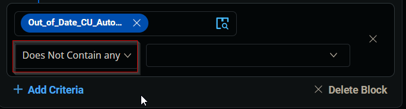  
   Type `0001-01-01 00:00:00` in the comparison field and press `Enter`.  
   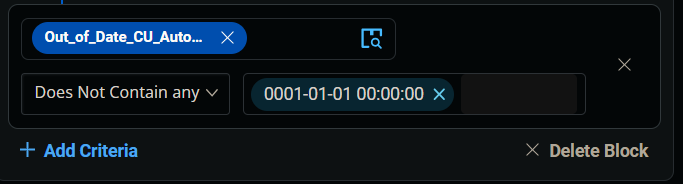  
   **Condition:** `Out_of_Date_CU_Autofix_Date` `Does Not Contain any of` `0001-01-01 00:00:00`

8. Click the `Save` button to save/create the group.  
   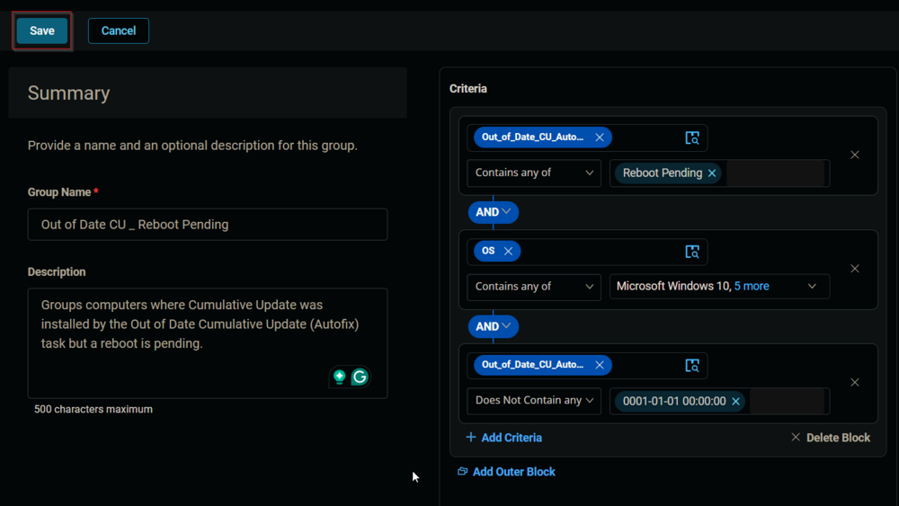

## Completed Group

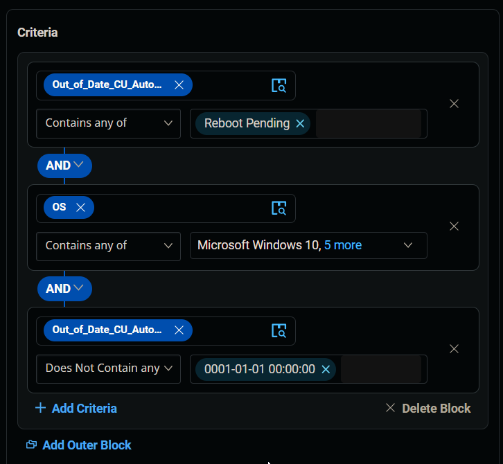  
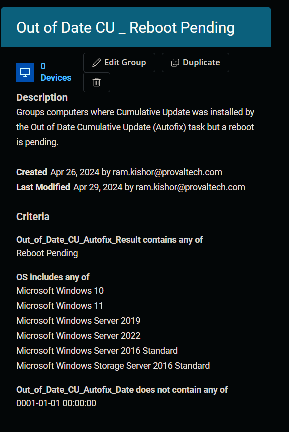

