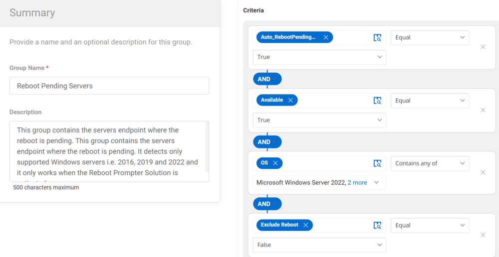

## Summary

This group contains the server endpoints where a reboot is pending. It detects only supported Windows servers, specifically 2016, 2019, and 2022, and it only works when the Reboot Prompter Solution is activated.

## Dependencies

[CW RMM - Custom Fields - Reboot Prompter](/docs/7876f32c-a5ec-4b58-9f7e-b60b710e19d5)

## Details

| Field Name                 | Type of Field (Machine or Organization) | Description                                                                                                                                                                                                                                                                                                                                                                         |
|----------------------------|-----------------------------------------|-------------------------------------------------------------------------------------------------------------------------------------------------------------------------------------------------------------------------------------------------------------------------------------------------------------------------------------------------------------------------------------|
| Reboot Pending Servers      | Dynamic Group                          | This group contains the server endpoints where a reboot is pending. It detects only supported Windows servers, specifically 2016, 2019, and 2022, and it only works when the Reboot Prompter Solution is activated.                                                                                                                                                                 |

## Group Creation

### 1. Create Dynamic Groups:

### 2. Reboot Pending Servers

**Criteria:**

- Auto_RebootPendingCheck custom field equals True.
- The agent available equals True.
- The OS contains any of Windows 2016, Windows 2019, or Windows 2022.
- The Exclude reboot custom field equals False.

