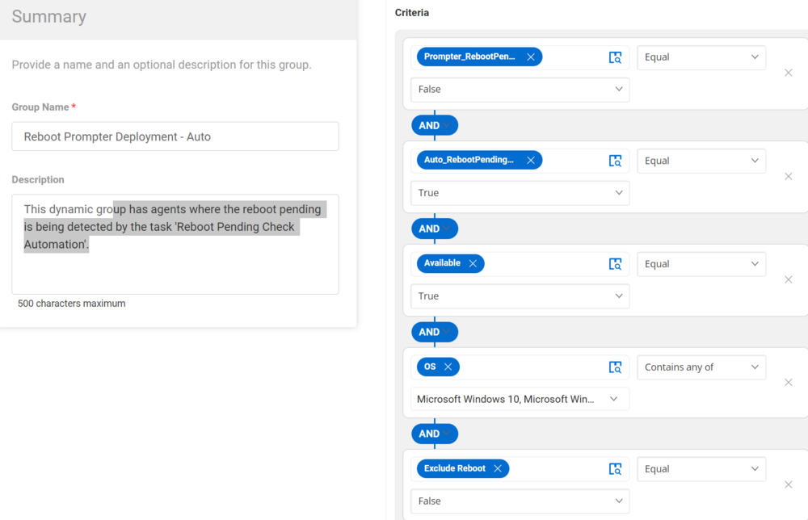

## Summary

This dynamic group depends on the endpoint custom field 'Auto_RebootPendingCheck' being checked, and the agent should be available to check into the group.

## Dependencies

- Auto_RebootPendingCheck --> Custom field (Endpoint)  
- [CW RMM - Custom Fields - Reboot Prompter](https://proval.itglue.com/DOC-5078775-15298950)  
- [CW RMM - Task - Reboot Pending Check Automation](<../tasks/Reboot Pending Check Automation.md>)  

## Details

| Field Name                            | Type of Field (Machine or Organization) | Description                                                                                                                                                        |
|---------------------------------------|-----------------------------------------|--------------------------------------------------------------------------------------------------------------------------------------------------------------------|
| Reboot Prompter Deployment - Auto     | Dynamic Group                           | This dynamic group detects the agents where the custom field 'Auto_RebootPendingCheck' is checked. The custom field is automatically managed by the task 'Reboot Pending Check Automation'. |

## Group Creation

1. **Create Dynamic Groups:**

   

2. **Reboot Prompter Deployment - Auto**

   

   **Criteria:**

   - Prompter_RebootPending custom field equals False.
   - Auto_RebootPendingCheck custom field equals True.
   - The agent available equals True.
   - The OS contains either Windows 10 or Windows 11.
   - Exclude Reboot custom field equals False.

