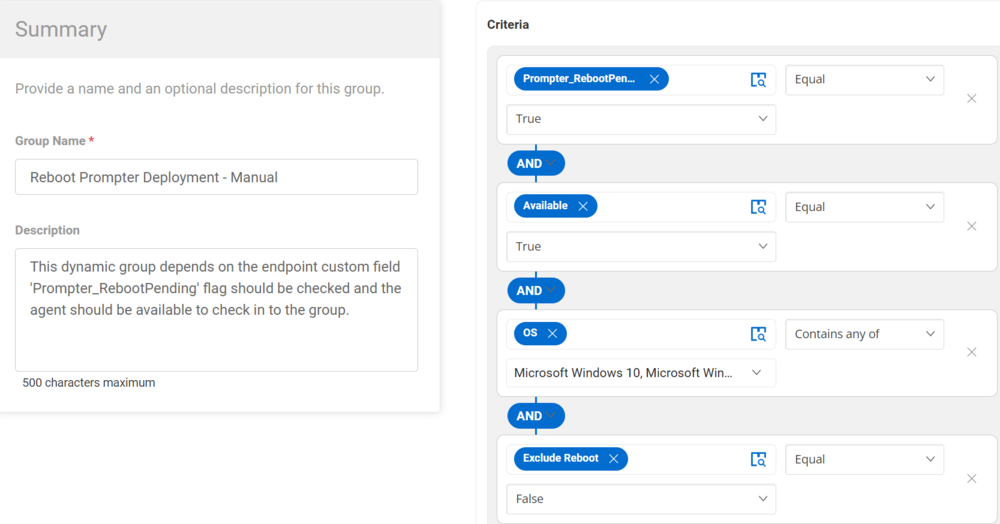

## Summary

This dynamic group depends on the endpoint custom field 'Prompter_RebootPending'. The flag should be checked, and the agent should be available to check in to the group.

## Dependencies

Reboot_PendingReboot --> Custom field (Endpoint)  
[CW RMM - Custom Fields - Reboot Prompter](https://proval.itglue.com/DOC-5078775-15298950)  

## Details

| Field Name                          | Type of Field (Machine or Organization) | Description                                                                                                                                                      |
|-------------------------------------|-----------------------------------------|------------------------------------------------------------------------------------------------------------------------------------------------------------------|
| Reboot Prompter Deployment - Manual | Dynamic Group                          | This dynamic group depends on the endpoint custom field 'Prompter_RebootPending'. The flag should be checked, and the agent should be available to check in to the group. |

## Group Creation 

1. Create Dynamic Groups:  
   

2. Reboot Prompter Deployment - Manual  
     

   Criteria:
   - Prompter_RebootPending custom field equals True.
   - The agent available equals True.
   - The OS contains either Windows 10 or Windows 11.
   - Exclude Reboot custom field equals False.

