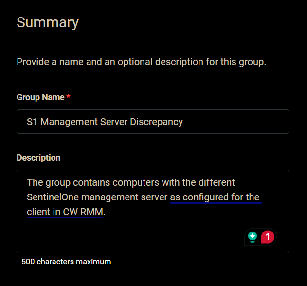
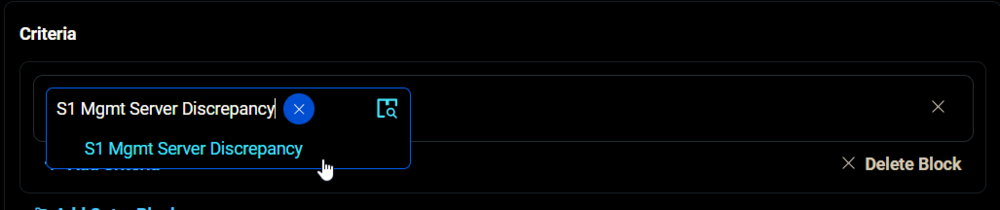
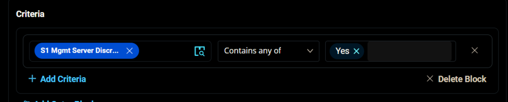
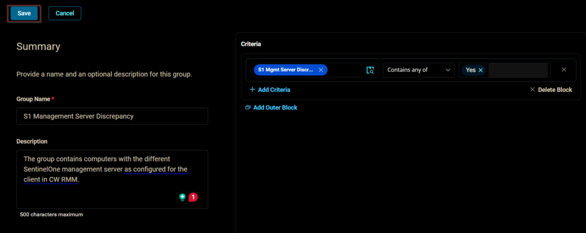
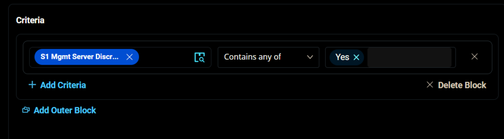
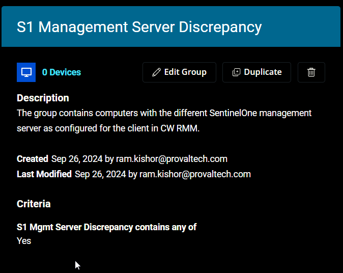

## Summary

The group contains computers with the different SentinelOne management server as configured for the client in CW RMM.

## Dependencies

[CW RMM - Custom Field - Endpoint - S1 Mgmt Server Discrepancy](https://proval.itglue.com/DOC-5078775-17312742)

## Group Creation

1. Navigate to `Devices` > `Device Groups`.
   

2. Create a new dynamic group by clicking the `Dynamic Group` button.

   

   This page will appear after clicking on the `Dynamic Group` button:
   

3. Set the group name to `S1 Management Server Discrepancy`.  
   Description: `The group contains computers with the different SentinelOne management server as configured for the client in CW RMM.`
   

4. Click the `+ Add Criteria` in the `Criteria` section of the group.
     
   This search box will appear.
   

5. Search and select the [`S1 Mgmt Server Discrepancy`](https://proval.itglue.com/DOC-5078775-17312742) custom field from the search box.
     
   Set `Yes` in the comparison condition.
     

   **Condition:** [`S1 Mgmt Server Discrepancy`](https://proval.itglue.com/DOC-5078775-17312742) `Contains any of` `Yes`

6. Click the `Save` button to save/create the group.
   

## Completed Group

  

