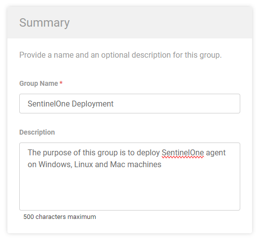
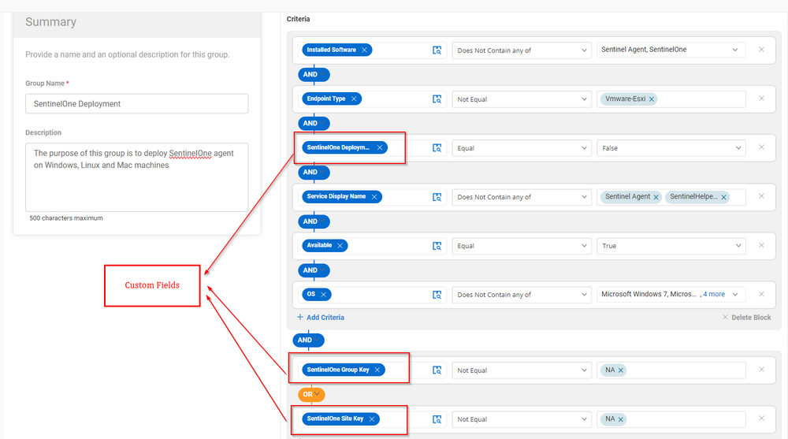
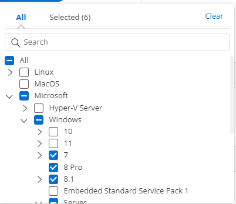
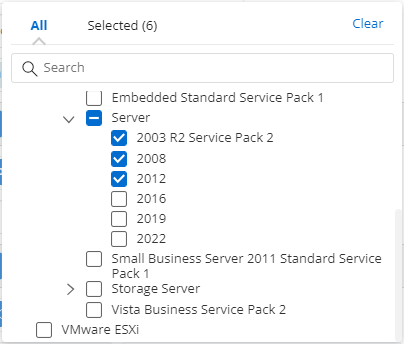
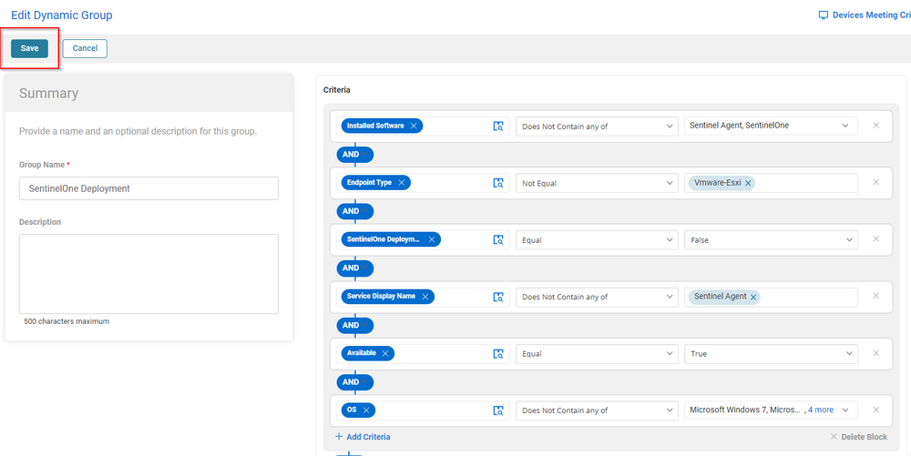
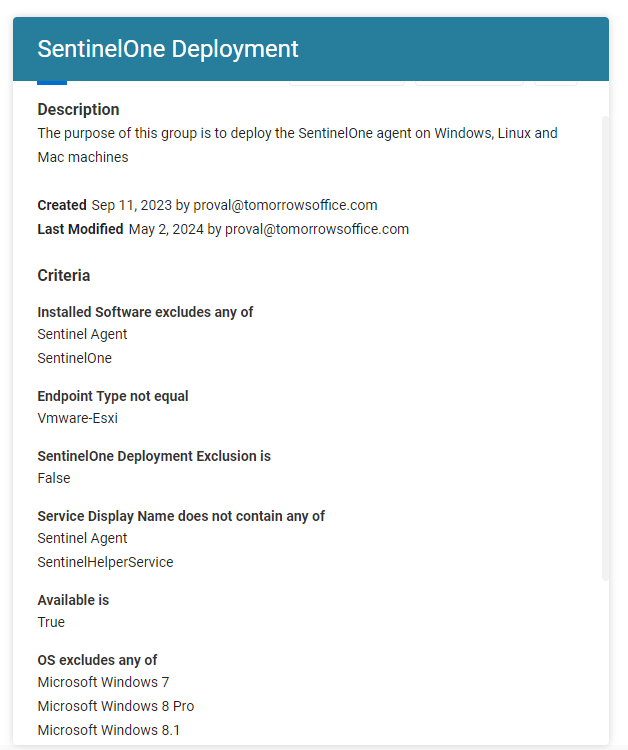

## Summary

The purpose of this group is to deploy SentinelOne agent on Windows, Linux and Mac machines.

## Dependencies

- [CW RMM - Custom Field - Flag - SentinelOne Deployment Exclusion](https://proval.itglue.com/DOC-5078775-15805740)  
- [CW RMM - Custom Field - Site - SentinelOne Site Key](https://proval.itglue.com/DOC-5078775-15805088)  
- [CW RMM - Custom Field - Site - SentinelOne Group Key](https://proval.itglue.com/DOC-5078775-15805085)  

## Summary

**Group Type:** Dynamic  
**Group Name:** SentinelOne Deployment  
**Description:** The purpose of this group is to deploy the SentinelOne agent on Windows, Linux and Mac machines.

### Criteria

- Installed Software does not contain any of `Sentinel Agent,Sentinelone`
- Endpoint type not equal to `Vmware-ESXi`
- `SentinelOne Deployment Exclusion` custom field equal to false.
- Service Display name does not contain any of the `Sentinel agent`
- Available should be True.
- OS does not contain any of the out of support machines like `windows 7,8 and server 2003,2008,2012`  
  Click on the Dropdown --> expand Microsoft --> Click on 7, 8 Pro, 8.1  
    
  Now Expand Server and click on 2003 R2 Service Pack 2, 2008 and 2012  
    

- SentinelOne Group Key should not equal to `NA`
- SentinelOne Site Key should not equal to `NA`

## Group

Once adding the above criteria, click the Save button to save the Group.  
  

  

