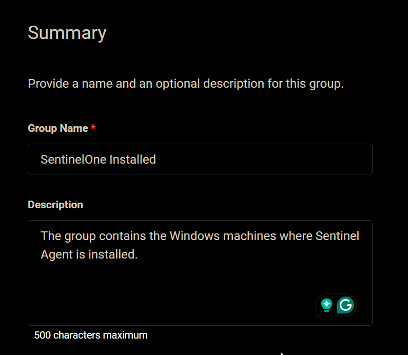
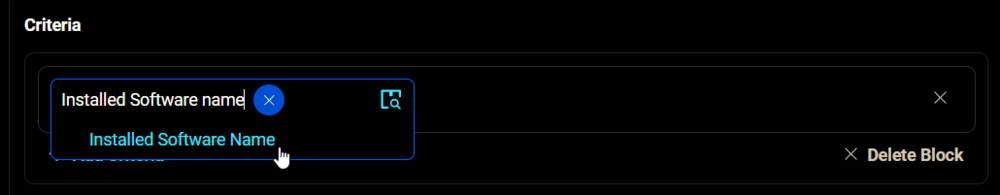
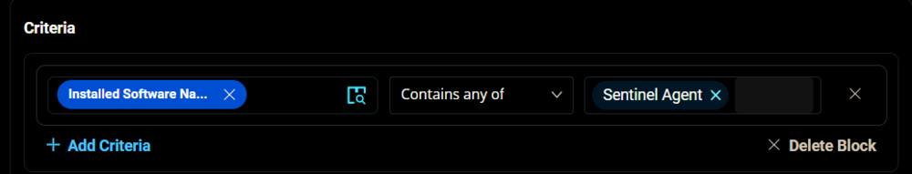
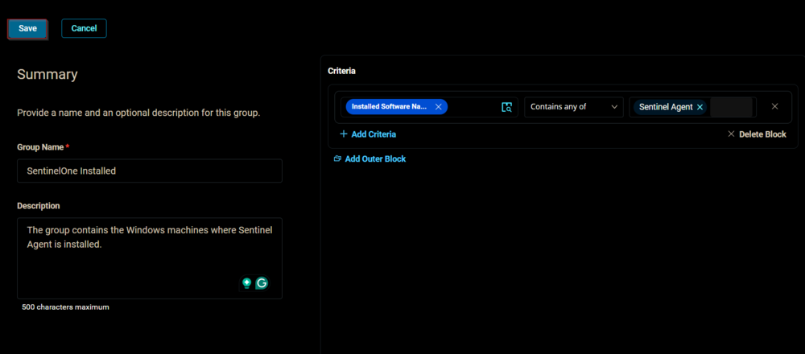
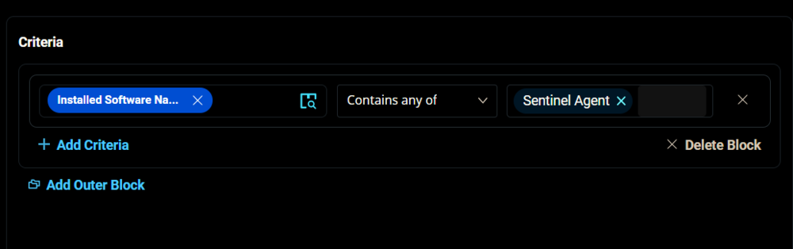
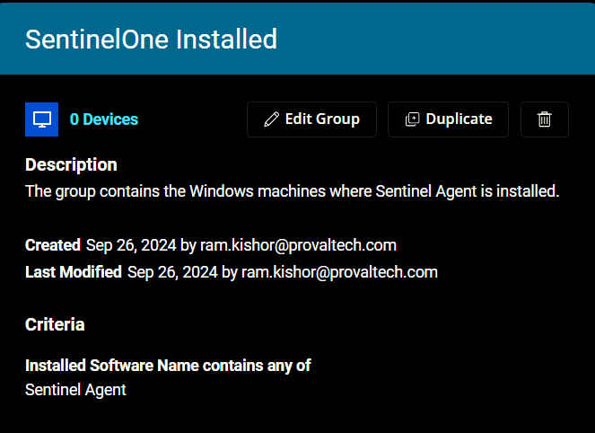

## Summary

This document outlines the process for creating a dynamic group that includes Windows machines with the Sentinel Agent installed.

## Group Creation

1. Navigate to `Devices` > `Device Groups`.
   

2. Create a new dynamic group by clicking the `Dynamic Group` button.  
     
   The following page will appear after clicking the `Dynamic Group` button:  
   

3. Set the group name to `SentinelOne Installed`.  
   Description: `The group contains the Windows machines where the Sentinel Agent is installed.`  
   

4. Click the `+ Add Criteria` in the `Criteria` section of the group.  
     
   This search box will appear.  
   

5. Search and select the `Installed Software Name` condition from the search box.  
     
   Set `Sentinel Agent` in the comparison condition.  
     
   **Condition:** `Installed Software Name` `Contains any of` `Sentinel Agent`

6. Click the `Save` button to save/create the group.  
   

## Completed Group

  

