## Summary

Houses the computers where the Windows 11 Installer (Beta) task has been executed but haven't rebooted since then.

## Dependencies

- [CW RMM - Custom Field - Company - Enable Windows 11 Installation](https://proval.itglue.com/DOC-5078775-15835788)
- [CW RMM - Custom Field - Site - Exclude Windows 11 Installation](https://proval.itglue.com/DOC-5078775-15835797)
- [CW RMM - Custom Field - Endpoint - Exclude Windows 11 Installation](https://proval.itglue.com/DOC-5078775-15835791)
- [CW RMM - Custom Field - Endpoint - Windows 11 Compatible](https://proval.itglue.com/DOC-5078775-15835398)
- [CW RMM - Task - Windows 11 Compatibility Validation](https://proval.itglue.com/DOC-5078775-15835244)

## Group Creation

1. Navigate to `Devices` > `Device Groups`.
   

2. Create a new dynamic group by clicking the `Dynamic Group` button.
   
   
   This page will appear after clicking on the `Dynamic Group` button:  
   

3. Set the group name to `Upgrade Enabled Windows 11 Compatible Machines`.  
   Description: `A group of Windows 10 machines that are compatible with Windows 11 installation and upgrade has been enabled through the custom fields.`  
   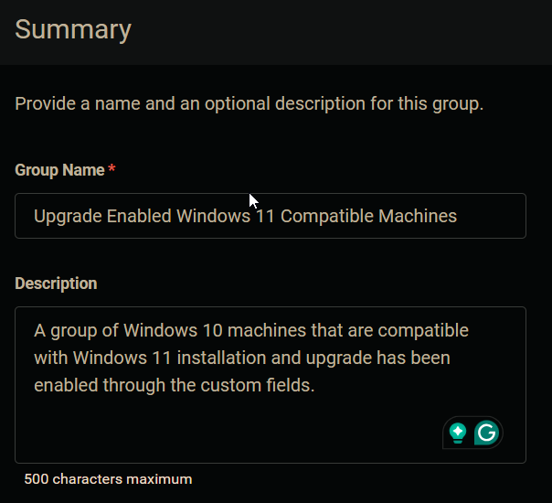

4. Click the `+ Add Criteria` in the `Criteria` section of the group.  
     
   This search box will appear.  
   

5. Search and select the `Enable Windows 11 Installation` custom field from the search box.  
   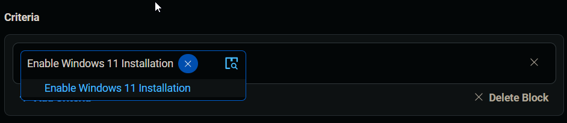  
   Set `True` in the comparison condition.  
   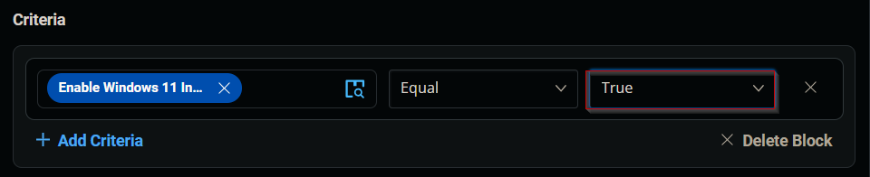  
   **Condition:** `Enable Windows 11 Installation` `Equal` `True`

6. Click the `+ Add Criteria` button.  
   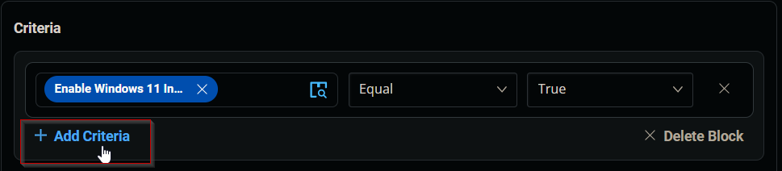  
   A new search box will appear.  
   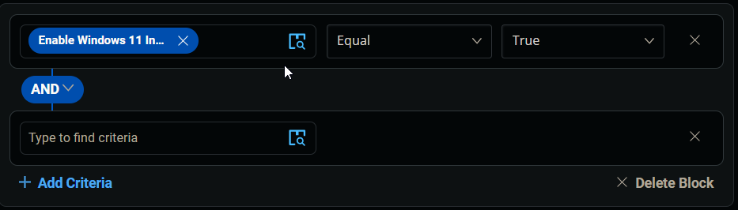  
   
   Search and select the `Exclude Windows 11 Installation` custom field from the search box. There are two custom fields with the same name. Select the site-level custom field in this step.  
   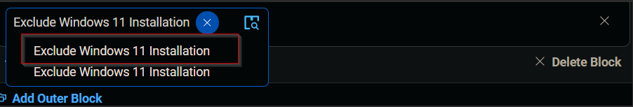  
   Set `False` in the comparison condition.  
   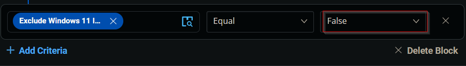  
   **Condition:** `Exclude Windows 11 Installation` `Equal` `False`

7. Click the `+ Add Criteria` button.  
     
   A new search box will appear.  
   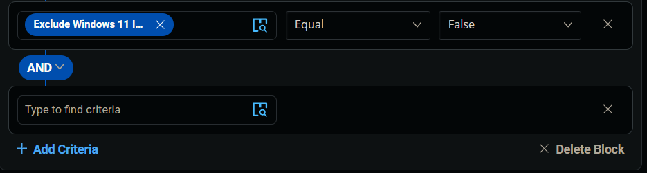  
   
   Search and select the `Exclude Windows 11 Installation` custom field from the search box. There are two custom fields with the same name. Select the computer-level custom field in this step.  
     
   Set `False` in the comparison condition.  
     
   **Condition:** `Exclude Windows 11 Installation` `Equal` `False`

8. Click the `+ Add Criteria` button.  
     
   A new search box will appear.  
     

   Search and select the `OS` criteria.  
   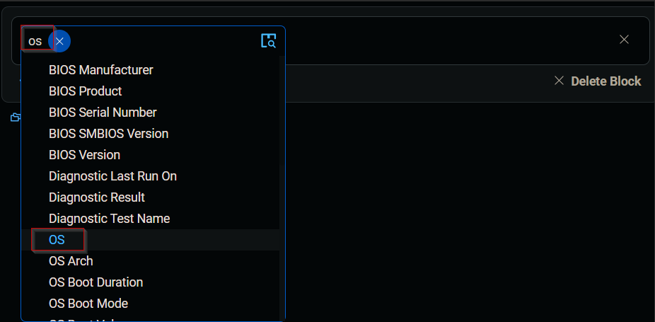  
   Select `Microsoft Windows 10` in the comparison condition.  
   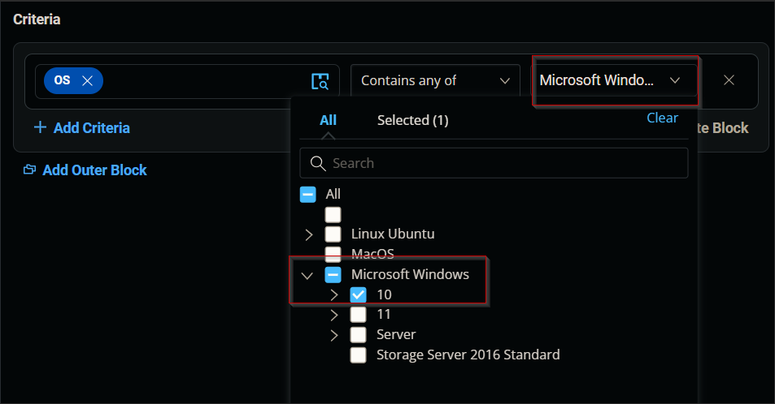  
   **Condition:** `OS` `Contains any of` `Microsoft Windows 10`

9. Click the `+ Add Criteria` button.  
   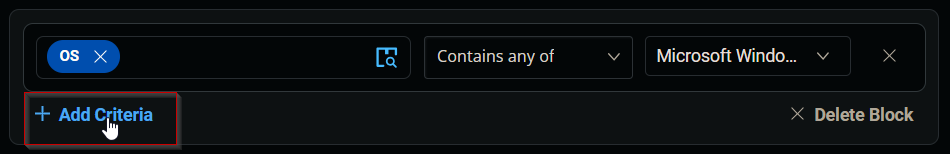  
   A new search box will appear.  
   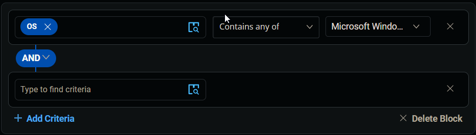  

   Search and select the `Windows 11 compatible` custom field from the search box.  
   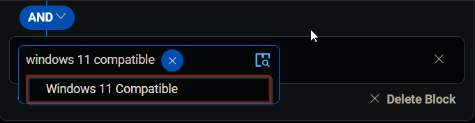  
   Set `Yes` in the comparison condition.  
   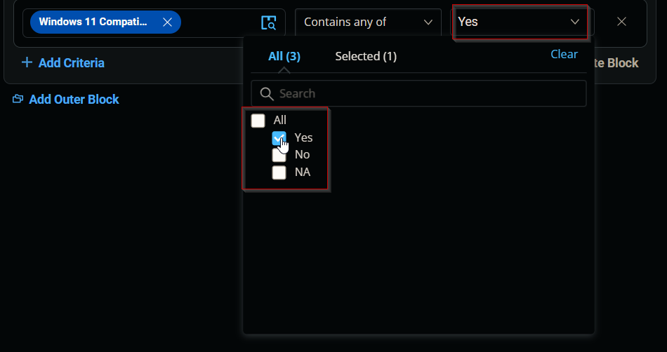  
   **Condition:** `Windows 11 Compatible` `Contains any of` `Yes`

10. Click the `Save` button to save/create the group.  
    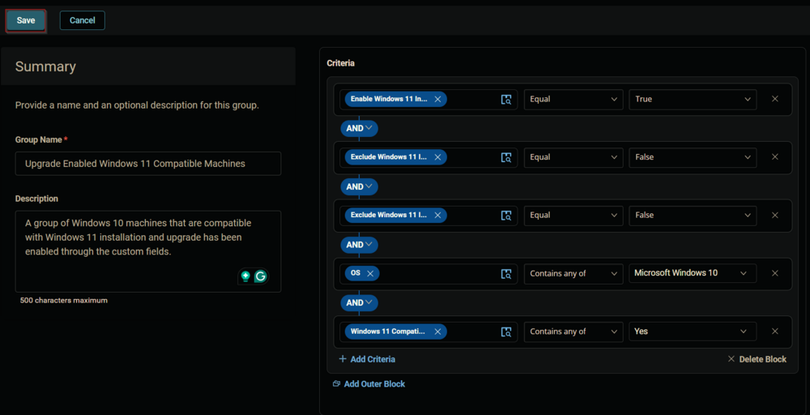

## Completed Group

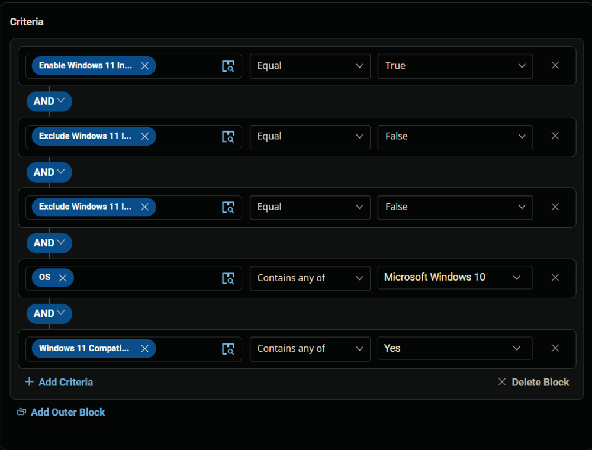  
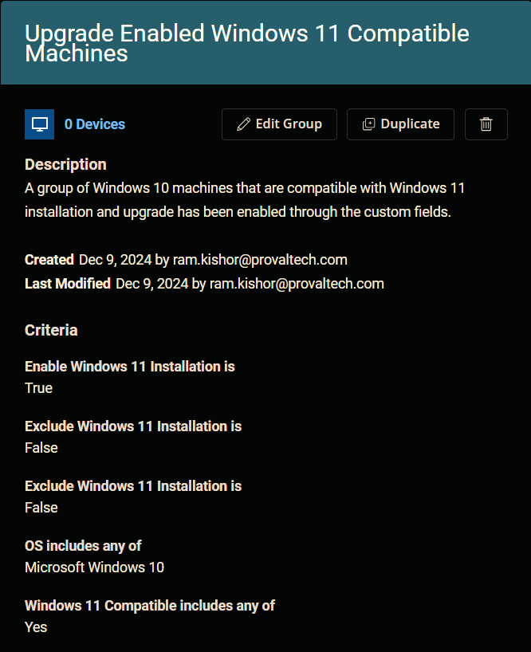

