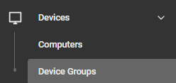
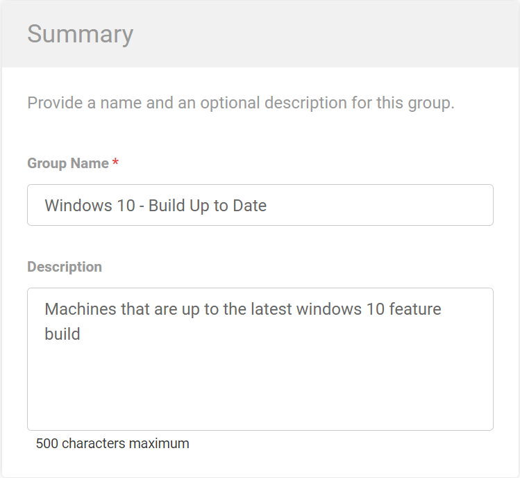
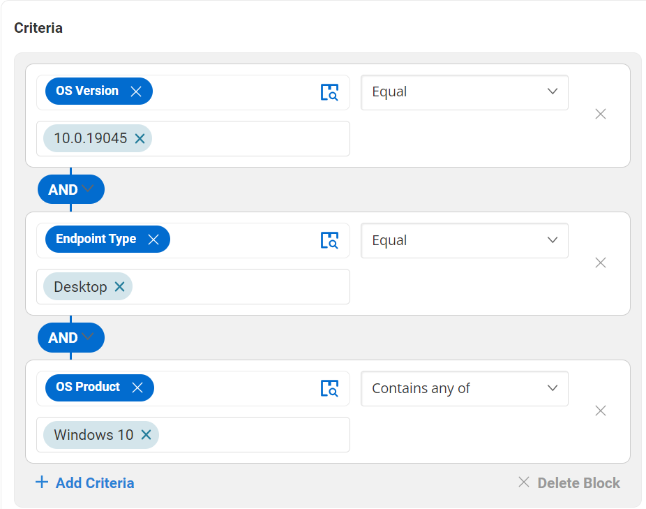
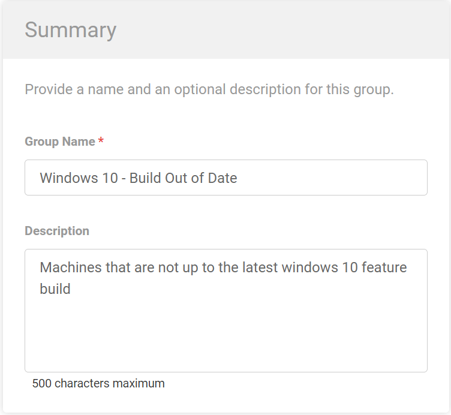
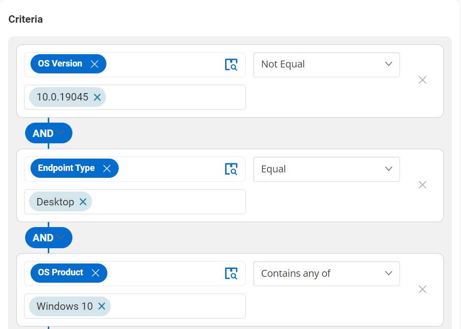

## Summary

There are two device groups related to the Windows 10 Upgrade Assistance solution. Please see the guide below to create separate device groups.

## Dependencies

- [CW RMM - Custom Field - Win10UpgradeAttempts](https://proval.itglue.com/5078775/docs/12949095#version=published&documentMode=edit)
- [CW RMM - Task - Feature Update Install (Windows 10) With Tracking](https://proval.itglue.com/5078775/docs/12947845#version=published&documentMode=edit)
- [CW RMM - Task - Windows 10 Feature Update Attempt Tracking (Subscript)](https://proval.itglue.com/5078775/docs/12949193#version=published&documentMode=view)

## Create Device Groups

There are two device groups for this solution. To create device groups, please navigate to Devices > Device Groups.

****

Select Add > Dynamic Group

Please repeat the above steps per device group.

---

### Device Group Name: Windows 10 - Build Up to Date

Description: Machines that are up to the latest Windows 10 feature build  
Criteria:  

When adding criteria, please search for the "OS Version"  
Equal: 10.0.19045  
AND  
Endpoint Type  
Equal: Desktop  
AND  
OS Product  
Contains any of: Windows 10  

This group holds all workstations that are up to the latest feature build.

---

### Device Group Name: Windows 10 - Build Out of Date

Description: Machines that are not up to the latest Windows 10 feature build  
Criteria:  

When adding criteria, please search for the "OS Version"  
Not Equal: 10.0.19045  
AND  
Endpoint Type  
Equal: Desktop  
AND  
OS Product  
Contains any of: Windows 10  

This group holds all workstations that are not up to the latest feature build.

