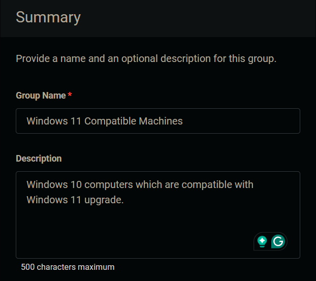
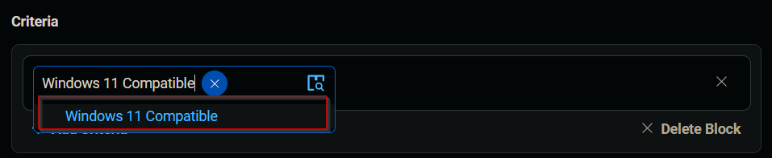
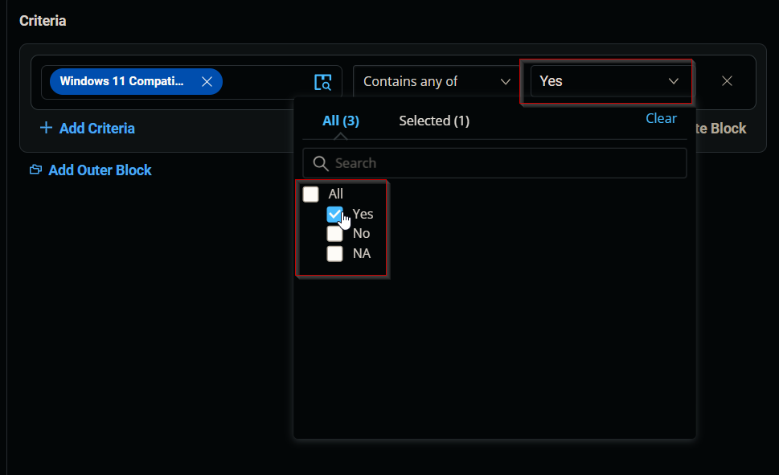
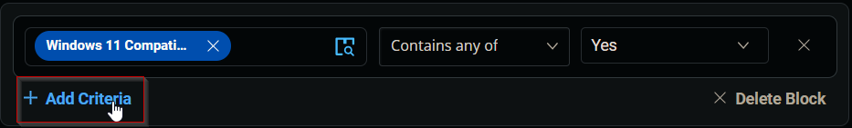
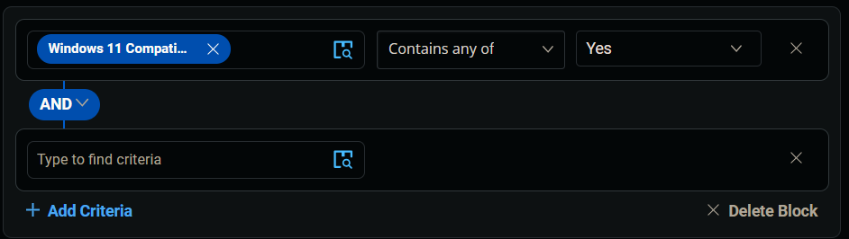
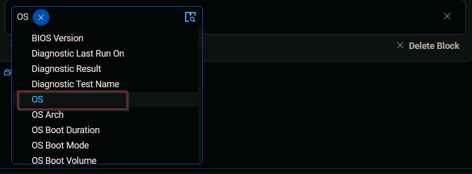
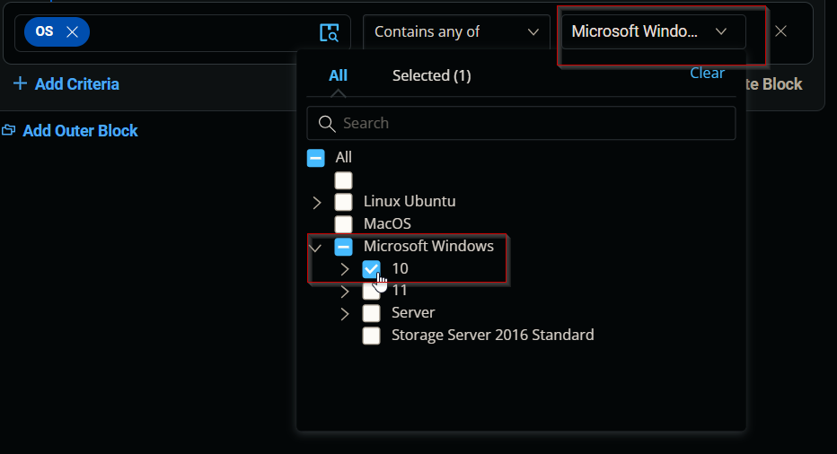
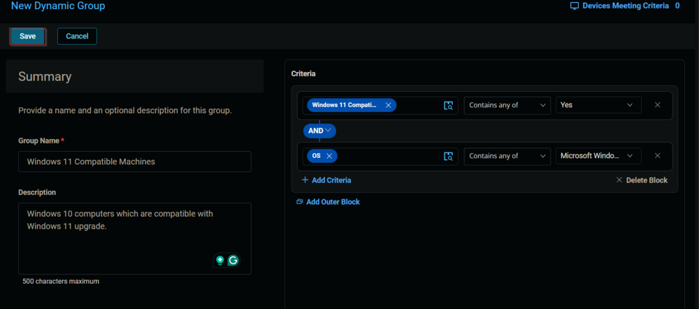
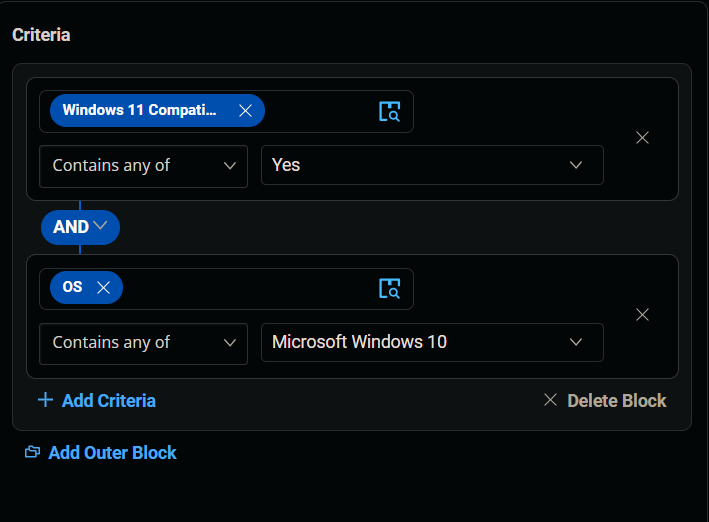
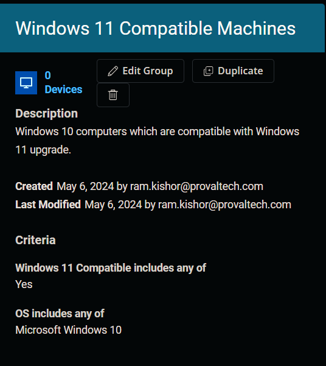

## Summary

Windows 10 computers which are compatible with Windows 11 upgrade.

## Dependencies

[CW RMM - Custom Field - Endpoint - Windows 11 Compatible](https://proval.itglue.com/DOC-5078775-15835398)

## Group Creation 

1. Navigate to `Devices` > `Device Groups`.
   

2. Create a new dynamic group by clicking the `Dynamic Group` button.  
     
   This page will appear after clicking on the `Dynamic Group` button:  
   

3. Set the group name to `Windows 11 Compatible Machines`.  
   Description: `Windows 10 computers which are compatible with Windows 11 upgrade.`  
   

4. Click the `+ Add Criteria` in the `Criteria` section of the group.  
     
   This search box will appear.  
   

5. Search and select the `Windows 11 compatible` custom field from the search box.  
     
   Set `Yes` in the comparison condition.  
     
   **Condition:** `Enable Windows 11 Compatible` `Contains any of` `Yes`

6. Click the `+ Add Criteria` button.  
     
   A new search box will appear.  
     
   Search and select the `OS` criteria.  
     
   Select `Microsoft Windows 10` in the comparison condition.  
     
   **Condition:** `OS` `Contains any of` `Microsoft Windows 10`

7. Click the `Save` button to save/create the group.  
   

## Completed Group 

  

