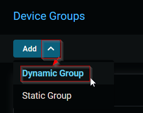
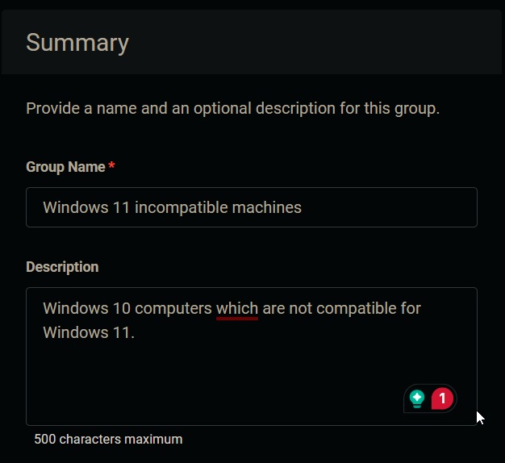
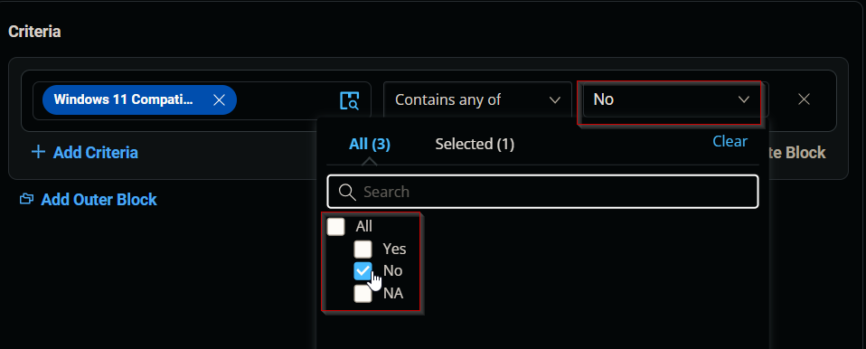
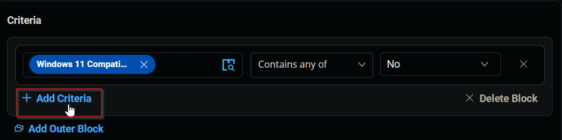
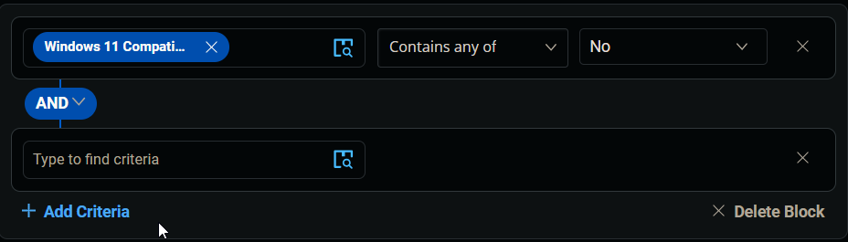
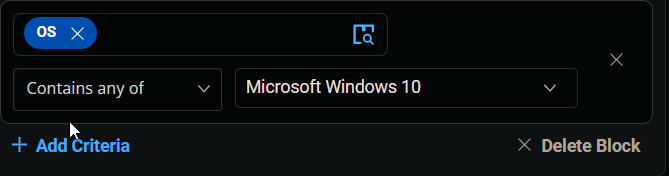
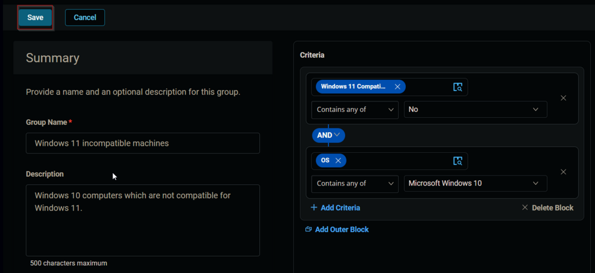
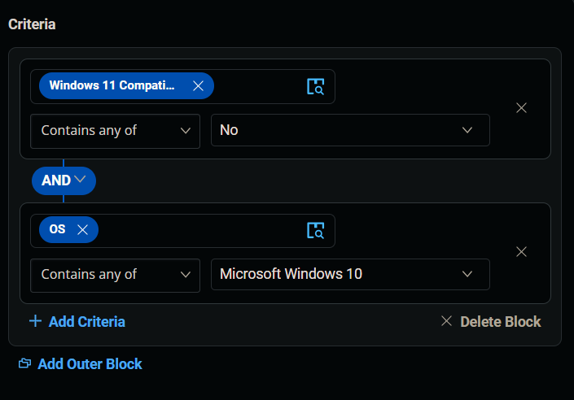
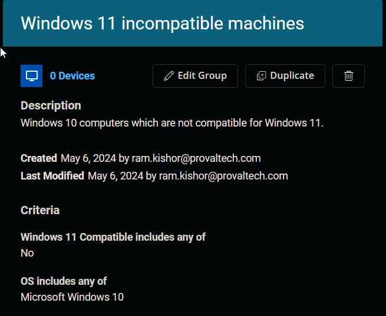

## Summary

Windows 10 computers which are not compatible for Windows 11.

## Dependencies

[CW RMM - Custom Field - Endpoint - Windows 11 Compatible](https://proval.itglue.com/DOC-5078775-15835398)

## Group Creation

Navigate to `Devices` > `Device Groups`.

### 1.
Create a new dynamic group by clicking the `Dynamic Group` button.

This page will appear after clicking on the `Dynamic Group` button:

### 2.
Set the group name to `Windows 11 incompatible machines`.  
Description: `Windows 10 computers which are not compatible for Windows 11.`

### 3.
Click the `+ Add Criteria` in the `Criteria` section of the group.

This search box will appear.

### 4.
Search and select the `Windows 11 compatible` custom field from the search box.

Set `No` in the comparison condition.

**Condition:** `Enable Windows 11 Compatible` `Contains any of` `No`

### 5.
Click the `+ Add Criteria` button.

A new search box will appear.

Search and select the `OS` criteria.

Select `Microsoft Windows 10` in the comparison condition.

  

**Condition:** `OS` `Contains any of` `Microsoft Windows 10`

### 6.
Click the `Save` button to save/create the group.

## Completed Group

  

