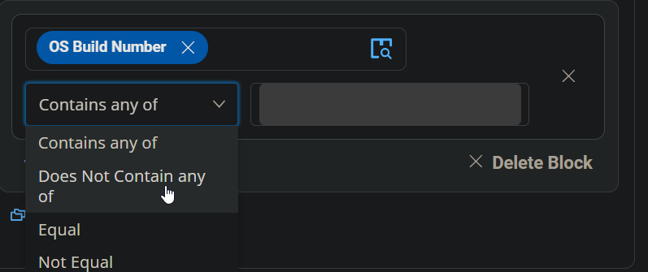
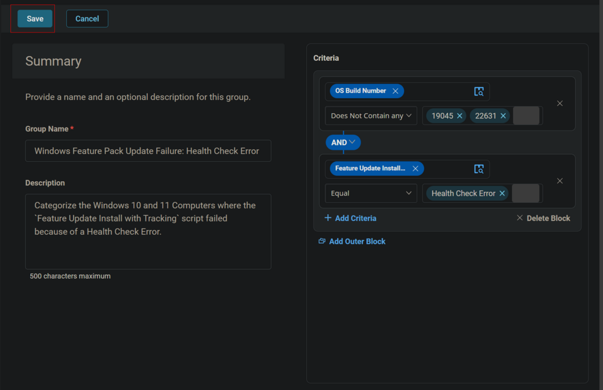
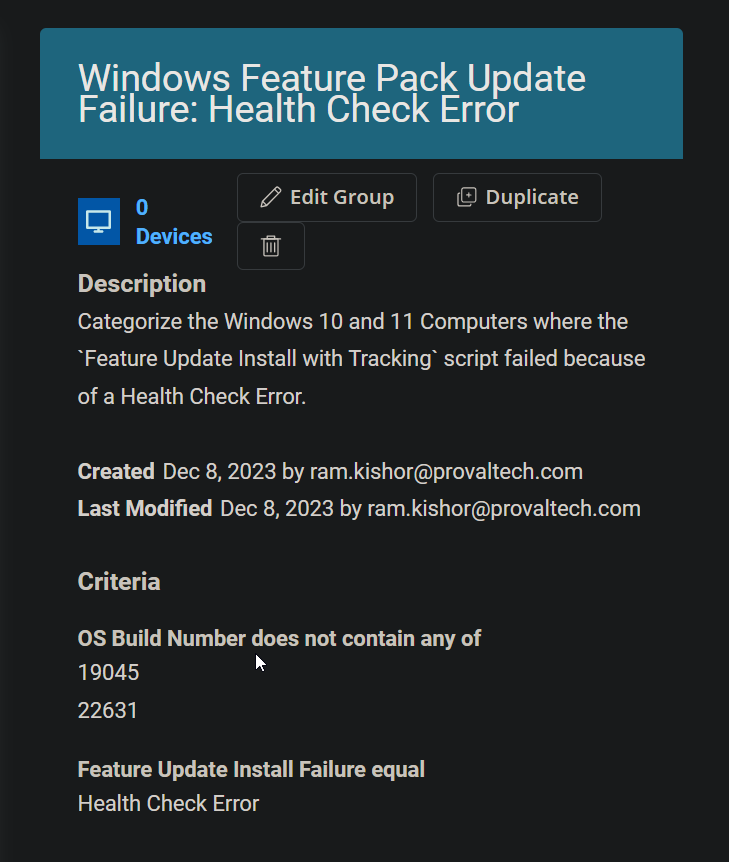

## Summary

This document categorizes Windows 10 and 11 computers where the `Feature Update Install with Tracking` script failed due to a Health Check Error.

## Dependencies

- [CW RMM - Task - Feature Update Install With Tracking](<../tasks/Feature Update Install With Tracking.md>)  
- [CW RMM - Custom Field - Feature Update Install Failure](<../custom-fields/Feature Update Install Failure.md>)

## Criteria

- Select `OS Build Number` for the criteria `Does Not Contain Any`, and type `19045` and `22631` in the condition box.  
    
    
    
    

- Click the `Add Criteria` button to add another criterion.  
    

- Select the `Feature Update Install Failure` custom field for criteria, `Equal` for comparator, and type `Health Check Error` in the condition box.  

## Group

Click the `Save` button to save the group.  
  
  

