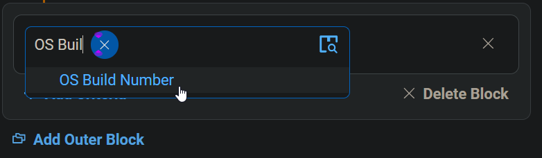
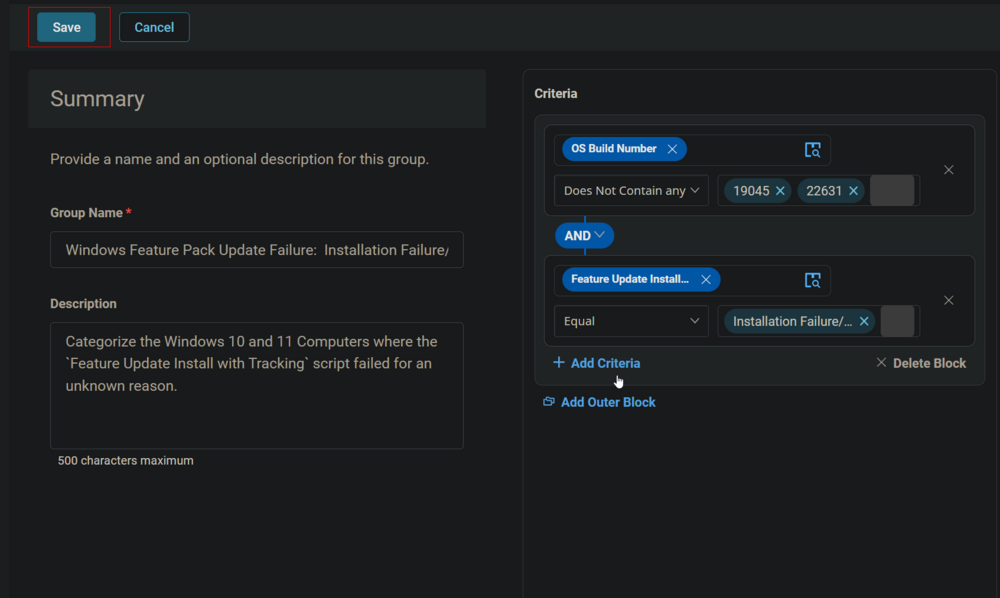
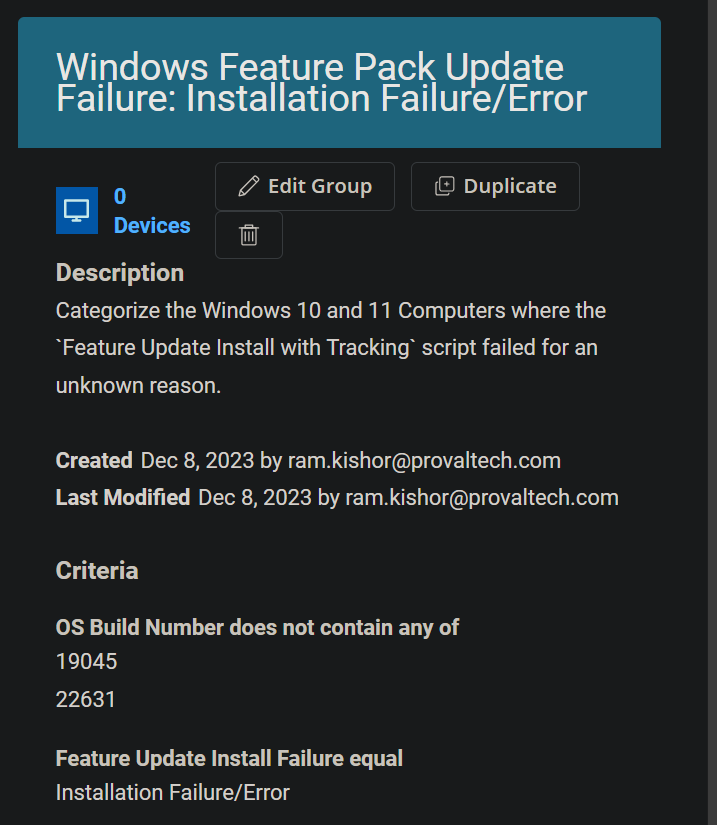

## Summary
Categorize the Windows 10 and 11 Computers where the `Feature Update Install with Tracking` script failed for an unknown reason.

## Dependencies
[CW RMM - Task - Feature Update Install With Tracking](https://proval.itglue.com/DOC-5078775-12947845)  
[CW RMM - Custom Field - Feature Update Install Failure](https://proval.itglue.com/DOC-5078775-14592254)

## Summary
Categorize the Windows 10 and 11 Computers where the `Feature Update Install with Tracking` script failed for an unknown reason.

### Criteria
- Select `OS Build Number` for the Criteria `Does Not Contain any` for comparator and type `19045` and `22631` in the condition box.  
  
  
  

- Click the `Add Criteria` button to add another Criteria.  

- Select `Feature Update Install Failure` custom field for criteria, `Equal` for comparator and type `Installation Failure/Error` in the condition box.

### Group
Click the `Save` button to Save the Group.  
  

