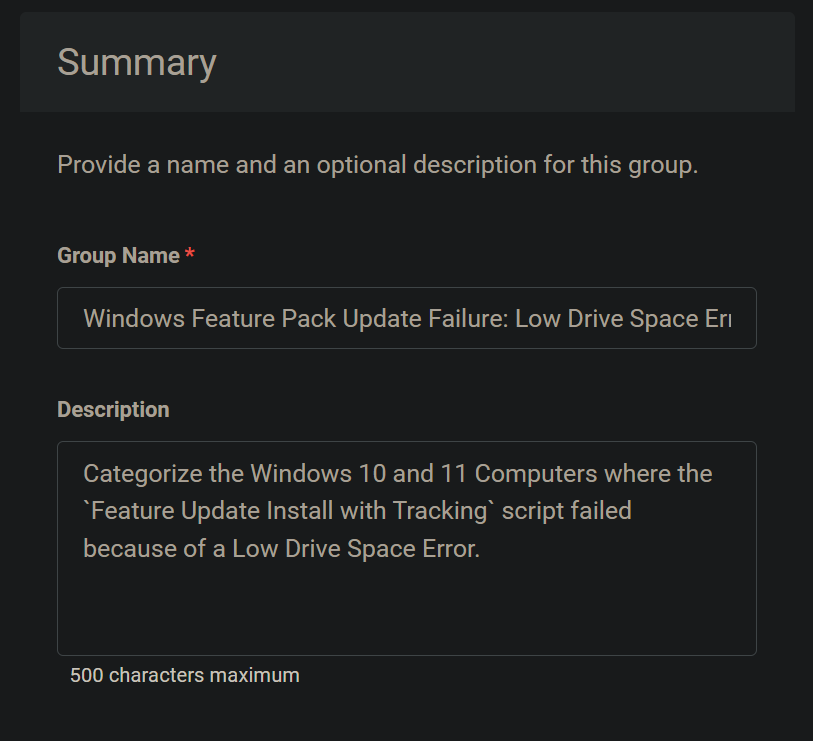
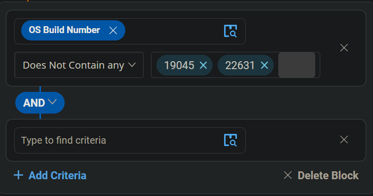
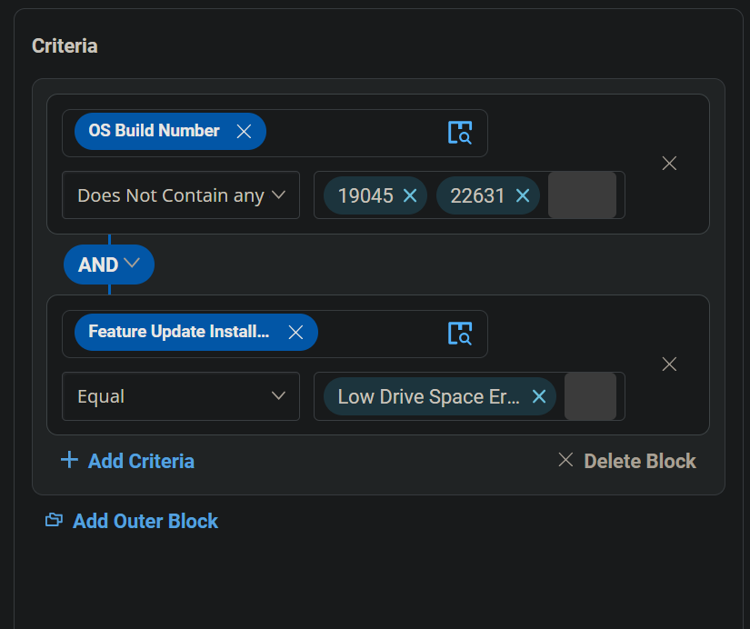
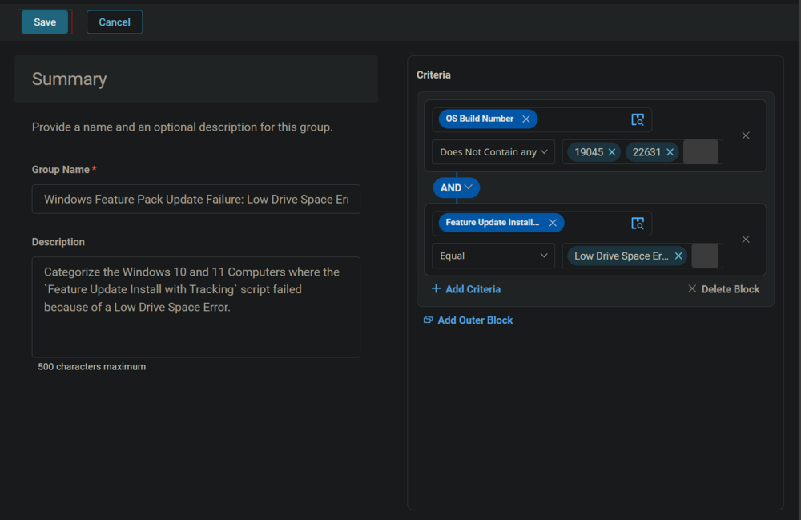
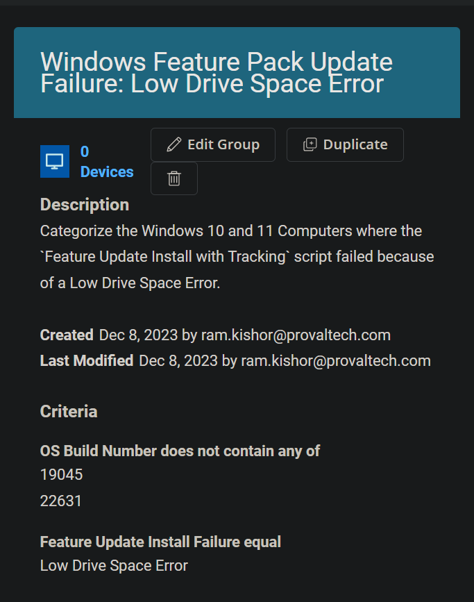

## Summary

Categorize the Windows 10 and 11 Computers where the `Feature Update Install with Tracking` script failed because of a Low Drive Space Error.

## Dependencies

[CW RMM - Task - Feature Update Install With Tracking](https://proval.itglue.com/DOC-5078775-12947845)  
[CW RMM - Custom Field - Feature Update Install Failure](https://proval.itglue.com/DOC-5078775-14592254)

## Summary

  
**Group Type:** Dynamic Group  
**Group Name:** Windows Feature Pack Update Failure: Low Drive Space Error  

**Description:**  
Categorize the Windows 10 and 11 Computers where the `Feature Update Install with Tracking` script failed because of a Low Drive Space Error.

## Criteria

- Select `OS Build Number` for the Criteria `Does Not Contain any` for comparator and type `19045` and `22631` in the condition box.  
  
  
  
  

- Click the `Add Criteria` button to add another Criteria.  
  

- Select `Feature Update Install Failure` custom field for criteria, `Equal` for comparator and type `Low Drive Space Error` in the condition box.  
  
  

## Group

Click the `Save` button to Save the Group.  
  
  

