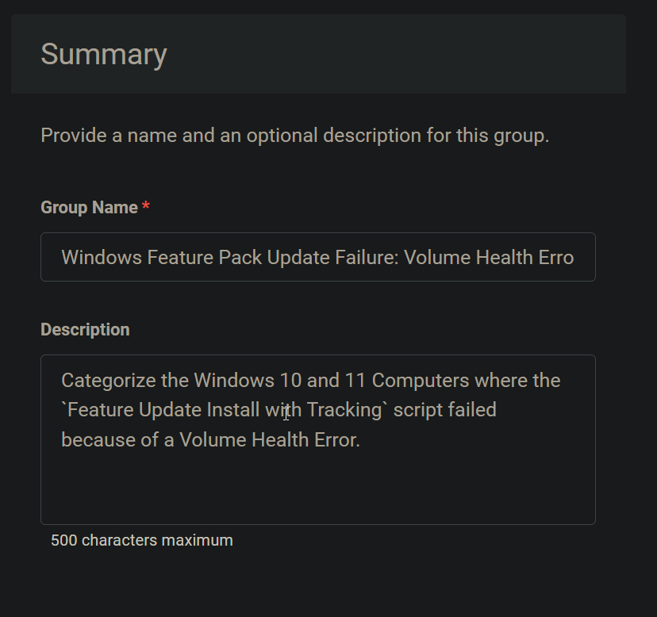
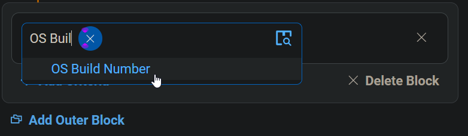
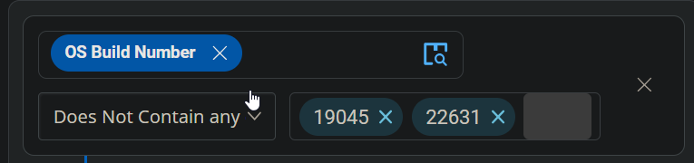
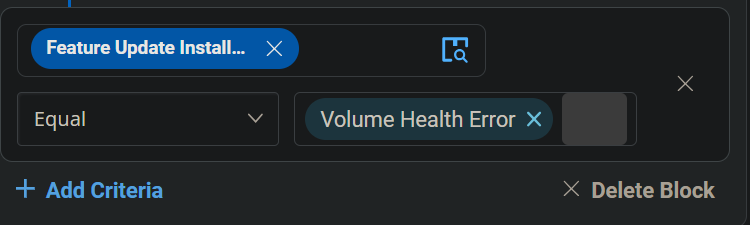
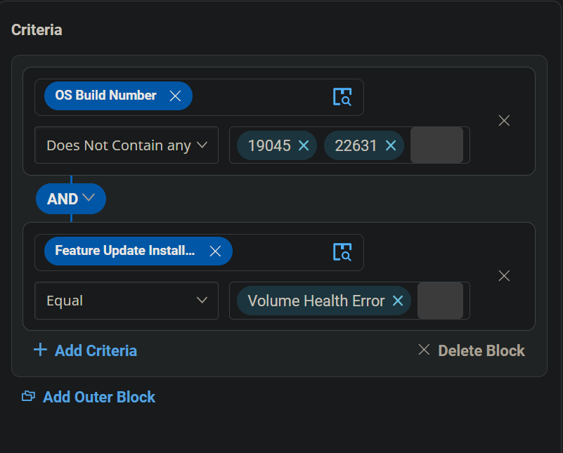
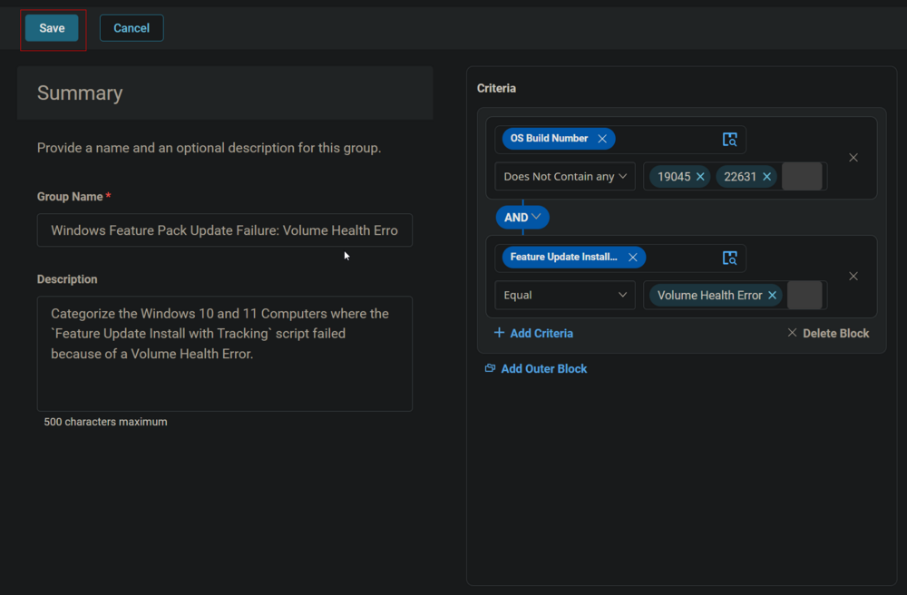
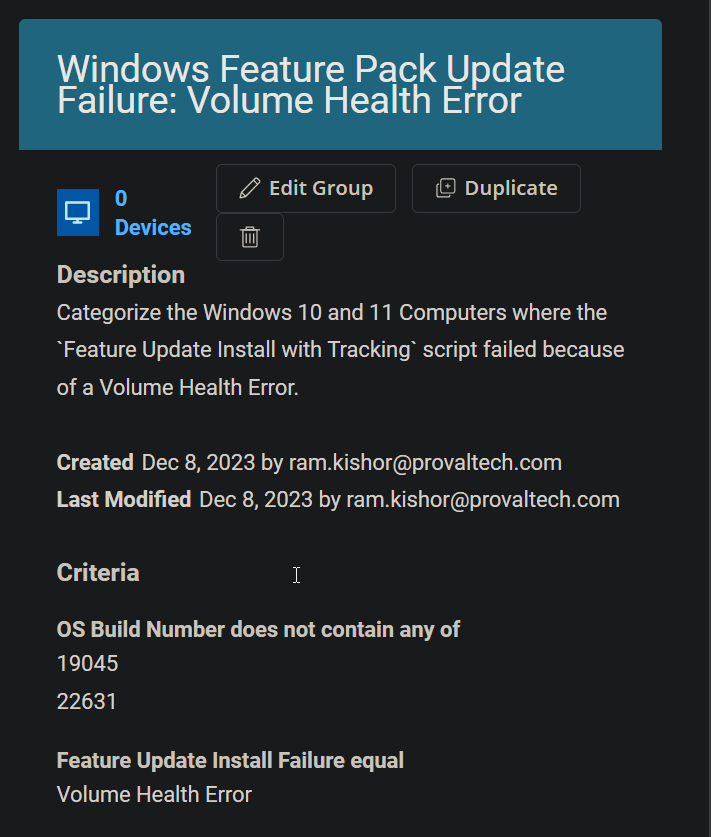

## Summary

This document categorizes Windows 10 and 11 computers where the `Feature Update Install with Tracking` script failed due to a Volume Health Error.

## Dependencies

- [CW RMM - Task - Feature Update Install With Tracking](<../tasks/Feature Update Install With Tracking.md>)
- [CW RMM - Custom Field - Feature Update Install Failure](https://proval.itglue.com/DOC-5078775-14592254)

## Visual Summary

**Group Type:** Dynamic

**Group Name:** Windows Feature Pack Update Failure: Volume Health Error

**Description:** Categorize the Windows 10 and 11 computers where the `Feature Update Install with Tracking` script failed due to a Volume Health Error.

## Criteria

- Select `\\OS Build Number\\` for the Criteria, choose `Does Not Contain any` for the comparator, and type `19045` and `22631` in the condition box.  
    
    
    
  

- Click the `Add Criteria` button to add another criterion.  
  

- Select the `Feature Update Install Failure` custom field for criteria, choose `Equal` for the comparator, and type `Volume Health Error` in the condition box.  
    
  

## Group

Click the `Save` button to save the group.  
  

