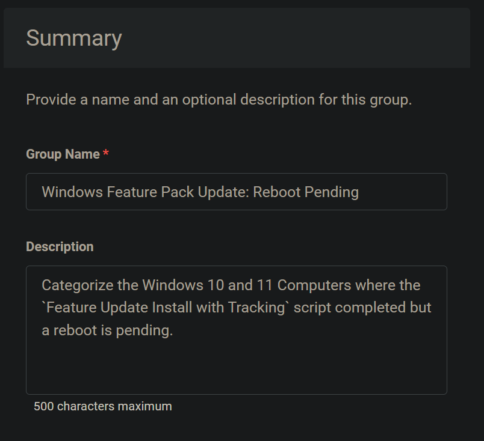
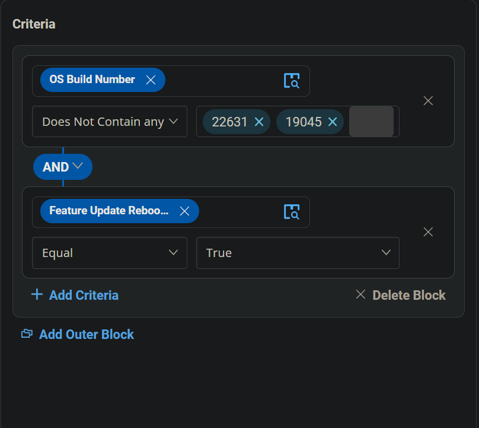
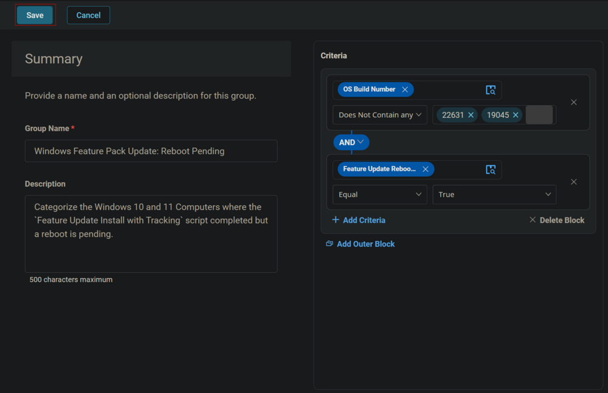

## Summary

Categorize the Windows 10 and 11 Computers where the `Feature Update Install with Tracking` script is completed but a reboot is pending.

## Dependencies

[CW RMM - Task - Feature Update Install With Tracking](https://proval.itglue.com/DOC-5078775-12947845)  
[CW RMM - Custom Field - Feature Update Reboot Pending](https://proval.itglue.com/DOC-5078775-14592255)  
[CW RMM - Task - Feature Update Install (Reboot Pending Machines Validation)](https://proval.itglue.com/DOC-5078775-14591604)  

## Summary

  
**Group Type:** Dynamic  
**Group Name:** Windows Feature Pack Update: Reboot Pending  
**Description:** Categorize the Windows 10 and 11 Computers where the `Feature Update Install with Tracking` script is completed but a reboot is pending.

## Criteria

- Select `OS Build Number` for the Criteria `Does Not Contain any` for comparator and type `19045` and `22631` in the condition box.  
  
  
  
  

- Click the `Add Criteria` button to add another Criteria.  
  

- Select `Feature Update Reboot Pending` custom field for criteria, `Equal` for comparator and type `True` in the condition box.  
  
  

## Group

Click the Save button to Save the Group.  
  
  

