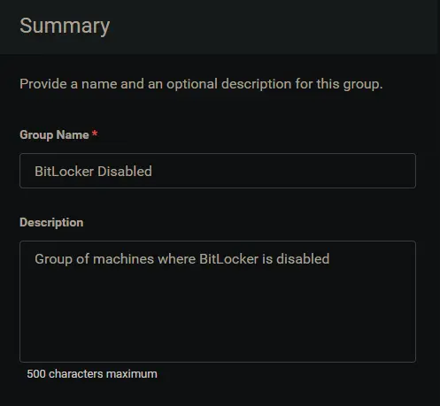
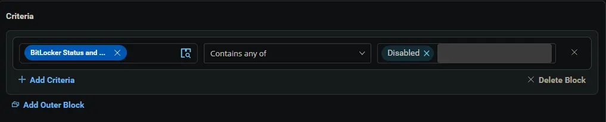
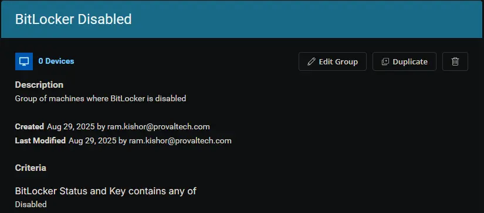

## Summary

Group of machines where BitLocker is disabled.

## Dependencies

- [Custom Field - BitLocker Status and Key](/docs/a7785954-5a6d-4003-9d0e-c919e1a96b0c)
- [Task - BitLocker Status and Recovery Key Audit](/docs/9682b5a8-d821-43f6-9b77-59d43b6ef015)
- [Solution - BitLocker Status and Recovery Key Audit](/docs/b2a974b2-c231-4197-a639-d0775d77d7c7)

## Group Setup Location

- **Group Path:** `ENDPOINTS` ➞ `Groups`  
- **Group Type:** `Dynamic Group`

## Group Summary

- **Group Name:** `BitLocker Disabled`  
- **Description:** `Group of machines where BitLocker is disabled.`

## Group Criteria

The group is defined by the following **criteria**:

| Block | Criteria Name          | Operator        | Value(s)                                 |
|-------|-----------------------|-----------------|-------------------------------------------|
| 1     | BitLocker Status and Key        | Contains any of | `Disabled` |

**Logic:**  
A machine matches the group if it meets ALL criteria in Block 1.

## Completed Group

