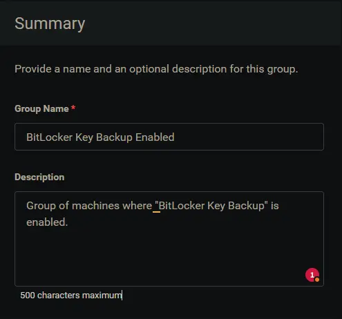
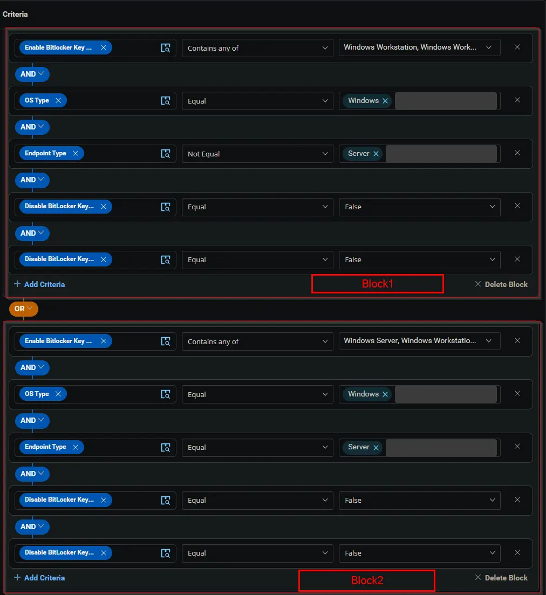
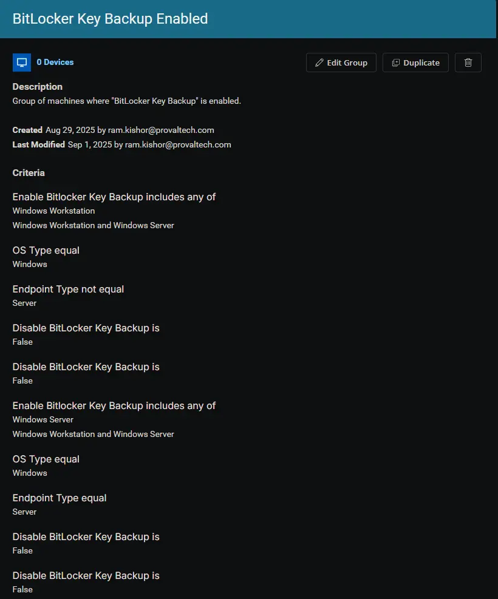

## Summary

Group of machines where "BitLocker Key Backup" is enabled.

## Dependencies

- [Custom Field - Enable BitLocker Key Backup](/docs/14c8ed9d-5357-432d-a8f2-8d522ac9f991)
- [Site Custom Field - Disable BitLocker Key Backup](/docs/f164c9c8-effe-48ce-9cd3-bc0b8a5e7025)
- [Endpoint Custom Field - Disable BitLocker Key Backup](/docs/6c9022a4-43db-49f3-8f89-ae27d8e340a4)
- [Solution - BitLocker Key Backup](/docs/fecda0ff-5a3e-4cc5-b6a7-fd37732aa2e9)

## Group Setup Location

- **Group Path:** `ENDPOINTS` ➞ `Groups`  
- **Group Type:** `Dynamic Group`

## Group Summary

- **Group Name:** `BitLocker Key Backup Enabled`  
- **Description:** `Group of machines where "BitLocker Key Backup" is enabled.`

## Group Criteria

The group is defined by the following **criteria blocks**, joined by an **OR**. Each block uses **AND** logic between its conditions.

| Block | Criteria Name          | Operator        | Value(s)                                 |
|-------|-----------------------|-----------------|-------------------------------------------|
| 1     | Enable BitLocker Key Backup        | Contains any of | `Windows Workstation`, `Windows Workstation and Server` |
| 1     | OS Type                | Equal           | `Windows`                                   |
| 1     | Endpoint Type          | Not Equal       | `Server`                                    |
| 1     | Disable BitLocker Key Backup (SITE) | Equal           | `False`                                     |
| 1     | Disable BitLocker Key Backup (ENDPOINT) | Equal           | `False`                                     |
| 2     | Enable BitLocker Key Backup        | Contains any of | `Windows Server`, `Windows Workstation and Server` |
| 2     | OS Type                | Equal           | `Windows`                                   |
| 2     | Endpoint Type          | Equal       | `Server`                                    |
| 2     | Disable BitLocker Key Backup (SITE) | Equal           | `False`                                     |
| 2     | Disable BitLocker Key Backup (ENDPOINT) | Equal           | `False`                                     |

- **Block 1:** Targets Windows Workstations (not servers)
- **Block 2:** Targets Windows Servers

**Logic:**  
A machine matches the group if it meets ALL criteria in Block 1 OR ALL criteria in Block 2.

## Completed Group

