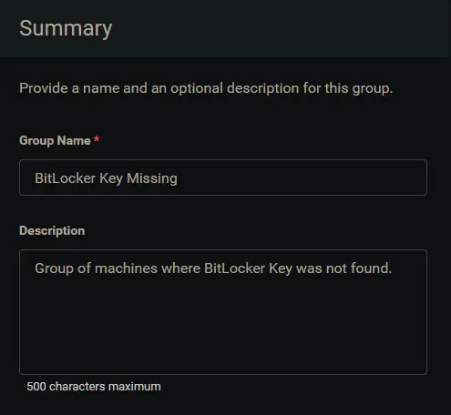
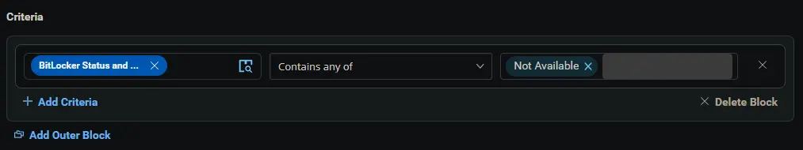

## Summary

Group of machines where BitLocker Key was not found.

## Dependencies

- [Custom Field - Enable BitLocker Key Backup](/docs/14c8ed9d-5357-432d-a8f2-8d522ac9f991)
- [Custom Field - Disable BitLocker Key Backup](/docs/f164c9c8-effe-48ce-9cd3-bc0b8a5e7025)
- [Custom Field - Disable BitLocker Key Backup](/docs/6c9022a4-43db-49f3-8f89-ae27d8e340a4)
- [Custom Field - BitLocker Key Backup Status](/docs/362c3958-f97e-4f40-bd1d-89cbfed9b17f)
- [Group - BitLocker Key Audit Enabled](/docs/819b7ac8-aa64-41b8-84d0-2123df0ef68e)
- [Task - BitLocker Recovery Key Backup](/docs/b469ea90-0c1b-421b-89e2-be5c91501035)
- [Solution - BitLocker Key Backup](/docs/fecda0ff-5a3e-4cc5-b6a7-fd37732aa2e9)

## Group Setup Location

- **Group Path:** `ENDPOINTS` ➞ `Groups`  
- **Group Type:** `Dynamic Group`

## Group Summary

- **Group Name:** `BitLocker Key Missing`  
- **Description:** `Group of machines where BitLocker Key was not found.`

## Group Criteria

The group is defined by the following **criteria**:

| Block | Criteria Name          | Operator        | Value(s)                                 |
|-------|-----------------------|-----------------|-------------------------------------------|
| 1     | BitLocker Key Backup Status        | Contains any of | `Not Available` |

**Logic:**  
A machine matches the group if it meets ALL criteria in Block 1.

## Completed Group

