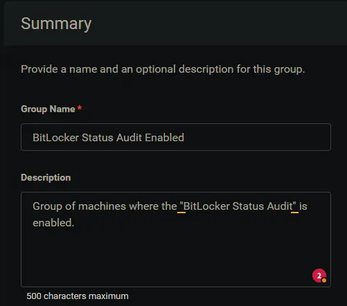
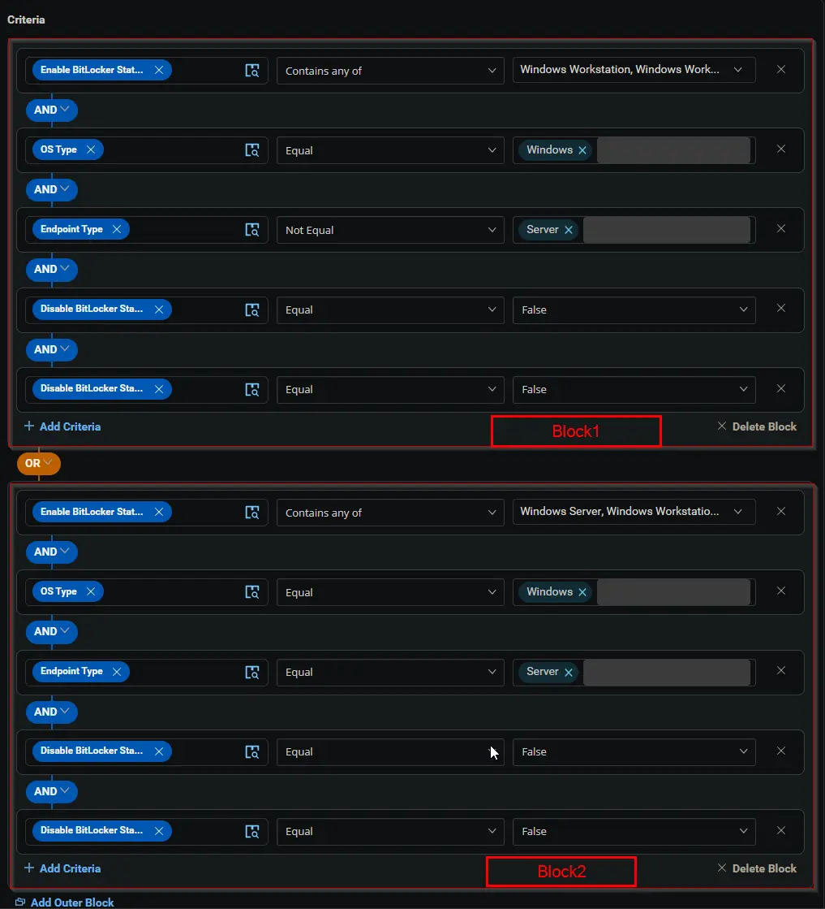
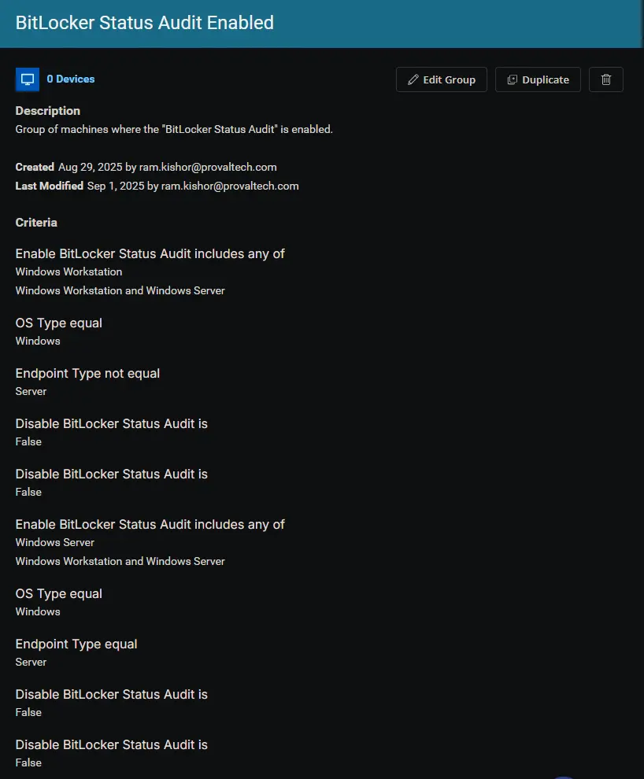

## Summary

Group of machines where the "BitLocker Status Audit" is enabled.

## Dependencies

- [Custom Field - Enable BitLocker Status Audit](/docs/c917557c-89d3-4487-a5f1-56ffd0fdac9c)
- [Custom Field - Disable BitLocker Status Audit](/docs/fb66191c-89d5-4712-a4a3-e1c90f943b7b)
- [Custom Field - Disable BitLocker Status Audit (Endpoint)](/docs/bf4fbfbb-28ae-4357-a81c-f407fa847128)
- [Solution - BitLocker Status and Recovery Key Audit](/docs/b2a974b2-c231-4197-a639-d0775d77d7c7)

## Group Setup Location

- **Group Path:** `ENDPOINTS` ➞ `Groups`  
- **Group Type:** `Dynamic Group`

## Group Summary

- **Group Name:** `BitLocker Status Audit Enabled`  
- **Description:** `Group of machines where the "BitLocker Status Audit" is enabled.`

## Group Criteria

The group is defined by the following **criteria blocks**, joined by an **OR**. Each block uses **AND** logic between its conditions.

| Block | Criteria Name          | Operator        | Value(s)                                 |
|-------|-----------------------|-----------------|-------------------------------------------|
| 1     | Enable BitLocker Status Audit        | Contains any of | `Windows Workstation`, `Windows Workstation and Server` |
| 1     | OS Type                | Equal           | `Windows`                                   |
| 1     | Endpoint Type          | Not Equal       | `Server`                                    |
| 1     | Disable BitLocker Status Audit (SITE) | Equal           | `False`                                     |
| 1     | Disable BitLocker Status Audit (ENDPOINT) | Equal           | `False`                                     |
| 2     | Enable BitLocker Status Audit        | Contains any of | `Windows Server`, `Windows Workstation and Server` |
| 2     | OS Type                | Equal           | `Windows`                                   |
| 2     | Endpoint Type          | Equal       | `Server`                                    |
| 2     | Disable BitLocker Status Audit (SITE) | Equal           | `False`                                     |
| 2     | Disable BitLocker Status Audit (ENDPOINT) | Equal           | `False`                                     |

- **Block 1:** Targets Windows Workstations (not servers)
- **Block 2:** Targets Windows Servers

**Logic:**  
A machine matches the group if it meets ALL criteria in Block 1 OR ALL criteria in Block 2.

## Completed Group

