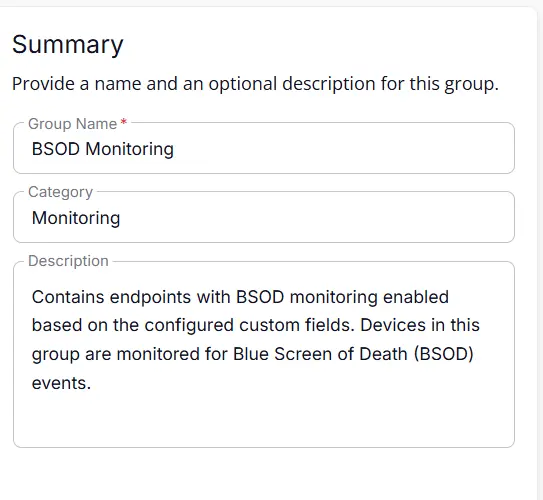
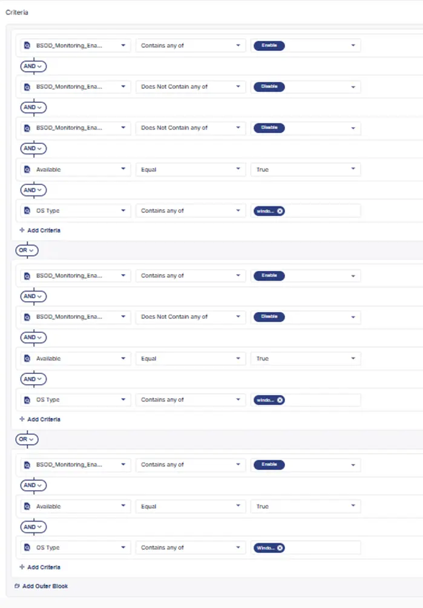
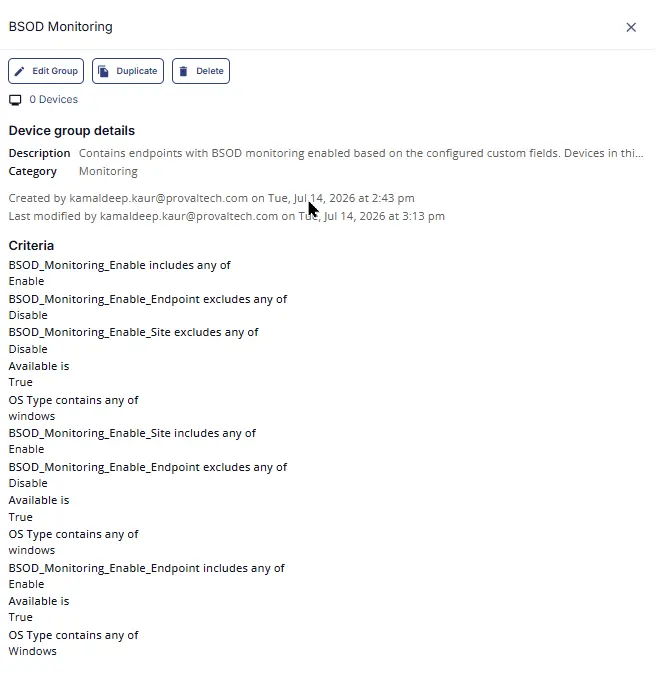

## Summary
Contains endpoints with BSOD monitoring enabled based on the configured custom fields. Devices in this group are monitored for Blue Screen of Death (BSOD) events.

## Dependencies

- [Solution: BSOD Monitoring](/docs/fc85a090-94c2-4f91-8055-9c8e52d91ad1)

## Group Setup Location

- **Group Path:** `ENDPOINTS` ➞ `Groups`  
- **Group Type:** `Dynamic Group`

## Group Summary

- **Group Name:** `BSOD Monitoring`  
- **Category:** `Monitoring`  
- **Description:** `Contains endpoints with BSOD monitoring enabled based on the configured custom fields. Devices in this group are monitored for Blue Screen of Death (BSOD) events.`  

## Criteria

The group is defined by the following **criteria blocks**, joined by an **OR**. Each block uses **AND** logic between its conditions.

| Block | Criteria Name            | Operator             | Value(s)   |
|-------|--------------------------|----------------------|------------|
| 1     | BSOD_Monitoring_Enable           | Contains any of      | `Enable`   |
| 1     | BSOD_Monitoring_Enable_Endpoint  | Does Not Contain any of | `Disable`  |
| 1     | BSOD_Monitoring_Enable_Site      | Does Not Contain any of | `Disable`  |
| 1     | OS Type                          | Contains any of      | `Windows`  |
| 1     | Available                        | Equal                | `True`   |
| 2     | BSOD_Monitoring_Enable_Site      | Contains any of      | `Enable`   |
| 2     | BSOD_Monitoring_Enable_Endpoint  | Does Not Contain any of | `Disable`  |
| 2     | OS Type                          | Contains any of      | `Windows`  |
| 2     | Available                        | Equal                | `True`   |
| 3     | BSOD_Monitoring_Enable_Endpoint  | Contains any of      | `Enable`   |
| 3     | OS Type                          | Contains any of      | `Windows`  |
| 3    | Available                        | Equal                | `True`   |

- **Block 1:** Targets Windows machines where the monitoring is enabled at Company level. Custom field (**BSOD_Monitoring_Enable**) is enabled, provided that the feature has not been explicitly disabled at the site level (**BSOD_Monitoring_Enable_Site**) or the individual endpoint level (**BSOD_Monitoring_Enable_Endpoint**).  
- **Block 2:** Targets Windows Machines where the site‑level setting (**BSOD_Monitoring_Enable_Site**) is explicitly enabled, provided that it has not been overridden and disabled at the individual endpoint level (**BSOD_Monitoring_Enable_Endpoint**). 
- **Block 3:** Targets **Any Windows Device** (Server or Workstation) where the feature is explicitly enabled directly at the individual endpoint level (**BSOD_Monitoring_Enable_Endpoint**).  

**Logic:**  
A machine matches the group if it meets **ALL** criteria in **Block 1**, **OR** **ALL** criteria in **Block 2**, **OR** **ALL** criteria in **Block 3**.

## Completed Group

## Changelog

### 2026-07-14

- Initial version of the document
