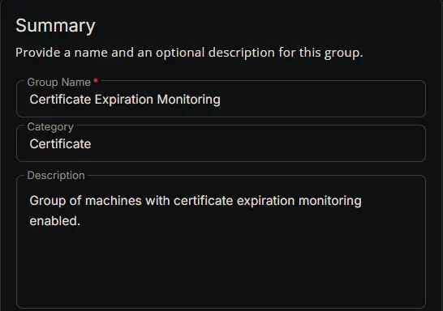
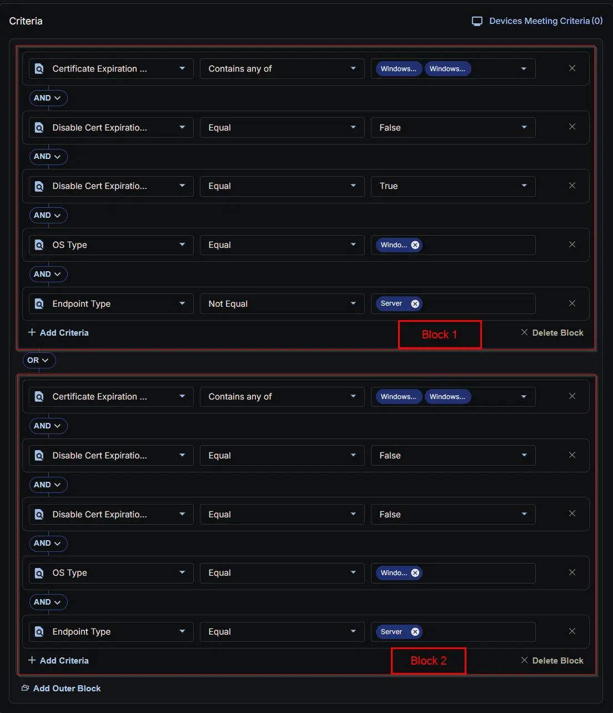
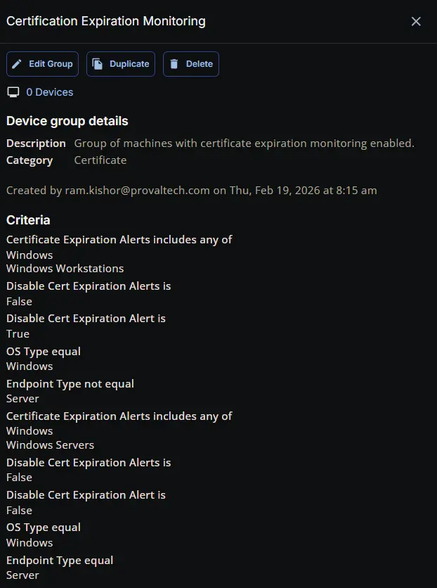

## Summary

Group of machines with certificate expiration monitoring enabled.'

## Dependencies

- [Custom Field: Certificate Expiration Alert](/docs/41d685b3-0e7c-41b6-802d-2d1a9b25593c)
- [Custom Field: Disable Cert Expiration Alerts](/docs/9fa7d829-75c9-455d-9908-d695e0ae0a96)
- [Custom Field: Disable Cert Expiration Alert](/docs/f329bc75-50a0-497a-bfa9-4d54a281101c)
- [Solution: Certificate Expiration Monitoring](/docs/4712590e-18e7-47f7-a038-ab704f5859c2)

## Group Setup Location

- **Group Path:** `ENDPOINTS` ➞ `Groups`  
- **Group Type:** `Dynamic Group`

## Group Summary

- **Group Name:** `Certificate Expiration Monitoring`  
- **Category:** `Certificate`  
- **Description:** `Group of machines with certificate expiration monitoring enabled.`

The group is defined by the following **criteria blocks**, joined by an **OR**. Each block uses **AND** logic between its conditions.

| Block | Criteria Name          | Operator        | Value(s)                                 |
|-------|-----------------------|-----------------|-------------------------------------------|
| 1     | Certificate Expiration Alerts         | Contains any of | `Windows`, `Windows Workstations` |
| 1     | Disable Cert Expiration Alerts | Equal           | `False`                                     |
| 1     | Disable Cert Expiration Alert | Equal           | `False`                                     |
| 1     | OS Type                | Equal           | `Windows`                                   |
| 1     | Endpoint Type          | Not Equal       | `Server`                                    |
| 2     | Certificate Expiration Alerts         | Contains any of | `Windows`, `Windows Servers` |
| 2     | Disable Cert Expiration Alerts | Equal           | `False`                                     |
| 2     | Disable Cert Expiration Alert | Equal           | `False`                                     |
| 2     | OS Type                | Equal           | `Windows`                                   |
| 2     | Endpoint Type          | Equal       | `Server`                                    |

- **Block 1:** Targets Windows Workstations (not servers)
- **Block 2:** Targets Windows Servers

**Logic:**  
A machine matches the group if it meets ALL criteria in Block 1 OR ALL criteria in Block 2.

## Completed Group

## Changelog

### 2026-02-19

- Initial version of the document
