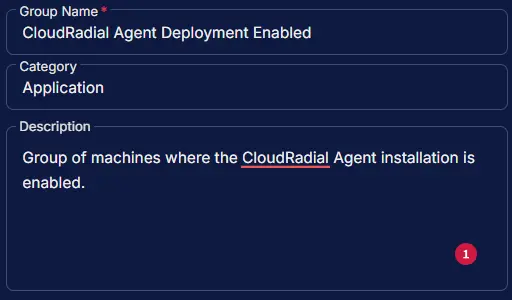
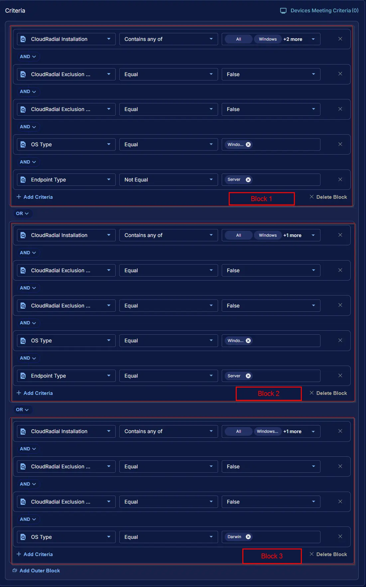
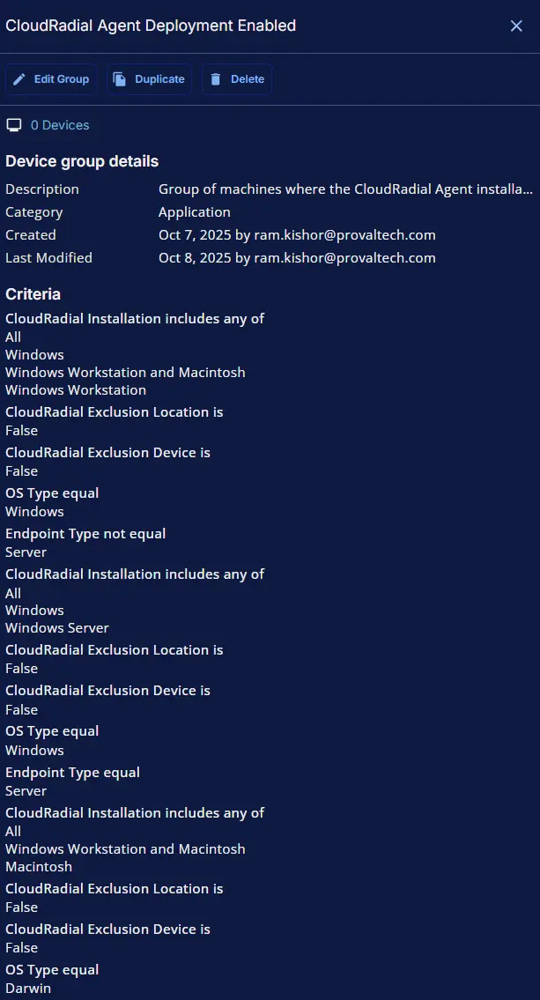

## Summary

Group of machines where the CloudRadial Agent installation is enabled.

## Dependencies

- [Custom Field - CloudRadial Installation](/docs/e1ac886a-807a-4c85-9f6a-a1cecbc15910)
- [Custom Field - CloudRadial Exclusion Location](/docs/d05ec922-2013-4947-a7aa-9b8a557b2253)
- [Custom Field - CloudRadial Exclusion Device](/docs/56e9c36a-12da-4b67-92af-2b8cb6a63dbb)
- [Solution - CloudRadial Agent Deployment](/docs/9e861bf3-2a05-46ef-9f7f-a46f33b675c5)

## Group Setup Location

- **Group Path:** `ENDPOINTS` ➞ `Groups`  
- **Group Type:** `Dynamic Group`

## Group Summary

- **Group Name:** `CloudRadial Agent Deployment Enabled`  
- **Description:** `Group of machines where the CloudRadial Agent installation is enabled.`

## Group Criteria

The group is defined by the following **criteria blocks**, joined by an **OR**. Each block uses **AND** logic between its conditions.

| Block | Criteria Name          | Operator        | Value(s)                                 |
|-------|-----------------------|-----------------|-------------------------------------------|
| 1     | CloudRadial Installation         | Contains any of | `All`, `Windows`, `Windows Workstation and Macintosh`, `Windows Workstation` |
| 1     | CloudRadial Exclusion Location | Equal           | `False`                                     |
| 1     | CloudRadial Exclusion Device | Equal           | `False`                                     |
| 1     | OS Type                | Equal           | `Windows`                                   |
| 1     | Endpoint Type          | Not Equal       | `Server`                                    |
| 2     | CloudRadial Installation         | Contains any of | `All`, `Windows`, `Windows Server` |
| 2     | CloudRadial Exclusion Location | Equal           | `False`                                     |
| 2     | CloudRadial Exclusion Device | Equal           | `False`                                     |
| 2     | OS Type                | Equal           | `Windows`                                   |
| 2     | Endpoint Type          | Equal       | `Server`                                    |
| 3     | CloudRadial Installation         | Contains any of | `All`, `Windows Workstation and Macintosh`, `Macintosh` |
| 3     | CloudRadial Exclusion Location | Equal           | `False`                                     |
| 3     | CloudRadial Exclusion Device | Equal           | `False`                                     |
| 3     | OS Type                | Equal           | `Darwin`                                   |

- **Block 1:** Targets Windows Workstations (not servers)
- **Block 2:** Targets Windows Servers
- **Block 3:** Targets Mac devices

**Logic:**  
A machine matches the group if it meets ALL criteria in Block 1 OR ALL criteria in Block 2 OR ALL criteria in Block 3.

## Completed Group

