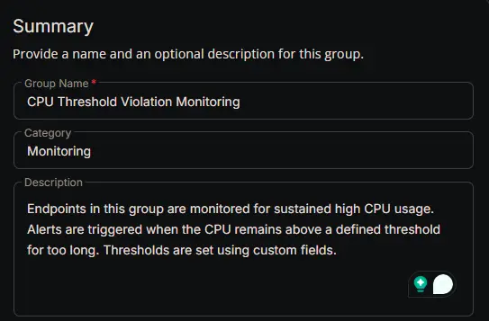
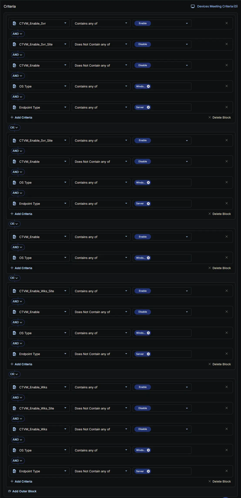
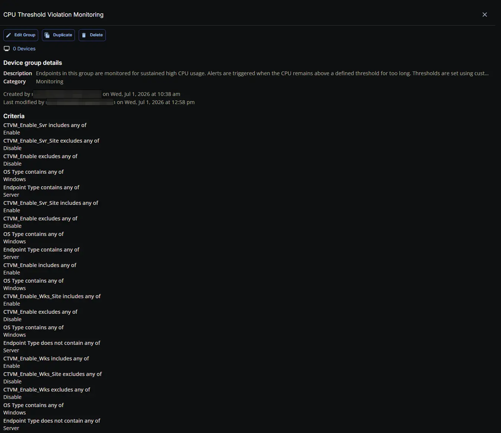

## Summary

Endpoints in this group are monitored for sustained high CPU usage. Alerts are triggered when the CPU remains above a defined threshold for too long. Thresholds are set using custom fields.

## Dependencies

- [Custom Field: CTVM_Enable](/docs/aa6be36d-3653-4f68-b9fe-5bdb7c7f5c20)
- [Custom Field: CTVM_Enable_Svr](/docs/5f3cb7ce-6d25-4199-9434-574fb2ed6542)
- [Custom Field: CTVM_Enable_Svr_Site](/docs/f991ac6d-10ed-4957-8cb7-72b08d01f4d3)
- [Custom Field: CTVM_Enable_Wks](/docs/5b985126-3e3d-4b86-b306-5a93381df895)
- [Custom Field: CTVM_Enable_Wks_Site](/docs/06dee656-c32f-4117-97fe-1641b0e29ab7)
- [Solution: CPU Threshold Violation Monitoring](/docs/49b06af7-af3b-4aaa-a90c-8efb28a65c9e)

## Group Setup Location

- **Group Path:** `ENDPOINTS` ➞ `Groups`  
- **Group Type:** `Dynamic Group`

## Group Summary

- **Group Name:** `CPU Threshold Violation Monitoring`  
- **Category:** `Monitoring`  
- **Description:** `Endpoints in this group are monitored for sustained high CPU usage. Alerts are triggered when the CPU remains above a defined threshold for too long.`  

## Criteria

The group is defined by the following **criteria blocks**, joined by an **OR**. Each block uses **AND** logic between its conditions.

| Block | Criteria Name            | Operator             | Value(s)   |
|-------|--------------------------|----------------------|------------|
| 1     | CTVM_Enable_Svr          | Contains any of      | `Enable`   |
| 1     | CTVM_Enable_Svr_Site     | Does Not Contain any of | `Disable`  |
| 1     | CTVM_Enable              | Does Not Contain any of | `Disable`  |
| 1     | OS Type                  | Contains any of      | `Windows`  |
| 1     | Endpoint Type            | Equal                | `Server`   |
| 2     | CTVM_Enable_Svr_Site     | Contains any of      | `Enable`   |
| 2     | CTVM_Enable              | Does Not Contain any of | `Disable`  |
| 2     | OS Type                  | Contains any of      | `Windows`  |
| 2     | Endpoint Type            | Equal                | `Server`   |
| 3     | CTVM_Enable              | Contains any of      | `Enable`   |
| 3     | OS Type                  | Contains any of      | `Windows`  |
| 4     | CTVM_Enable_Wks          | Contains any of      | `Enable`   |
| 4     | CTVM_Enable_Wks_Site     | Does Not Contain any of | `Disable`  |
| 4     | CTVM_Enable              | Does Not Contain any of | `Disable`  |
| 4     | OS Type                  | Contains any of      | `Windows`  |
| 4     | Endpoint Type            | Not Equal            | `Server`   |
| 5     | CTVM_Enable_Wks_Site     | Contains any of      | `Enable`   |
| 5     | CTVM_Enable              | Does Not Contain any of | `Disable`  |
| 5     | OS Type                  | Contains any of      | `Windows`  |
| 5     | Endpoint Type            | Not Equal            | `Server`   |

- **Block 1:** Targets Windows Servers where the primary **server** setting (**CTVM_Enable_Svr**) is enabled, provided that the feature has not been explicitly disabled at the site level (**CTVM_Enable_Svr_Site**) or the individual endpoint level (**CTVM_Enable**).  
- **Block 2:** Targets Windows Servers where the site‑level **server** setting (**CTVM_Enable_Svr_Site**) is explicitly enabled, provided that it has not been overridden and disabled at the individual endpoint level (**CTVM_Enable**).  
- **Block 3:** Targets **Any Windows Device** (Server or Workstation) where the feature is explicitly enabled directly at the individual endpoint level (**CTVM_Enable**).  
- **Block 4:** Targets Windows **Workstations** (devices not equal to "Server") where the primary workstation setting (**CTVM_Enable_Wks**) is enabled, provided that the feature has not been explicitly disabled at the site level (**CTVM_Enable_Wks_Site**) or the individual endpoint level (**CTVM_Enable**).  
- **Block 5:** Targets Windows **Workstations** (devices not equal to "Server") where the site‑level workstation setting (**CTVM_Enable_Wks_Site**) is explicitly enabled, provided that it has not been overridden and disabled at the individual endpoint level (**CTVM_Enable**).

**Logic:**  
A machine matches the group if it meets **ALL** criteria in **Block 1**, **OR** **ALL** criteria in **Block 2**, **OR** **ALL** criteria in **Block 3**, **OR** **ALL** criteria in **Block 4**, **OR** **ALL** criteria in **Block 5**.

## Completed Group

## Changelog

### 2026-06-24

- Initial version of the document
