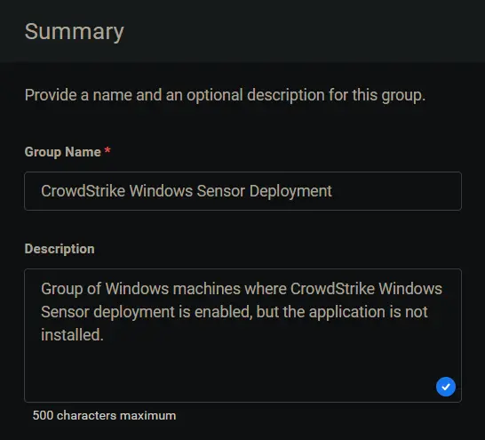
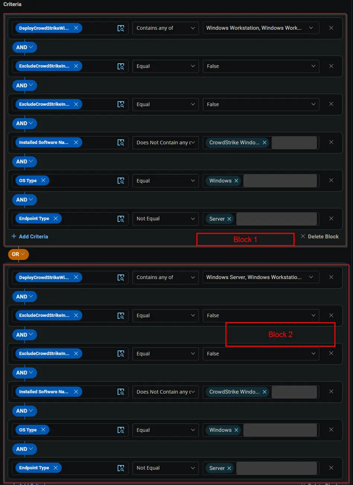
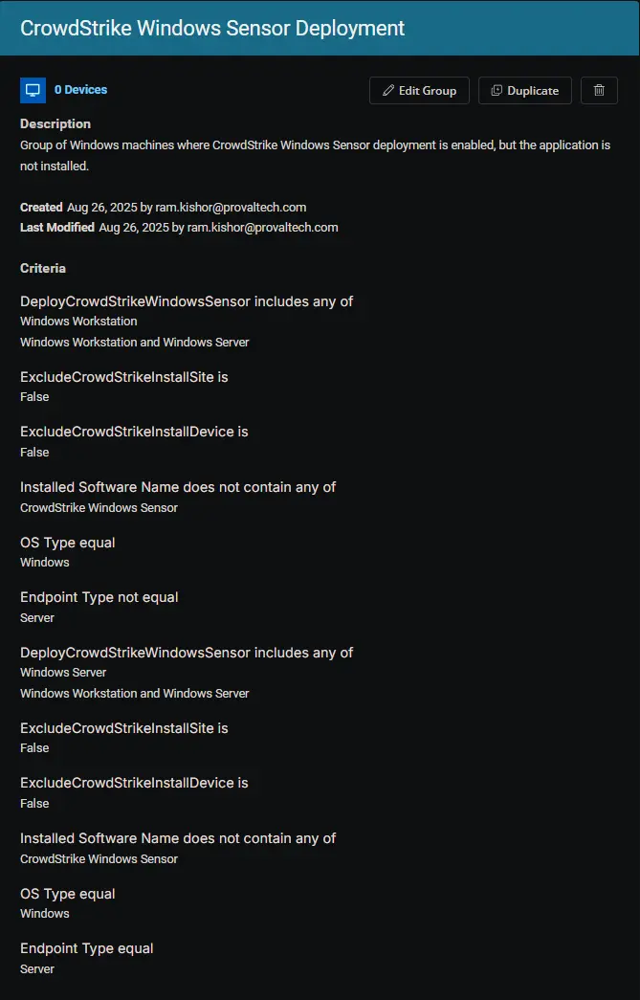

## Summary

Group of Windows machines where CrowdStrike Windows Sensor deployment is enabled, but the application is not installed.

## Dependencies

- [DeployCrowdStrikeWindowsSensor](/docs/ffe13fcc-700f-41ea-9fdf-20ea4d253326)
- [ExcludeCrowdStrikeInstallDevice](/docs/cde64225-1c67-4483-9c39-580b315dd30a)
- [ExcludeCrowdStrikeInstallSite](/docs/8d9498e0-4392-471e-93da-b546e0934b89)
- [CrowdStrikeDownloadUrl](/docs/406c6d18-a948-45f6-897b-b1d0174e21de)
- [CrowdStrikeCustomerId](/docs/28f5fdfd-c11e-4643-ae07-62d6f7007805)
- [Solution: Deploy CrowdStrike Windows Sensor](/docs/dec6391a-c159-4b45-8c3a-9df4d88dd1c5)

## Group Setup Location

- **Group Path:** `ENDPOINTS` ➞ `Groups`  
- **Group Type:** `Dynamic Group`

## Group Summary

- **Group Name:** `CrowdStrike Windows Sensor Deployment`  
- **Description:** `Group of Windows machines where CrowdStrike Windows Sensor deployment is enabled, but the application is not installed.`

## Group Criteria

The group is defined by the following **criteria blocks**, joined by an **OR**. Each block uses **AND** logic between its conditions.

| Block | Criteria Name          | Operator        | Value(s)                                 |
|-------|-----------------------|-----------------|-------------------------------------------|
| 1     | DeployCrowdStrikeWindowsSensor          | Contains any of | `Windows Workstation`, `Windows Workstation and Server` |
| 1     | ExcludeCrowdStrikeInstallSite | Equal           | `False`                                     |
| 1     | ExcludeCrowdStrikeInstallDevice | Equal           | `False`                                     |
| 1     | Installed Software Name | Does Not Contain any of | `CrowdStrike Windows Sensor` |
| 1     | OS Type                | Equal           | `Windows`                                   |
| 1     | Endpoint Type          | Not Equal       | `Server`                                    |
| 2     | DeployCrowdStrikeWindowsSensor          | Contains any of | `Windows Server`, `Windows Workstation and Server` |
| 2     | ExcludeCrowdStrikeInstallSite | Equal           | `False`                                     |
| 2     | ExcludeCrowdStrikeInstallDevice | Equal           | `False`                                     |
| 2     | Installed Software Name | Does Not Contain any of | `CrowdStrike Windows Sensor` |
| 2     | OS Type                | Equal           | `Windows`                                   |
| 2     | Endpoint Type          | Equal       | `Server`                                    |

- **Block 1:** Targets Windows Workstations (not servers)
- **Block 2:** Targets Windows Servers

**Logic:**  
A machine matches the group if it meets ALL criteria in Block 1 OR ALL criteria in Block 2.

## Completed Group

