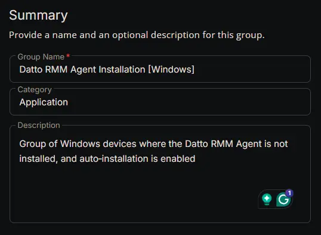
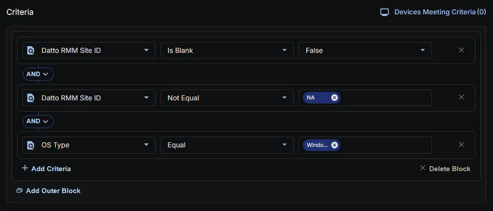
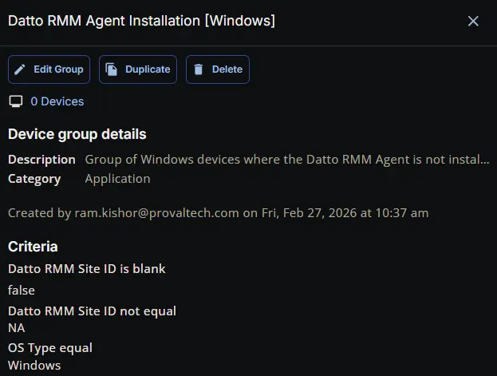

## Summary

Group of Windows devices where the Datto RMM Agent is not installed, and auto‑installation is enabled.

## Dependencies

- [Custom Field: Datto RMM Site ID](/docs/b5af697b-7eeb-4395-8962-44b76645fdc5)
- [Solution : Deploy Datto RMM Agent](/docs/b646e989-5515-4bda-9728-107ac03cdc07)

## Group Setup Location

- **Group Path:** `ENDPOINTS` ➞ `Groups`  
- **Group Type:** `Dynamic Group`

## Group Summary

- **Group Name:** `Datto RMM Agent Installation [Windows]`  
- **Description:** `Group of Windows devices where the Datto RMM Agent is not installed, and auto‑installation is enabled.`

## Group Criteria

The group is defined by the following **criteria block**. Each block uses **AND** logic between its conditions.

| Block | Criteria Name          | Operator        | Value(s)                                 |
|-------|-----------------------|-----------------|-------------------------------------------|
| 1     | Datto RMM Site ID      | Is Blank | `False` |
| 1     | Datto RMM Site ID      | Not Equal | `NA` |
| 1     | OS Type                | Equal           | `Windows` |

- **Block 1:** Targets Windows machines (Both Servers and Workstations).

**Logic:**  
A machine matches the group if it meets ALL criteria in Block 1.

## Completed Group

