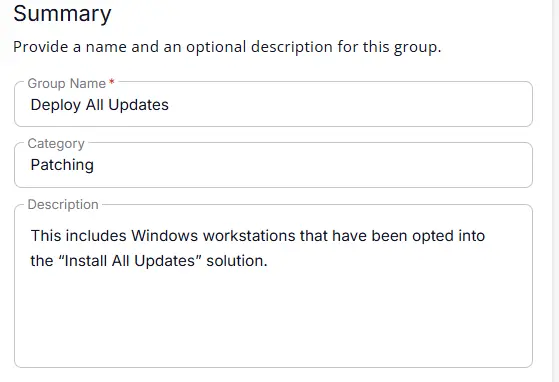
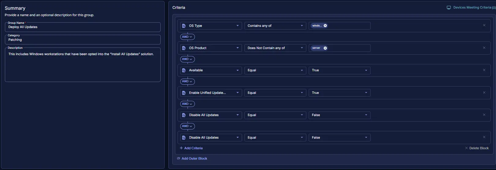

## Summary
This includes Windows workstations that have been opted into the “Install All Updates” solution.

## Dependencies

## Group Setup Location

- **Group Path:** `ENDPOINTS` ➞ `Groups`  
- **Group Type:** `Dynamic Group`

## Group Summary

**Group Name:** `Deploy All Updates`  
**Description:** `This includes Windows workstations that have been opted into the “Install All Updates” solution.`

## Group Criteria

The group is defined by the following **criteria** joined by `AND` condition.

| Criteria Name   | Operator   | Value(s)   |
|------------|--------|-----------|
| Available   | Equal  | `True` |
| OS Type  | Equal   | `Windows` |
| OS Product | Does Not Contain any of   | `Server` |
| Enable All Updates | Equal  | `True` |
| Disable All Updates (Site) | Equal   | `False` |
| Disable All Updates (Endpoint) | Equal   | `False` |

## Completed Group

## Changelog

### 2026-04-21

- Initial version of the document