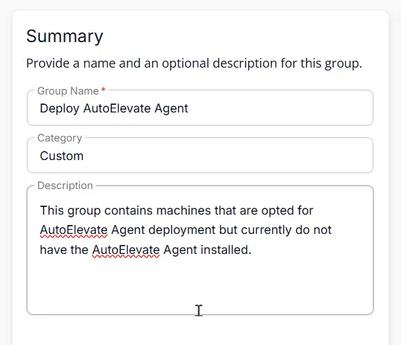
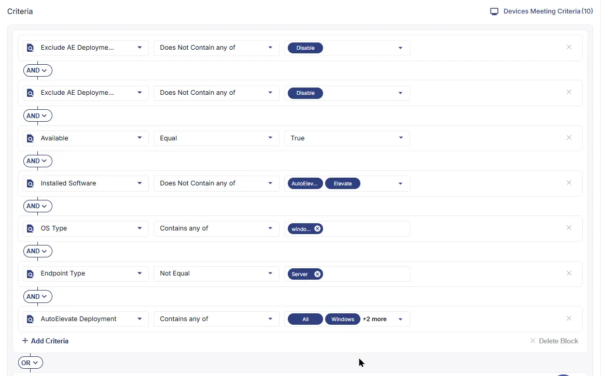
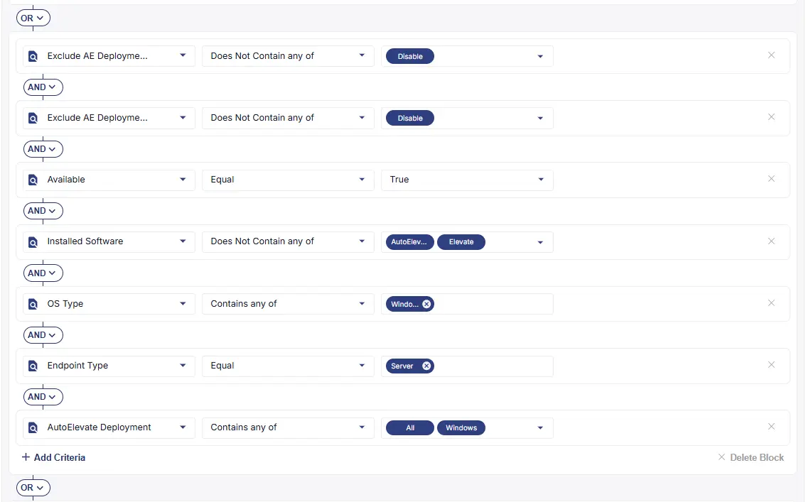
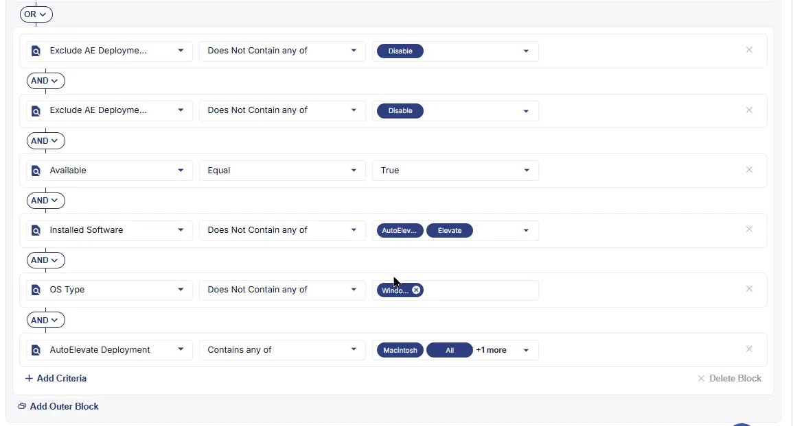
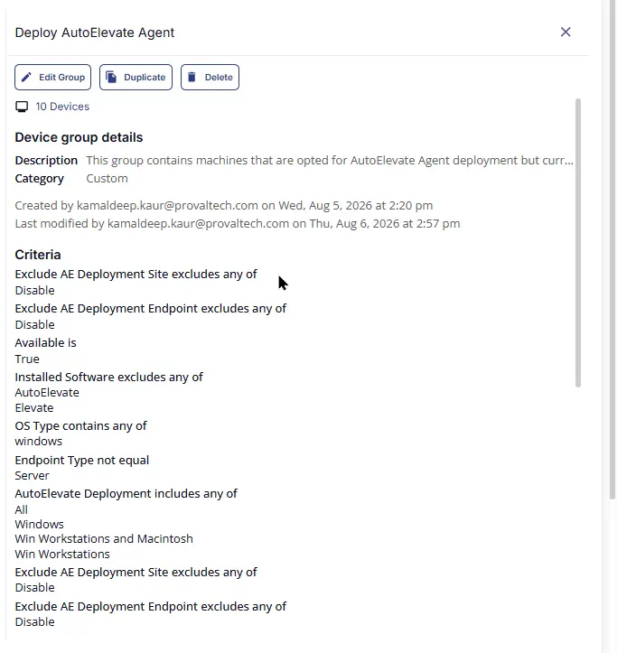

## Summary
This group contains machines that are opted for AutoElevate Agent deployment but currently do not have the AutoElevate Agent installed.

## Dependencies

- [AutoElevate Deployment](/docs/087d044f-a130-4650-ba45-eaf144d45b65)
- [Exclude AE Deployment Site](/docs/d4fd67e2-f69d-4d12-9b38-e7fadcdeb5cc)
- [Exclude AE Deployment Endpoint](/docs/db12afad-326d-4dea-a76f-161a5cd7f1b5)
- [Solution : AutoElevate Deployment](/docs/4a95cdd5-dec1-4d8e-aa3a-0ee4dd7c0273)

## Group Setup Location

- **Group Path:** `ENDPOINTS` ➞ `Groups`  
- **Group Type:** `Dynamic Group`

## Group Summary

- **Group Name:** `Deploy AutoElevate Agent`  
- **Category:** `Custom`  
- **Description:** `This group contains machines that are opted for AutoElevate Agent deployment but currently do not have the AutoElevate Agent installed.`  

## Criteria

The group is defined by the following **criteria blocks**, joined by an **OR**. Each block uses **AND** logic between its conditions.

| Block | Criteria Name            | Operator             | Value(s)   |
|-------|--------------------------|----------------------|------------|
| 1     | AutoElevate Deployment         | Contains any of         | `All`,`Windows`,`Win Workstations`,`Win Workstations and Macintosh`   |
| 1     | Exclude AE Deployment Site     | Does Not Contain any of | `Disable`       |
| 1     | Exclude AE Deployment Endpoint | Does Not Contain any of | `Disable`       |
| 1     | OS Type                        | Contains any of         | `Windows`       |
| 1     | Endpoint Type                  | Not Equal               | `Server`        |
| 1     | Available                      | Equal                   | `True`          |
| 1     | Installed Software             | Does Not Contain any of | `AutoElevate`,`Elevate`  |
| 2     | AutoElevate Deployment         | Contains any of         | `All`,`Windows` |
| 2     | Exclude AE Deployment Site     | Does Not Contain any of | `Disable`       |
| 2     | Exclude AE Deployment Endpoint | Does Not Contain any of | `Disable`       |
| 2     | OS Type                        | Contains any of         | `Windows`       |
| 2     | Endpoint Type                  | Equal                   | `Server`        |
| 2     | Available                      | Equal                   | `True`          |
| 2     | Installed Software             | Does Not Contain any of | `AutoElevate`,`Elevate`  |
| 3     | AutoElevate Deployment         | Contains any of         | `All`,`Macintosh`,`Win Workstations and Macintosh`  |
| 3     | Exclude AE Deployment Site     | Does Not Contain any of | `Disable`       |
| 3     | Exclude AE Deployment Endpoint | Does Not Contain any of | `Disable`       |
| 3     | OS Type                        | Does Not Contains any of         | `Windows`       |
| 3     | Available                      | Equal                   | `True`          |
| 3     | Installed Software             | Does Not Contain any of | `AutoElevate`,`Elevate`  |

- **Block 1:** Targets workstation devices where the primary setting (**AutoElevate Deployment**) is enabled, provided that the deployment has not been explicitly disabled at the site level (**Exclude AE Deployment Site**) or the individual endpoint level (**Exclude AE Deployment Endpoint**).  
- **Block 2:** Targets server devices where the primary setting (**AutoElevate Deployment**) is enabled, provided that the deployment has not been explicitly disabled at the site level (**Exclude AE Deployment Site**) or the individual endpoint level (**Exclude AE Deployment Endpoint**).  
- **Block 3:** Targets Mac machines where the primary setting (**AutoElevate Deployment**) is enabled, provided that the deployment has not been explicitly disabled at the site level (**Exclude AE Deployment Site**) or the individual endpoint level (**Exclude AE Deployment Endpoint**).  

**Logic:**  
A machine matches the group if it meets **ALL** criteria in **Block 1**, **OR** **ALL** criteria in **Block 2**, **OR** **ALL** criteria in **Block 3**.

**Block 1**

**Block 2**

**Block 3**

## Completed Group

## Changelog

### 2026-08-10

- Initial version of the document
