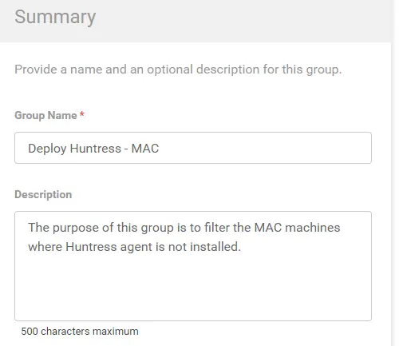
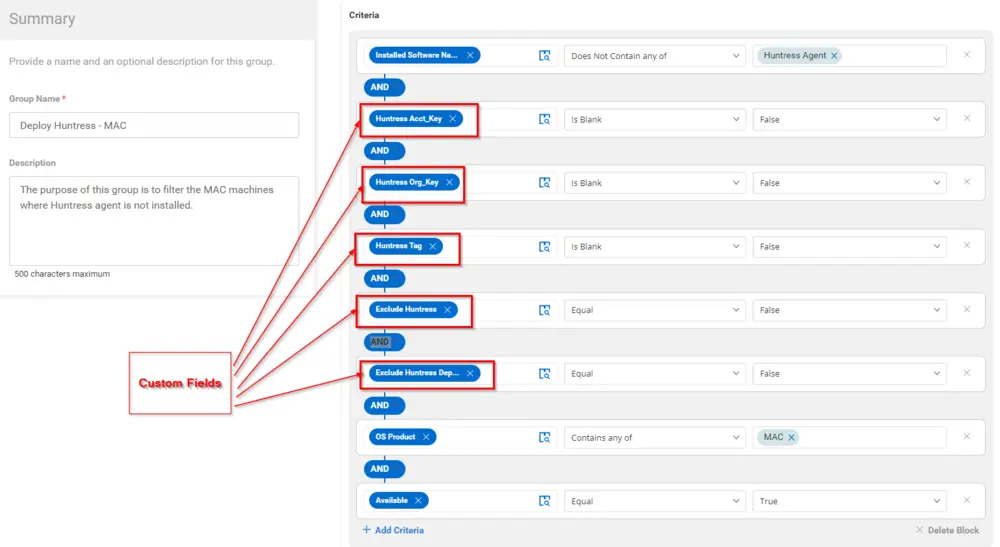
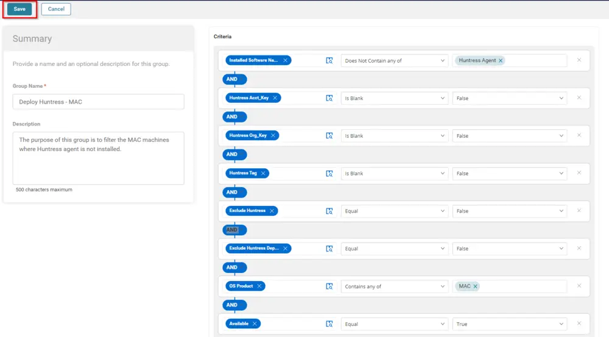
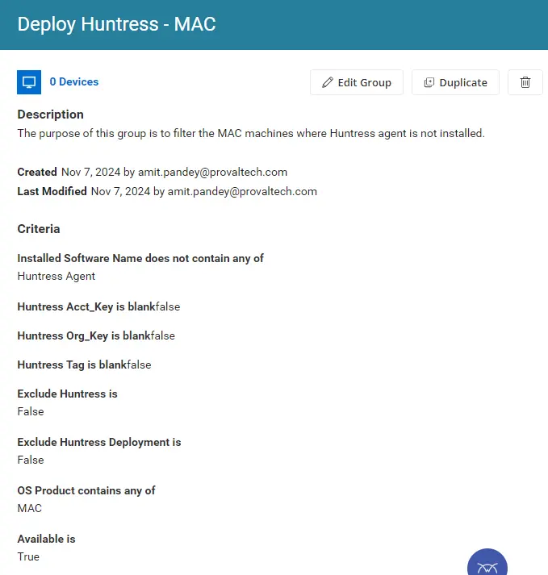

## Summary

The purpose of this group is to filter the MAC machines where the Huntress agent is not installed.

## Dependencies

- [CW RMM - Custom Fields - Huntress Acct_Key](/docs/b8ce44cf-a4a7-4b17-a292-43615b2b192a)
- [CW RMM - Custom Fields - Huntress Org_Key](/docs/00d66215-fe07-4bae-b6cb-d96a73486694)
- [CW RMM - Custom Fields - Huntress Tag](/docs/30690dec-ecd0-448f-8429-24a5d2854953)
- [CW RMM - Custom Fields - Exclude Huntress](/docs/a65dbf66-6cfe-4136-aba1-0b75b3068485)
- [CW RMM - Custom Fields - Exclude Huntress Deployment](/docs/caedfebd-73ec-43cb-a978-02283622f430)
- [CW RMM - Task - Huntress Agent (INSTALL)](/docs/e1f40d15-13f1-465e-9870-653927ad0434)

## Group Overview

**Group Type:** Dynamic  
**Group Name:** Deploy Huntress - MAC  
**Description:** The purpose of this group is to filter the MAC machines where the Huntress agent is not installed.

## Criteria

- Installed Software does not contain any of the `Huntress Agent`
- Huntress Acct_Key should not be blank
- Huntress Org_Key should not be blank
- The Huntress Tag should not be blank
- Exclude Huntress should be false
- Exclude Huntress Deployment should be false
- OS Product Contains `MAC`
- Available should be True.

## Saving the Group

Once the above criteria are met, click the Save button to save the group.

