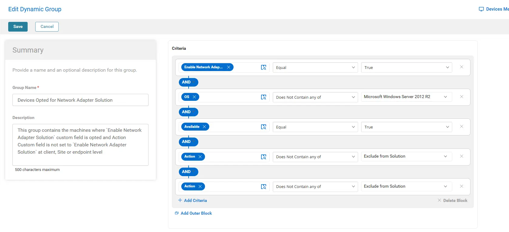

## Summary
This group contains the machines where `Enable Network Adapter Solution` custom field is opted and `Action` Custom field is not set to `Enable Network Adapter Solution` at Client, Site or Endpoint level

## Dependencies

- [Manage - Network Adapter Solutions Custom Field](/docs/97f24a5e-9b01-4a3c-8288-0aef911bf2ad)
- [Task - Manage - Network Adapter Protocols](/docs/2dbbb9c6-8bb7-4f1a-a050-7cb9f4b2382f)
- [ Solution - Manage Network Adapter Solution](/docs/0d47f7f9-c0f9-42f1-9bc9-23b6d5cb6220)

## Details

| Field Name                 | Type of Field (Machine or Organization) | Description                                                                                                                                                                                                                                                                                                                                                                         |
|----------------------------|-----------------------------------------|-------------------------------------------------------------------------------------------------------------------------------------------------------------------------------------------------------------------------------------------------------------------------------------------------------------------------------------------------------------------------------------|
| Devices Opted for Network Adapter Solution    | Dynamic Group | This group contains the machines where `Enable Network Adapter Solution` custom field is opted and Action Custom field is not set to `Enable Network Adapter Solution` at client, Site or endpoint level. |

## Group Creation

### Step 1
Navigate to `ENDPOINTS` ➞ `Groups`  

### Step 2

Create a new dynamic group by clicking the `Dynamic Group` button.  

### Step 3

This page will appear after clicking on the `Dynamic Group` button:  

- **Group Name:** `Devices Opted for Network Adapter Solution`  
- **Description:** This group contains the machines where "Enable Network Adapter Solution" custom field is opted and 'Action' Custom field is not set to "Enable Network Adapter Solution" at Client, Site or Endpoint level.

### Step 4

Click the `+ Add Criteria` in the `Criteria` section of the group.  

This search box will appear:  

Add the following criteria as shown:

**Criteria:**

- `Enable Network Adapter Solution` custom field equals `True`.
- `OS` does not not contains `unsupported machines`. Select the unsupported versions one by one.
- The agent `Available` equals `True`.
- `Action(Site)` does not contain `Exclude From the Solution`
- `Action(Endpoint)` does not contain `Exclude From the Solution`

## Completed Group

